<!--
SYNC IMPACT REPORT
==================
Version change: 1.7.0 -> 1.8.0
Bump rationale: MINOR - Added a new system hardening principle and
materially expanded testing, planning, performance, documentation,
and deployment governance from user input. The amendment formalizes
100% test coverage, real model weights and raw test data, live-stream
and offline-video planning, Ultralytics documentation authority, and
the development Docker versus production native Linux split.

Modified Principles:
- II. Test-in-Loop Standards - raised coverage and real-data rules
- VI. Performance Requirements - expanded responsiveness targets

Added Principles:
- XII. End-to-End System Hardening

Added Sections:
- Principle XII - End-to-End System Hardening

Removed Sections: None.

Expanded Sections:
- Test Enforcement Rules
- Three-Phase Testing Pipeline
- Quality Gates
- Governance

Templates Requiring Updates:
- updated: .specify/templates/plan-template.md
- updated: .specify/templates/spec-template.md
- updated: .specify/templates/tasks-template.md
- updated: README.md
- not present: .specify/templates/commands/*.md

Follow-up TODOs: None.

Previous Change (v1.5.0 → 1.6.0):
- Renamed II. Testing Standards → II. Test-in-Loop Standards
- Added Test-in-Loop workflow with diagram
- Expanded Mandatory Diagram Types with entity coverage requirements
- tasks-template.md still needs "OPTIONAL" → "MANDATORY" update
-->

# Student Cheating Analyzer & Detector Constitution

## Core Principles

### ⚡ Supreme Directive — Commit & Document After Every Modification (HIGHEST PRIORITY)

This directive carries the **HIGHEST PRIORITY** of all instructions
in this constitution and across ALL agents working on this project.
It supersedes and overrides any conflicting agent instructions,
workflow shortcuts, or ad-hoc practices. Violation of this directive
is a **BLOCKING FAILURE** that invalidates any delivered work.

**Every agent MUST, after EVERY modification (create, update, fix,
refactor, or delete of ANY file), perform ALL of the following
before proceeding to the next task:**

1. **COMMIT immediately** — Create a git commit with a Conventional
   Commits message describing the specific change. No batching of
   unrelated changes. No deferring commits. Each logical
   modification = one commit.

2. **CREATE or UPDATE all `.md` documentation files** affected by
   the modification — this includes:
   - The corresponding `docs/` directory `.md` file for every
     source file touched.
   - The module's `README.md`.
   - Any system-level documentation (root `README.md`,
     `backend/README.md`, `frontend/README.md`) if the change
     affects architecture, features, or setup.
   - All Mermaid diagrams in affected `.md` files MUST be verified
     or updated to reflect the current state.

3. **USE ALL TYPES OF DIAGRAMS** in every `.md` file — agents MUST
   include multiple diagram types (not just one) to provide
   comprehensive visual documentation. See the **Mandatory Diagram
   Types** section below for the complete list.

4. **EXPLAIN every diagram in VERY DETAILED way** — each diagram
   MUST be preceded by an introduction paragraph and followed by a
   detailed explanation section that walks through every node, edge,
   relationship, and flow depicted. See the **Diagram Explanation
   Requirements** section below for exact format.

5. **CONNECT all `.md` files to each other** — every `.md` file
   MUST contain explicit cross-reference links to related `.md`
   files using relative Markdown links. See the **.md File
   Interconnection** section below for exact requirements.

**Enforcement**:
- Work without a commit after each modification is NOT delivered.
- Documentation without ALL diagram types is NOT complete.
- Diagrams without detailed explanations are NOT acceptable.
- `.md` files without cross-links to related files are NOT valid.
- Agents MUST self-verify these five items as a checklist after
  every single modification before proceeding.

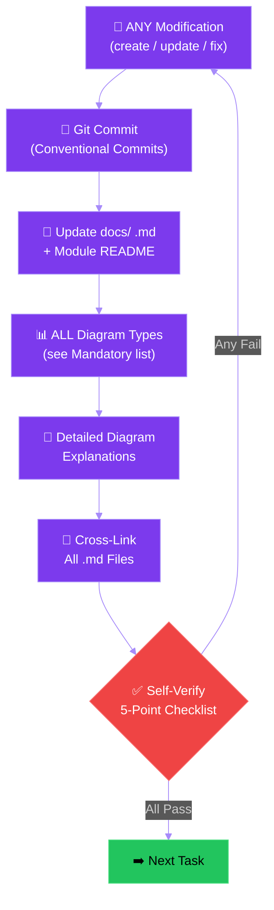

**Detailed explanation of the Supreme Directive workflow diagram
above**: This flowchart depicts the mandatory post-modification
workflow that every agent MUST follow. The flow begins at the top
with **ANY Modification** (purple node) — this includes creating
new files, updating existing code, fixing bugs, or refactoring.
The agent then proceeds sequentially through five mandatory steps:
(1) **Git Commit** — the change is committed immediately with a
Conventional Commits message; (2) **Update docs/ .md + Module
README** — all documentation files affected by the modification
are created or updated; (3) **ALL Diagram Types** — the agent
ensures every `.md` file includes all applicable diagram types from
the mandatory list; (4) **Detailed Diagram Explanations** — every
diagram has an introductory paragraph and a walkthrough explanation;
(5) **Cross-Link All .md Files** — relative links connect the file
to all related documentation. After all five steps, the agent
reaches the **Self-Verify 5-Point Checklist** gate (red diamond).
If all five checks pass, the agent proceeds to the **Next Task**
(green node). If ANY check fails, the flow loops back to the
modification step to fix the gap. This loop enforces that no task
progresses until documentation and commits are complete.

### I. Code Quality Excellence

Every module, class, and function MUST adhere to strict code quality
standards. This is the foundation upon which all other principles rest.

- **SOLID principles are mandatory** for every class and module:
  - **Single Responsibility**: Each class has exactly one reason to
    change. Each module file handles one concern.
  - **Open/Closed**: New detection models are added via plugin
    registry, not by modifying pipeline code. Config-driven behavior
    changes MUST NOT require code changes.
  - **Liskov Substitution**: All model adapters MUST be
    interchangeable via a common base interface.
  - **Interface Segregation**: Clients MUST NOT depend on methods
    they do not use. Separate interfaces for read-only vs read-write
    operations.
  - **Dependency Inversion**: High-level modules depend on
    abstractions, not concrete implementations. Dependencies MUST be
    injected via constructors.
- **Zero `print()` statements** — all output MUST go through
  structured logging with auto-redaction of sensitive patterns.
- **Custom exception hierarchy** with retry/backoff for transient
  failures and graceful degradation for non-critical paths.
- **Design patterns** MUST be applied where appropriate: Strategy
  (model selection), Factory (pipeline stages), Observer (anomaly
  alerts), Template Method (detection layers).
- **Functions MUST NOT exceed 30 lines**. Classes MUST follow
  single-responsibility. Naming MUST be meaningful and consistent.
  DRY is enforced — no duplicated logic.
- **All configuration** MUST be loaded through validated config
  models (e.g., Pydantic v2 strict mode). No hardcoded magic
  numbers or string literals.
- **Package-per-module structure**: Every module MUST have its own
  package directory with clear entry points and separated concerns
  (business logic, CLI, interfaces).

### II. Test-in-Loop Standards (NON-NEGOTIABLE)

No feature, update, or fix is considered delivered until ALL test
cases pass. Testing is a blocking delivery gate — not optional.
Every agent MUST use the **Test-in-Loop** methodology: write ALL
tests first across all levels, verify they fail, then implement
until all tests pass, running them continuously throughout
development.

#### Test-in-Loop Methodology (MANDATORY)

The Test-in-Loop workflow is the ONLY acceptable development
methodology for this project. Every agent MUST follow this exact
sequence for every feature, fix, or update:

1. **WRITE ALL TESTS FIRST** — Before writing any implementation
   code, the agent MUST write the complete test suite covering:
   - **Unit tests** for every public function, class, and method
     that will be created or modified.
   - **Integration tests** for every cross-module interaction,
     layer handoff, API contract, and data flow between components.
   - **System tests** for every end-to-end user scenario defined
     in the spec (e.g., video input → detection → anomaly report
     → UI display).
2. **VERIFY ALL TESTS FAIL (RED)** — Run the complete test suite
   and confirm every new test fails. A test that passes before
   implementation indicates the test is not testing new behavior
   and MUST be rewritten.
3. **IMPLEMENT UNTIL TESTS PASS (GREEN)** — Write the minimum
   implementation code needed to make all tests pass. During
   implementation, the agent MUST run the test suite after every
   logical change (every few lines or every function completion)
   to get continuous feedback. This is the "loop" — tests are
   executed repeatedly throughout development, not just at the end.
4. **REFACTOR (CLEAN)** — Once all tests pass, refactor the
   implementation for clarity, performance, and adherence to
   Principle I (Code Quality). Re-run all tests after each
   refactoring step to ensure no regressions.
5. **FULL SUITE VERIFICATION** — After refactoring, run the
   entire test suite (unit + integration + system) one final time.
   ALL tests MUST pass. This is a blocking gate.

**Test-in-Loop is NOT optional.** Agents MUST NOT:
- Write implementation code before writing tests.
- Write only unit tests and skip integration or system tests.
- Write tests after implementation ("test-after" is PROHIBITED).
- Run tests only at the end of implementation.
- Skip the RED phase (verifying tests fail first).

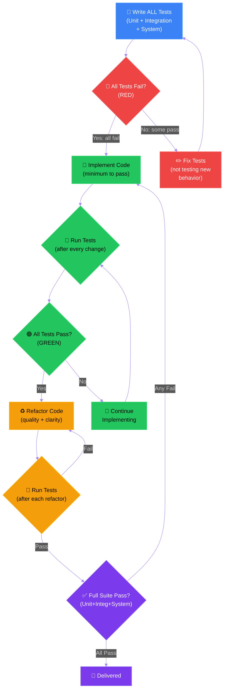

**Detailed explanation of the Test-in-Loop workflow diagram above**:
This flowchart enforces the mandatory Test-in-Loop development cycle
for every agent. The flow begins with **Write ALL Tests** (blue
node) — the agent writes the complete test suite spanning unit,
integration, and system tests before any implementation code exists.
Next, the **All Tests Fail? (RED)** gate (red diamond) verifies
every new test fails; if any test passes before implementation, the
agent loops back to **Fix Tests** to ensure the tests actually
validate new behavior. Once all tests correctly fail, the agent
enters the implementation loop: **Implement Code** (green) writes
the minimum code needed, then **Run Tests (after every change)**
provides continuous feedback — this is the core "loop" that gives
the methodology its name. If tests pass, the agent moves to
**Refactor Code** (yellow) for quality improvements, running tests
after each refactor step. If refactoring breaks a test, the agent
refactors again until tests pass. Finally, the **Full Suite Pass?**
gate (purple) runs the complete test suite one last time. Only when
all unit, integration, and system tests pass does the agent reach
**Delivered**. If the final suite reveals failures, the agent loops
back to implementation. No shortcutting is allowed — every arrow in
this diagram represents a mandatory step.

#### Three-Phase Testing Pipeline

ALL three phases MUST pass before any merge or delivery:

1. **Unit tests** for every public function and class.
2. **Integration tests** for: pyramid layer handoffs, RTSP
   connection lifecycle, anomaly detection pipeline, tracking ID
   persistence, frontend-backend API contracts.
3. **System tests** for end-to-end flows covering BOTH mandatory
   runtime scenarios:
   - **Live stream scenario**: RTSP/WebRTC input -> detection ->
     tracking -> anomaly report -> UI display.
   - **Offline video processing scenario**: uploaded/raw video file
     -> batch inference -> tracking -> persisted results -> playback
     overlay.

#### Test Enforcement Rules

- **100% line and branch coverage** is enforced as a delivery gate
  for every module, feature, and integration path already
  implemented or newly implemented. Any temporary exemption MUST be
  documented in Complexity Tracking with owner, expiry date, and
  removal plan.
- **Tests MUST mirror source structure**: `tests/unit/`, `tests/
  integration/`, `tests/system/` directories MUST parallel the
  `src/` tree.
- **Real model weights and real raw test data are mandatory** for
  every inference, prediction, tracking, video-processing, and
  overlay test. Tests MUST use the project model artifacts and raw
  video/image data from approved test-data locations. Mocks,
  fakes, or synthetic frames MUST NOT replace model weights, raw
  media, trackers, or prediction outputs in these paths.
- **Limited test doubles** are allowed only for non-ML side effects
  such as email, network outages, auth providers, or clocks. They
  MUST NOT hide frontend-backend, backend-Triton, Docker, or native
  Linux production wiring defects.
- **Every agent delivering a feature or update MUST confirm that
  ALL existing and new test cases pass before marking work as
  complete.** Partial test passes are a blocking failure.
- **No feature merges** without the full test pipeline (Unit →
  Integration → System) passing green.
- **Automation testing is mandatory by default**: all repeatable
  validations (unit, integration, system, contract, regression,
  smoke, performance/load) MUST run through automated CI/local
  scripts. Manual-only testing MAY supplement but MUST NOT replace
  required automated gates.
- **Load testing is mandatory** for backend APIs, WebSocket/event
  streams, inference queues, and storage paths that handle
  production-like traffic. Test plans MUST define concurrency,
  sustained duration, burst behavior, and pass/fail thresholds
  (latency, throughput, error rate, resource usage) before merge.
- **High-value test categories are required where applicable**:
  contract testing (API and WebSocket schema compatibility),
  regression testing (defect-prevention suites), smoke testing
  (critical-path deploy checks), and resilience testing (timeouts,
  retries, dependency degradation, recovery behavior).

### III. User Experience Consistency

Every user-facing interaction MUST follow uniform patterns that
make the system intuitive, predictable, and professional.

- **Uniform interaction patterns** across all views (monitoring
  dashboard, camera feeds, recording review, settings).
- **Real-time feedback** for detection status (active / paused /
  error) with ≤500 ms UI update latency.
- **Error messages MUST be actionable**: user-facing messages MUST
  explain what happened and what the user can do about it. Raw
  stack traces, error codes, or technical jargon MUST NEVER be
  shown to users.
- **Loading states and progressive disclosure** for long-running
  operations (video processing, model loading, recording playback).
- **Keyboard navigable**: all primary workflows MUST be accessible
  via keyboard alone.
- **Responsive layout** supporting 1920×1080 minimum resolution.
- **Consistent iconography and color semantics** across all
  components: red = alert/critical, yellow = warning, green =
  normal/active, purple = primary accent.
- **Micro-interactions** for state changes MUST complete within
  200 ms to feel instant.

### IV. Security Standards

All data handling, authentication, and communication MUST follow
strict security practices. Student monitoring data is sensitive.

- **API keys, tokens, passwords, and secrets MUST NEVER be
  hardcoded** in source code. Store in `.env` (in `.gitignore`),
  load via environment variables, and use encrypted in-memory
  vaults (Fernet encryption, decrypt-at-use, immediate clearance).
- **All file paths MUST be sanitized** against directory traversal
  attacks: resolve to absolute path, verify within allowed
  directories, reject paths containing `..`, `~`, or null bytes.
- **RTSP URLs MUST be validated** against allowlist patterns before
  connection.
- **Student data is PII**: no raw student identifiers in logs,
  anonymized IDs in telemetry, data retention policies enforced
  and configurable.
- **Role-based access control** for dashboard: instructor and admin
  roles with principle of least privilege.
- **Audit log** for every detection event, configuration change,
  login attempt, and recording access.
- **Input validation**: all video file MIME types verified before
  processing. All config values validated through strict schemas.
- **Session management**: secure session tokens, configurable
  inactivity timeout (default 30 min), non-specific error messages
  for failed login attempts.
- **Log redaction**: all logging MUST auto-redact patterns matching
  API keys, tokens, passwords, and PII.

### V. Amazing UI Design & User Experience

The interface MUST be beautiful, modern, and purpose-built for
exam monitoring — not generic. Visual design is a first-class
requirement, not an afterthought.

- **Three themes MUST be shipped from Day 1**:
  - **Black + Purple** (default): dark background with purple
    accent colors for a professional, modern look.
  - **Full Black**: pure black backgrounds for OLED-friendly,
    low-light exam hall environments.
  - **White**: clean light theme for well-lit environments or
    printed documentation.
- **Theme switching MUST be instant** (≤300 ms, no page reload)
  and persist across browser sessions via local storage.
- **All three themes MUST pass WCAG 2.1 AA** contrast requirements
  for text and interactive elements.
- **Bounding box overlay colors MUST remain distinguishable** in
  all three themes — adaptive stroke colors where necessary.
- **Camera feed dashboard**: real-time multi-camera grid view with
  color-coded bounding boxes (per detection class), student
  tracking IDs, and anomaly indicators overlaid on feeds.
- **Predictions panel**: per-student pyramid layer breakdown with
  severity-scored anomaly highlights.
- **Student behavior timeline**: scrollable history with anomaly
  markers and one-click navigation to video moments.
- **Reusable component library**: buttons, cards, modals, status
  badges, form inputs, toggles — all themed consistently.
- **Dark/light mode transitions MUST animate smoothly** — no
  flash-of-unstyled-content allowed.
- **WCAG 2.1 AA accessibility compliance** for all interactive
  elements.

### VI. Performance Requirements

The system MUST sustain real-time operation under production
workloads on both GPU and CPU environments.

- **Real-time inference MUST sustain ≥15 FPS** on live camera
  feeds (single stream). Multi-stream targets MUST be documented
  per hardware profile.
- **Multi-threading MUST be used** for I/O-bound operations:
  video capture, RTSP streaming, file reading, network calls,
  logging I/O.
- **Multi-processing MUST be used** for CPU-bound operations:
  frame preprocessing, model inference (CPU mode), batch anomaly
  analysis.
- **GPU acceleration (CUDA) MUST be used** when available; graceful
  CPU fallback MUST be implemented with documented performance
  expectations for each mode.
- **Memory-efficient student tracking**: bounded track history per
  student, automatic cleanup of expired tracks, no unbounded growth.
- **Batch processing** for recorded videos MUST utilize all
  available cores.
- **Lazy model loading**: pyramid layers loaded on-demand per
  camera session, not all at startup.
- **Frontend performance**: initial page load ≤3 seconds on
  standard broadband. UI interactions ≤200 ms response time.
  Camera grid renders at native feed frame rate without dropped
  frames.
- **System responsiveness** MUST be measured across browser,
  backend API, WebSocket, Celery/background workers, inference
  runtime, and storage. Plans MUST define p95 latency targets for
  user-visible actions and frame/result propagation.
- **Live stream and offline video performance** MUST be planned and
  tested separately. A feature that handles video MUST state
  throughput, latency, backpressure, retry, timeout, and degradation
  behavior for both scenarios.
- **Cross-platform**: Windows + Linux with identical behavior.
  CI MUST verify both platforms.

### VII. Delivery Sign-Off Protocol

No work is considered delivered until the agent has performed a
comprehensive quality sweep and verified every gate passes. This
principle governs the mandatory sign-off sequence for ALL agents.

### VIII. Think Before Coding

Do not assume. Do not hide confusion. Surface tradeoffs. Before
implementing, state assumptions explicitly. If uncertain, ask.
If multiple interpretations exist, present them — do not pick
silently. If a simpler approach exists, say so. Push back when
warranted. If something is unclear, stop, name what is confusing,
and ask.

- **Surface assumptions explicitly** — every agent MUST state
  what they are assuming before writing code.
- **Present tradeoffs** — when multiple approaches exist, document
  the options with pros/cons rather than silently choosing one.
- **Ask when uncertain** — confusion is not a failure; hidden
  confusion is. Name what is unclear and seek clarification.
- **Push back when warranted** — if requirements seem wrong,
  overcomplicated, or contradictory, raise the issue before
  proceeding.
- **Prefer simplicity** — if a simpler solution exists, propose it
  before implementing the complex one.

### IX. Simplicity First

Write the minimum code that solves the problem. Nothing
speculative. No features beyond what was asked. No abstractions
for single-use code. No "flexibility" or "configurability" that
was not requested. No error handling for impossible scenarios.
If you write 200 lines and it could be 50, rewrite it.

- **Minimum viable solution** — implement exactly what is required,
  no more.
- **No speculative features** — do not add functionality that
  "might be needed later."
- **No premature abstractions** — single-use code does not need
  abstraction layers.
- **No unnecessary configurability** — hardcode values that will
  not change; expose as config only when variability is required.
- **Ruthless reduction** — if code can be simplified, it MUST be
  simplified before delivery.
- **Self-check** — ask: "Would a senior engineer say this is
  overcomplicated?" If yes, simplify.

### X. Surgical Changes

Touch only what you must. Clean up only your own mess. When editing
existing code, do not "improve" adjacent code, comments, or
formatting. Do not refactor things that are not broken. Match
existing style, even if you would do it differently. If you notice
unrelated dead code, mention it — do not delete it. Remove only
imports, variables, or functions that YOUR changes made unused.

- **Minimal surface area** — every changed line MUST trace directly
  to the user's request.
- **No tangential improvements** — do not refactor, reformat, or
  "clean up" code unrelated to the task.
- **Match existing style** — follow the patterns already present
  in the file, even if they differ from your preference.
- **Clean up your own orphans only** — remove unused imports,
  variables, or functions that YOUR changes created. Do not remove
  pre-existing dead code unless explicitly asked.
- **Report, do not fix** — if you notice unrelated issues, mention
  them but do not fix them in the same change set.

### XI. Goal-Driven Execution

Define success criteria. Loop until verified. Transform vague
tasks into verifiable goals: "Add validation" becomes "Write
tests for invalid inputs, then make them pass." "Fix the bug"
becomes "Write a test that reproduces it, then make it pass."
"Refactor X" becomes "Ensure tests pass before and after." For
multi-step tasks, state a brief plan with verification at each
step.

- **Verifiable success criteria** — every task MUST have explicit,
  testable completion conditions.
- **Test-driven verification** — when fixing or adding features,
  write the test first, then make it pass.
- **State the plan** — for multi-step work, enumerate steps with
  verification criteria: "1. Step name -> verify: expected check"
- **Loop until verified** — do not mark work complete until
  success criteria are demonstrably met.
- **Strong criteria enable autonomy** — clear success criteria let
  agents work independently without constant clarification.

No work is considered delivered until the agent has performed a
comprehensive quality sweep and verified every gate passes. This
principle governs the mandatory sign-off sequence for ALL agents.

- **Step 1 — Comprehensive Issue Scan**: Before declaring any
  work complete, the agent MUST scan for ALL known issue types:
  - **Lint errors**: ESLint, Ruff/Flake8, Pylint violations.
  - **Type errors**: TypeScript `tsc --noEmit`, mypy/Pyright.
  - **Security warnings**: dependency vulnerabilities (npm audit,
    pip-audit/safety), hardcoded secrets scan, path traversal
    risks, CORS/CSRF misconfigurations.
  - **Runtime warnings**: deprecation notices, unhandled promise
    rejections, Django system checks, React strict-mode warnings.
  - **Build errors**: compilation failures, missing imports,
    circular dependencies.
  - **Test failures**: unit, integration, and system test suites.
  - **Documentation gaps**: missing module READMEs, stale
    docstrings, outdated Mermaid diagrams.
  - **Spec compliance violations**: deviations from spec.md FRs,
    plan.md architecture, data-model.md schemas, or API contracts.
- **Step 2 — Solution Determination**: For every issue found, the
  agent MUST determine and document the resolution approach before
  applying changes. Fixes MUST NOT introduce regressions.
- **Step 3 — Fix Application**: Apply all fixes systematically.
  Each fix MUST be an atomic, reviewable change. Fixes MUST be
  committed individually with Conventional Commits messages.
- **Step 4 — Full Test Suite Verification**: ALL test phases
  (Unit → Integration → System) MUST pass green. Partial passes
  are a blocking failure.
- **Step 5 — Security Gateway Verification**: All security checks
  MUST pass: no hardcoded secrets, paths sanitized, PII redacted
  in logs, RBAC enforced, audit logging functional, dependencies
  free of known critical/high CVEs.
- **Step 6 — Spec-Driven Compliance Check**: The delivered code
  MUST satisfy all applicable FRs from spec.md, adhere to the
  architecture in plan.md, match data-model.md schemas, and
  conform to API contracts. Deviations MUST be documented and
  approved.
- **Step 7 — Sign-Off**: ONLY after Steps 1–6 pass without
  blocking findings can the agent mark work as **delivered**.
  The sign-off MUST include a brief delivery summary listing:
  issues found, issues resolved, test results, and any deferred
  items with justification.
- **Partial delivery is prohibited**: If any gate fails, the work
  MUST NOT be signed off. The agent MUST iterate through Steps
  1–6 until all gates pass.

### XII. End-to-End System Hardening

The project MUST be hardened as one connected system, not as isolated
files. Documents, source code, Mermaid diagrams, frontend-backend
contracts, Docker development wiring, Triton inference wiring, and
native Linux production deployment MUST remain consistent and
verifiable at every change.

- **Modular low-coupling design** is mandatory. Each module MUST
  expose a narrow public interface, depend on abstractions where
  practical, and avoid cross-module knowledge that is not required
  by the feature.
- **Simple code is the default**. Complexity is allowed only when
  the feature genuinely requires it, and the plan MUST document why
  the simpler approach is insufficient.
- **Live stream and offline video processing are first-class
  scenarios**. Every spec, plan, task list, and system test for a
  video or inference feature MUST cover both scenarios, or state an
  explicit non-applicability rationale.
- **Frontend-backend contracts MUST be hardened** through typed API
  schemas, WebSocket payload contracts, error contracts, and
  integration tests that exercise real request/response wiring.
- **Backend-Triton wiring MUST be hardened** through explicit model
  repository layout, model versioning, health/readiness checks,
  timeout/retry policy, and integration tests using real model
  weights.
- **Docker is a development and test convenience only**. Development
  MAY use Docker Compose for infrastructure and Triton. Production
  Linux servers MUST NOT depend on Docker availability; deployment
  plans and runbooks MUST use native Linux services, systemd or
  equivalent process supervision, and filesystem model repositories.
- **Ultralytics official documentation is the authority** for YOLO
  prediction, tracking, tracker configuration, and inference API
  behavior. Plans and research for tracking or prediction changes
  MUST reference Ultralytics docs as the primary source and document
  any deliberate deviation.
- **Mermaid explainability diagrams MUST match implementation**.
  Architecture, flow, sequence, state, ER, deployment, and wiring
  diagrams MUST be updated when code or deployment behavior changes,
  and every diagram MUST explain how live-stream and offline-video
  paths move through the system when applicable.

## Mandatory Diagram Types (ALL MUST Be Used)

Every `.md` documentation file MUST include diagrams from ALL of the
following categories that are applicable to the file's content. An
agent MUST NOT skip a diagram type unless it has zero relevance to
the file — and MUST document the reason for omission in a comment.

### 1. Flowchart Diagrams

Show control flow, decision points, and process steps. Use for:
algorithms, request handling, lifecycle management, workflow steps.

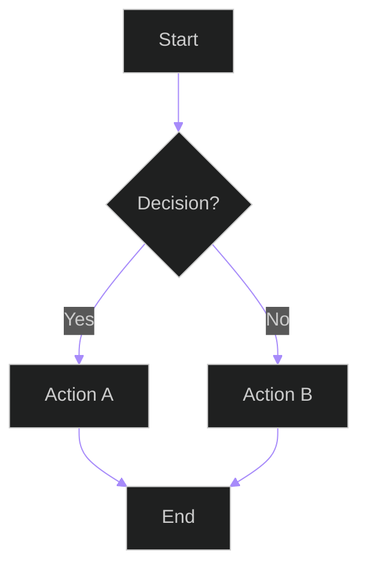

### 2. Sequence Diagrams

Show time-ordered interactions between components, services, or
actors. Use for: API call flows, WebSocket message exchanges,
authentication flows, multi-service orchestrations.

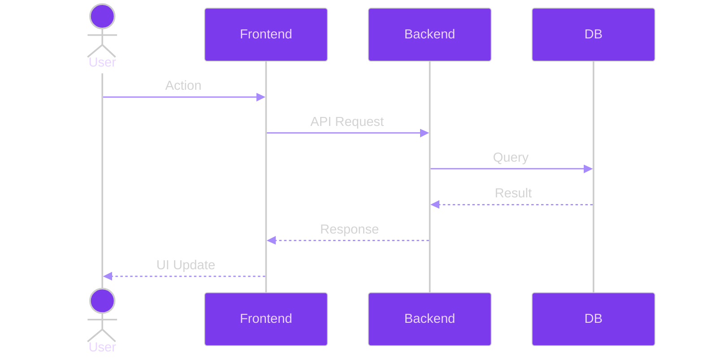

### 3. Class Diagrams

Show class hierarchies, interfaces, inheritance, and composition.
Use for: model definitions, service layers, abstract base classes,
design pattern implementations.

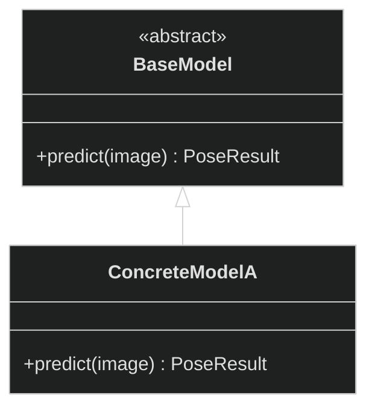

### 4. Entity-Relationship (ER) Diagrams

Show database entities, their attributes, and relationships. Use
for: data model files, migration documentation, schema overviews.

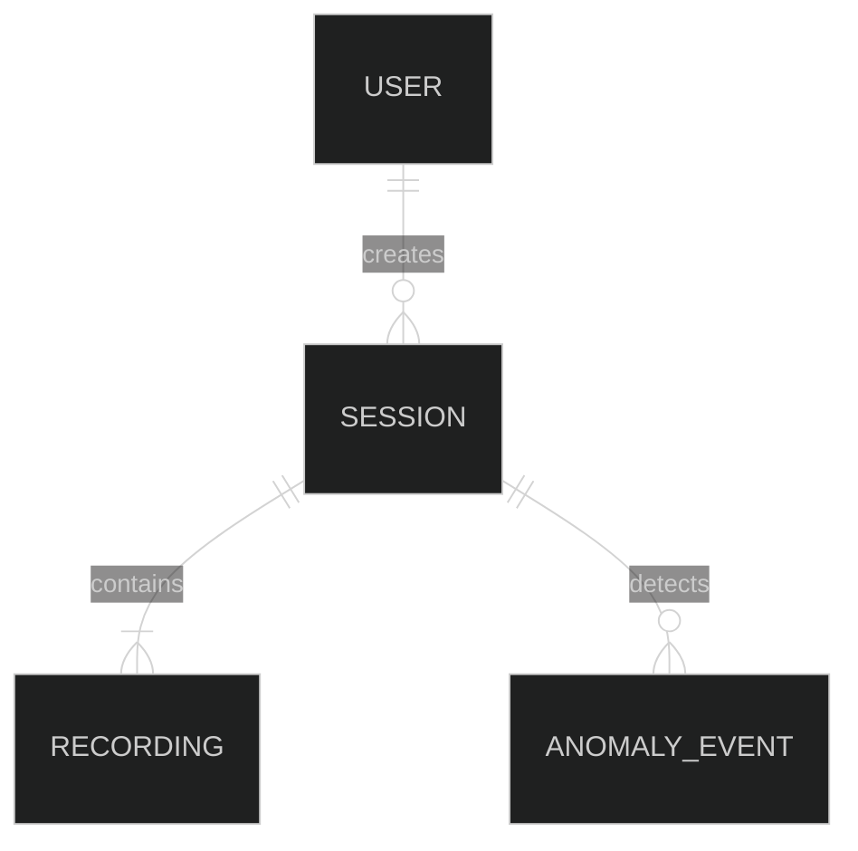

### 5. State Diagrams

Show state machines, transitions, and lifecycle states. Use for:
session lifecycle, anomaly triage workflow, recording states,
export job states, connection states.

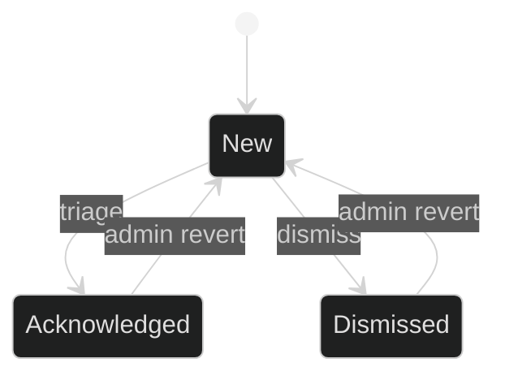

### 6. Gantt Charts

Show task timelines, dependencies, and phases. Use for: project
plans, migration schedules, deployment timelines, feature roadmaps.

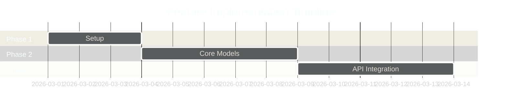

### 7. Pie Charts

Show proportional distributions. Use for: test coverage breakdown,
module size distributions, error type distributions, resource usage.

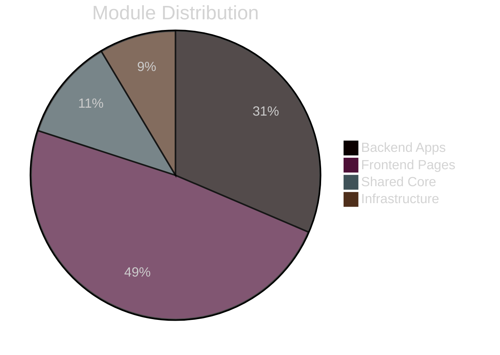

### 8. Mindmap Diagrams

Show hierarchical concept relationships. Use for: feature
breakdowns, module dependency trees, decision trees, architecture
overviews.

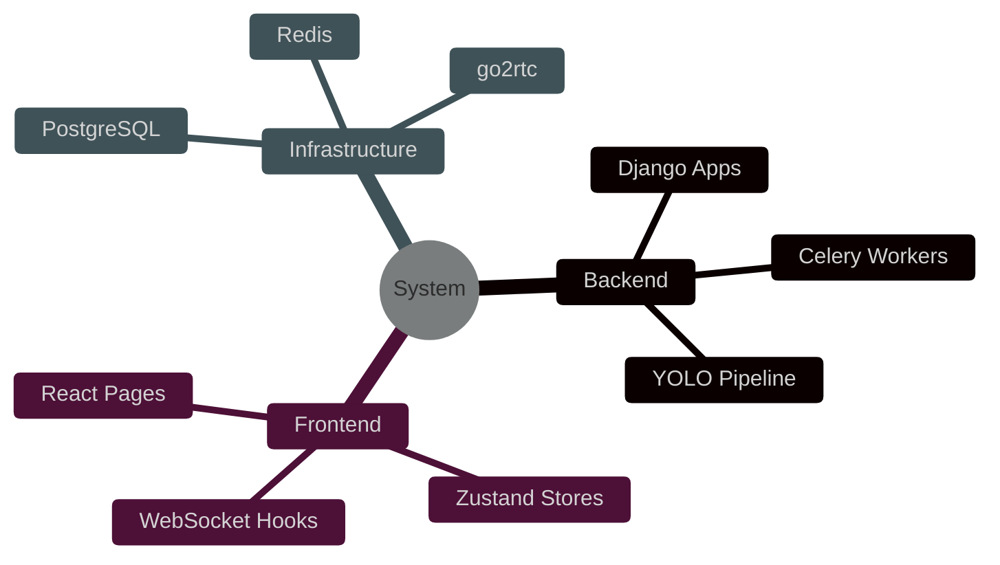

### 9. Git Graph Diagrams

Show branching strategies, merge flows, and release timelines. Use
for: branching documentation, release workflow, feature branch
lifecycle.

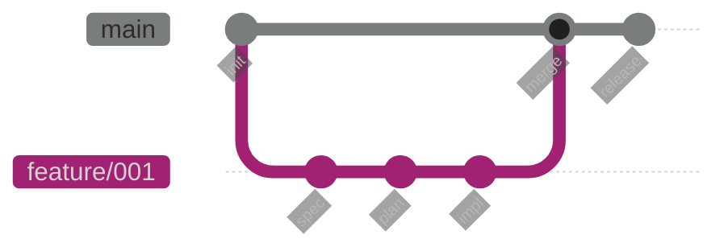

### 10. Architecture / C4 Diagrams (using flowchart)

Show high-level system architecture with layered containers. Use
for: system overview, deployment topology, service boundaries.

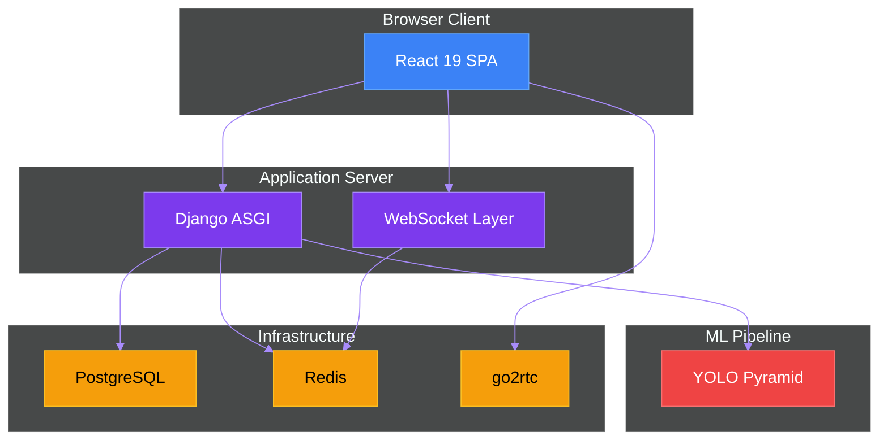

### 11. Timeline Diagrams

Show chronological sequences of events or milestones. Use for:
project milestones, incident timelines, session event sequences.

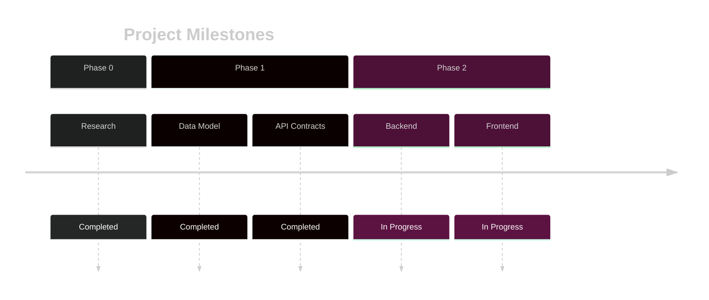

### 12. Quadrant Charts

Show prioritized comparisons on two axes. Use for: feature
prioritization, risk assessment, technology evaluation.

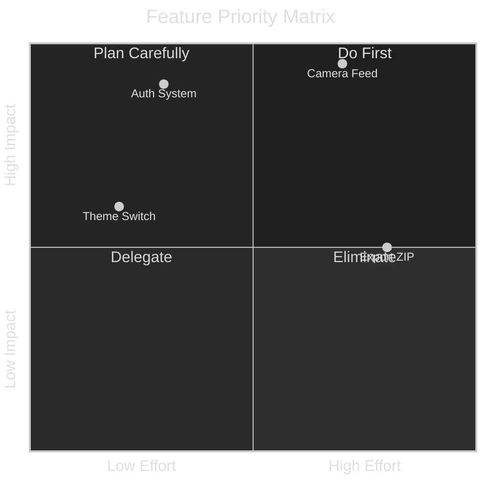

### Mandatory Entity Coverage in Diagrams (ALL MUST Be Shown)

Every `.md` documentation file MUST include diagrams that explicitly
show the relationships between ALL applicable entities in the
project. Diagrams MUST NOT be abstract — they MUST reference real
project entities by name. The following entity categories MUST be
covered wherever relevant:

1. **Files and Source Code Relationships**: Diagrams MUST show which
   source files depend on, import from, or interact with other source
   files. Use class diagrams or flowcharts to map file-to-file
   dependencies, inheritance chains, and import graphs.

2. **Users and Actors**: Diagrams MUST show all user roles (student,
   teacher, instructor, admin) and how they interact with the system.
   Use sequence diagrams or flowcharts to map user actions to system
   responses. ER diagrams MUST show User entities and their
   relationships to other data entities.

3. **Databases and Storage**: Diagrams MUST show all database
   tables/entities, their attributes, and relationships using ER
   diagrams. Data flow diagrams MUST show how data moves from input
   (video frames, user actions) through processing to storage
   (database, file system) and retrieval.

4. **ML Models and Detection Pipeline**: Diagrams MUST show all
   trained models (person detector, standing/sitting classifier,
   left/right classifier, forward/backward classifier, up/down
   classifier), their inputs, outputs, and how they connect within
   the feature pyramid. Use flowcharts for pipeline flow and class
   diagrams for model interfaces.

5. **All Project Entities**: Every entity defined in data-model.md,
   spec.md, or plan.md MUST appear in at least one diagram in the
   relevant documentation file. Entities include but are not limited
   to: Frame, Person Detection, Cropped Student Image, Behavior
   Prediction, Merged Behavior Record, Session, Recording, Anomaly
   Event, Camera Source, User Account.

**Enforcement**: A `.md` file that documents a module touching any
of the above categories but omits diagrams showing those entity
relationships is NOT considered complete. Agents MUST verify entity
coverage as part of the self-verification checklist.

## Diagram Explanation Requirements (MANDATORY)

Every Mermaid diagram in every `.md` file MUST follow this exact
documentation pattern:

1. **Introduction paragraph** (BEFORE the diagram): A paragraph
   explaining what the diagram shows, why it is included, and what
   the reader MUST focus on. This paragraph MUST:
   - State the diagram type (e.g., "The following sequence diagram
     shows...").
   - Explain the context (e.g., "...the authentication flow between
     the browser, Django backend, and PostgreSQL database").
   - Highlight key aspects to observe (e.g., "Note how the session
     cookie is validated during the WebSocket upgrade handshake").

2. **The Mermaid diagram code block** (the diagram itself).

3. **Detailed explanation section** (AFTER the diagram): A thorough
   walkthrough of the diagram that covers:
   - **Every node/actor**: What each box, circle, or actor
     represents in the system.
   - **Every edge/arrow**: What each connection means — the data
     or control flowing between nodes.
   - **Every decision point**: What conditions trigger each branch
     (for flowcharts and state diagrams).
   - **Temporal sequence**: The order of operations and why that
     order matters (for sequence diagrams).
   - **Color semantics**: What each color represents (if colors
     are used to encode meaning).
   - **Real-world mapping**: How diagram elements map to actual
     files, classes, functions, or infrastructure components in
     the codebase.

**Format example**:
```markdown
The following flowchart shows the anomaly triage workflow that
instructors follow when reviewing detected anomalies during a
live monitoring session. Focus on the first-write-wins locking
mechanism at the decision node.

Mermaid diagram block goes here.

**Detailed explanation**: The diagram begins with the **Anomaly
Detected** node (purple), representing a new anomaly event
created by the YOLO pipeline's rule engine
(`backend/apps/pipeline/rule_engine.py`). The event flows to
the **Instructor Review** node, where the instructor sees the
alert in the anomaly panel (`frontend/src/components/anomaly/
AnomalyPanel.tsx`). At the **Triage Decision** diamond, the
instructor chooses one of two paths: **Acknowledge** (marking
the event as reviewed, handled by `TriageService.acknowledge()`
in `backend/apps/anomalies/services.py`) or **Dismiss** (with
a mandatory reason, handled by `TriageService.dismiss()`). Both
paths converge at the **Audit Log** node, where the action is
recorded as an immutable `AuditLogEntry` in
`backend/apps/audit/models.py`. The red **Lock Check** gate
enforces first-write-wins: if another instructor has already
triaged this anomaly, the action is rejected with an "already
handled" message. The green **Success** node indicates the
triage is complete and all connected WebSocket clients receive
a status update via `AnomalyConsumer` in
`backend/apps/anomalies/consumers.py`.
```

**Agents MUST NOT**:
- Include a diagram without both introduction and explanation.
- Write vague explanations like "This diagram shows the flow."
- Skip nodes or edges in the explanation.
- Omit file path references where diagram nodes map to real code.

## .md File Interconnection (MANDATORY)

Every `.md` documentation file MUST be interconnected with all
related `.md` files through explicit relative Markdown links. No
`.md` file may exist in isolation.

### Cross-Reference Requirements

1. **Every `docs/` file MUST link to**:
   - The source file it documents (relative path).
   - The module's `README.md`.
   - All `docs/` files for modules it imports or depends on.
   - All `docs/` files for modules that import or depend on it.
   - The relevant spec file(s) in `specs/` if the module
     implements specific functional requirements.
   - The data model file (`data-model.md`) if the module defines
     or uses database entities.
   - The API contract file (`contracts/rest-api.md` or
     `contracts/websocket-api.md`) if the module exposes or
     consumes API endpoints.

2. **Every module `README.md` MUST link to**:
   - All `docs/` files for source files in that module.
   - The parent directory's `README.md` (e.g., `apps/README.md`
     or `backend/README.md`).
   - Related module `README.md` files for direct dependencies.
   - The constitution (`../.specify/memory/constitution.md`).

3. **Every spec file MUST link to**:
   - Related spec files (e.g., `spec.md` ↔ `plan.md` ↔
     `tasks.md` ↔ `data-model.md`).
   - The constitution.
   - Implementation source files and their `docs/` counterparts.

4. **Navigation aids**: Each `.md` file MUST include a
   **"Related Documents"** section at the bottom containing a
   bulleted list of all cross-referenced files with brief
   descriptions:

```markdown
## Related Documents

- [constitution.md](../../.specify/memory/constitution.md) —
  Project governance and coding standards
- [models.md](models.md) — Data models for this module
- [views.md](views.md) — API endpoints for this module
- [services.md](services.md) — Business logic for this module
- [../cameras/models.md](../cameras/models.md) — Camera models
  (dependency: CameraSource FK)
- [../../specs/001-exam-monitor-dashboard/spec.md](
  ../../specs/001-exam-monitor-dashboard/spec.md) — Feature
  specification
- [../../specs/001-exam-monitor-dashboard/data-model.md](
  ../../specs/001-exam-monitor-dashboard/data-model.md) — Database
  schema reference
```

5. **Link validation**: Agents MUST verify that all cross-reference
   links resolve to existing files. Broken links are a blocking
   finding.

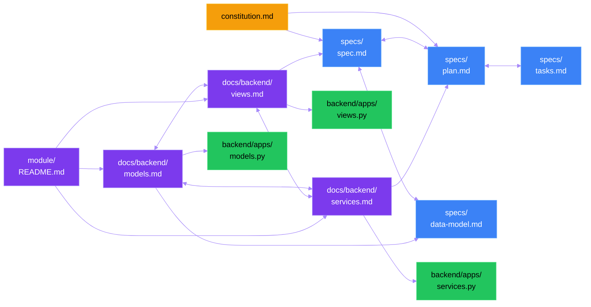

**Detailed explanation of the .md File Interconnection diagram
above**: This flowchart shows the mandatory cross-referencing
topology between all documentation file types in the project. On
the left side (blue nodes), the **spec files** form a tightly
linked cluster: `spec.md`, `plan.md`, `tasks.md`, and
`data-model.md` all link bidirectionally to each other, and all
link back to the **constitution** (yellow node at center-left).
In the middle column (purple nodes), the **docs/ directory files**
(`models.md`, `views.md`, `services.md`) are fully
cross-referenced with each other — because models are used by
views, views call services, and services operate on models. The
module **README.md** links down to all three docs/ files. On the
right side (green nodes), the **source files** (`models.py`,
`views.py`, `services.py`) are referenced by their corresponding
docs/ files. Crucially, docs/ files also link back to spec files:
`models.md` links to `data-model.md` (for schema reference),
`views.md` links to `spec.md` (for FR traceability), and
`services.md` links to `plan.md` (for architecture context). This
creates a fully navigable documentation graph where any reader can
traverse from any file to any related file.

## Documentation & Commit Standards

Documentation is a first-class deliverable. Every file, module, and
feature MUST be documented, and the project README MUST always
reflect the current state of the system.

### README.md (System-Level)

- A **major `README.md` MUST exist at the project root** from the
  very first commit and MUST be kept updated with every feature
  addition or structural change.
- The README MUST include: project overview, architecture diagram
  (Mermaid), setup instructions, module listing, contribution
  guidelines, and current feature status.
- **Every agent delivering work MUST update the root `README.md`**
  if the work adds, removes, or changes modules, features, or
  setup steps. This is a mandatory delivery artifact.
- A **separate `README.md` MUST exist for each top-level project
  directory** (`backend/README.md`, `frontend/README.md`) covering:
  project-specific setup, architecture, testing, and deployment.

### README.md (Per-Module — Mandatory)

- **Every module (package directory) MUST have its own `README.md`**.
  This applies to:
  - Every Django app (e.g., `backend/apps/accounts/README.md`,
    `backend/apps/cameras/README.md`, etc.)
  - Every frontend component domain (e.g.,
    `frontend/src/components/anomaly/README.md`,
    `frontend/src/stores/README.md`, etc.)
  - Every shared/core package (e.g., `backend/core/README.md`)
  - Every configuration package (e.g., `backend/config/README.md`)
- Each module README MUST include:
  - **Purpose**: What this module does and why it exists.
  - **Public API**: Key classes, functions, hooks, or components
    exported by this module.
  - **Dependencies**: Internal modules and external packages this
    module depends on.
  - **Usage examples**: How to import and use the module's API.
  - **Configuration**: Environment variables, settings, or config
    files the module requires.
- **Every agent creating a new module MUST create its README.md
  in the same commit.** This is non-negotiable — a module without
  a README is not considered delivered.
- **Every agent modifying a module MUST update its README.md** if
  the change affects the public API, dependencies, or configuration.
- **Post-work README gate**: After finishing ANY work session on a
  module (feature, fix, refactor, or documentation), the agent
  MUST verify the module's README.md exists and is current. If it
  does not exist, the agent MUST create it before marking the work
  as complete. This applies even to minor changes.

### Per-File Documentation

- **Every source file** MUST have a module-level docstring or header
  comment explaining its purpose, responsibilities, and key exports.
- **Documentation MUST be created alongside code** — not after. If
  a file is created, its documentation is created in the same
  commit.

### `docs/` Directory — Source Code Documentation (MANDATORY)

A project-level `docs/` directory MUST exist at the repository root.
This directory mirrors the folder structure of `backend/` and
`frontend/` but replaces every source code file (`.py`, `.ts`,
`.tsx`, `.js`, `.jsx`) with a corresponding `.md` Markdown file
that documents that source file comprehensively.

- **Structure rule**: The `docs/` folder MUST replicate the exact
  directory hierarchy of `backend/` and `frontend/`. For example:
  ```text
  docs/
  ├── backend/
  │   ├── apps/
  │   │   ├── accounts/
  │   │   │   ├── models.md
  │   │   │   ├── views.md
  │   │   │   ├── serializers.md
  │   │   │   ├── services.md
  │   │   │   ├── permissions.md
  │   │   │   └── urls.md
  │   │   ├── cameras/
  │   │   │   ├── models.md
  │   │   │   ├── views.md
  │   │   │   ├── consumers.md
  │   │   │   └── services.md
  │   │   └── ... (every app mirrors its source files)
  │   ├── config/
  │   │   ├── settings.md
  │   │   ├── urls.md
  │   │   ├── asgi.md
  │   │   └── celery.md
  │   └── core/
  │       ├── exceptions.md
  │       ├── logger.md
  │       ├── middleware.md
  │       └── pagination.md
  └── frontend/
      └── src/
          ├── components/
          │   └── ... (mirrors component files)
          ├── pages/
          │   └── ... (mirrors page files)
          ├── hooks/
          │   └── ... (mirrors hook files)
          ├── stores/
          │   └── ... (mirrors store files)
          └── api/
              └── ... (mirrors API files)
  ```
- **Content requirements for each `.md` file**:
  1. **Purpose**: What the source file does and why it exists.
  2. **Exports**: Every class, function, constant, type, hook, or
     component exported by the file — with brief descriptions.
  3. **Internal logic**: Explanation of key algorithms, business
     rules, and control flow within the file.
  4. **Dependencies**: All internal modules and external packages
     imported by the file, with explanation of why each is needed.
  5. **Cross-references**: How this file connects to other modules
     in the system — which files call it, which files it calls,
     and the data flow between them.
  6. **Mermaid diagram (MANDATORY)**: At least one Mermaid diagram
     per `.md` file showing the file's relationships, data flow,
     or class hierarchy. See the Mermaid Diagrams section below
     for formatting requirements.
- **Agent obligation**: Every agent MUST create or update the
  corresponding `docs/` `.md` file whenever it creates or modifies
  a source file. A source file without its `docs/` counterpart is
  NOT considered delivered.
- **New module creation**: When an agent creates a new module or
  package, it MUST also create all corresponding `docs/` files in
  the same commit.
- **Modification rule**: When an agent modifies a source file in a
  way that changes its public API, dependencies, or control flow,
  the corresponding `docs/` `.md` file MUST be updated in the same
  commit.
- **Review gate**: Pull requests MUST include `docs/` updates for
  every source file touched. PRs missing `docs/` updates for
  modified files are a blocking review finding.

### Mermaid Diagrams

- **Architecture diagrams MUST use Mermaid syntax** for rendering
  in Markdown (GitHub, GitLab, VS Code all render natively).
- Diagrams MUST be **colorful**: use `style`, `classDef`, or
  `%%{init: {'theme': ...}}%%` directives to apply distinct colors
  to different component types.
- Diagrams MUST have **readable, properly sized text**: node labels
  MUST be concise (≤5 words), and diagrams MUST be tested for
  readability at standard viewport widths.
- **Text fitting**: All text inside diagram nodes, edges, and
  labels MUST be fully visible without truncation or overflow.
  Agents MUST verify that diagram labels do not exceed node
  boundaries by keeping labels short and using line breaks
  (`<br/>`) for multi-word labels when necessary.
- **Diagram sizing**: Diagrams MUST render correctly at a viewport
  width of 900px minimum. Use `%%{init: {'theme': 'base',
  'themeVariables': {'fontSize': '14px'}}}%%` or equivalent to
  ensure consistent font sizing across renderers.
- **ALL diagram types are MANDATORY**: Every `.md` file in the
  `docs/` directory MUST include diagrams from ALL applicable
  categories listed in the **Mandatory Diagram Types** section
  above. The minimum set per file is:
  - At least one **flowchart** OR **sequence diagram** showing
    the file's primary control/data flow.
  - At least one **class diagram** OR **ER diagram** showing
    the file's data structures or relationships.
  - At least one **state diagram** if the file manages stateful
    entities (sessions, recordings, anomalies, exports).
  - Additional diagram types (pie, gantt, mindmap, timeline,
    quadrant, git graph) MUST be included wherever they add
    value to understanding.
- **Detailed explanations are MANDATORY**: Every diagram MUST have
  an introduction paragraph and a detailed walkthrough explanation
  as specified in the **Diagram Explanation Requirements** section.
  Diagrams without explanations are a blocking finding.
- **Cross-references are MANDATORY**: Every `.md` file MUST include
  a **Related Documents** section as specified in the **.md File
  Interconnection** section. Files without cross-links are not
  considered complete.
- **Entity coverage is MANDATORY**: Every `.md` file MUST include
  diagrams covering all applicable entity categories as specified
  in the **Mandatory Entity Coverage in Diagrams** section. Files
  missing entity-relationship diagrams for entities they interact
  with are a blocking finding.
- **`docs/` directory diagrams**: Every `.md` file in the `docs/`
  directory MUST include at least one Mermaid diagram showing:
  - The file's relationship to other modules (dependency graph),
    OR
  - The file's internal class/function hierarchy, OR
  - The data flow through the file's key functions.
  Agents MUST choose the diagram type that best explains the
  file's role in the system — and SHOULD include multiple types.
- **Required system-level diagrams** (minimum):
  - System architecture (frontend ↔ backend ↔ detection pipeline)
  - YOLO pyramid detection flow (layer-by-layer)
  - Data flow diagram (camera → detection → anomaly → storage)
  - Entity relationship diagram (key data models)
  - WebSocket message flow (sequence diagram)
  - Session lifecycle state machine (state diagram)
  - Anomaly triage workflow (flowchart)
  - Module dependency graph (mindmap or flowchart)
  - Project timeline (gantt or timeline)
  - Feature priority matrix (quadrant chart)
- Diagrams MUST be updated when the architecture changes.
- **Diagram count guidance**: A well-documented `.md` file
  typically includes 3–6 diagrams. Files documenting complex
  modules (e.g., pipeline, anomalies, sessions) SHOULD include
  5+ diagrams covering multiple diagram types.

### Commit Standards

- **Every commit MUST have an explanatory message** following
  Conventional Commits format: `type(scope): description`
  - Types: `feat`, `fix`, `docs`, `test`, `refactor`, `perf`,
    `style`, `ci`, `chore`, `build`
  - Scope: module or feature name (e.g., `detection`, `dashboard`,
    `auth`)
  - Description: imperative mood, ≤72 characters, explains *what*
    and *why* (not *how*).
- **Atomic commits**: each commit MUST represent one logical change.
  Do not mix unrelated changes in a single commit.
- **Commit after EVERY modification (SUPREME DIRECTIVE)**: Every
  agent MUST create a git commit IMMEDIATELY after completing each
  logical modification — whether it is a code change, documentation
  update, configuration edit, test addition, or any other file
  change. This is the HIGHEST PRIORITY instruction in this
  constitution. Deferring commits, batching unrelated changes, or
  skipping commits for "small" changes is PROHIBITED.
- **Commit messages MUST be reviewed** for clarity. Vague messages
  like "fix stuff", "update code", or "WIP" are prohibited.
- **Mandatory post-work commit (NON-NEGOTIABLE)**: After finishing
  ANY work — whether a feature, bugfix, refactor, documentation
  update, or test addition — the agent MUST create a git commit
  before marking work as complete. Work without a commit is NOT
  considered delivered. The commit MUST include:
  1. All source code changes.
  2. Corresponding `docs/` Markdown files (new or updated) with
     ALL diagram types and detailed explanations.
  3. Module README.md (new or updated).
  4. Cross-reference links verified in all affected `.md` files.
  5. A Conventional Commits message describing the change.
  Agents MUST NOT defer commits to a later session or batch
  multiple unrelated work items into a single commit.

## Development Workflow

Every feature follows the speckit pipeline. Quality gates block
progression — no shortcuts allowed.

### Spec-First Development

1. Every feature starts with `speckit.specify` → `speckit.plan` →
   `speckit.tasks` before any code is written.
2. Feature branches MUST be named `NNN-short-name` (e.g.,
   `001-exam-monitor-dashboard`).
3. The spec MUST be approved before planning begins. The plan MUST
   be approved before implementation begins.

### Test-in-Loop Development (MANDATORY)

Every implementation task MUST follow the Test-in-Loop workflow
defined in Principle II. This means:

1. Before implementing any feature task, write ALL tests (unit,
   integration, system) for that task.
2. Verify all tests fail (RED phase).
3. Implement code while running tests continuously (GREEN phase).
4. Refactor with continuous test verification (CLEAN phase).
5. Full suite verification before marking task complete.

No implementation task may skip this workflow. Agents MUST NOT
write implementation code before the corresponding tests exist.

### Quality Gates (Blocking)

1. **Pre-commit**: Lint + format + type-check MUST pass.
2. **Pre-merge**: Full test pipeline (Unit -> Integration -> System)
   MUST pass. Coverage MUST be collected and published for every run.
   Coverage thresholds are release-policy inputs (not implicit hard
   blockers) and MUST be enforced only by explicit gate configuration.
   Required automated categories for applicable changes include:
   regression, contract, smoke, and performance/load tests with
   documented thresholds and published results.
3. **PR approval**: Every change MUST be submitted as a Pull
   Request, MUST receive automated approval checks before merging,
   and MUST also receive human approval when the change affects
   protected or sensitive areas (or when automated checks flag
   issues). Direct pushes to protected branches are prohibited.
4. **Constitution compliance**: Every PR/review MUST verify
  adherence to all 12 principles (I-XII). Non-compliance is a
  blocking finding.
5. **Documentation check**: README.md updated, module docs present,
   `docs/` directory `.md` files created/updated for all touched
   source files, Mermaid diagrams current.
6. **Diagram completeness check**: Every `.md` file MUST include
   ALL applicable diagram types from the Mandatory Diagram Types
   list. Every diagram MUST have introduction + detailed
   explanation. Every `.md` file MUST have a Related Documents
   section with cross-links to all related files. Every `.md`
   file MUST include entity-relationship diagrams covering all
   applicable entity categories.
7. **Test-in-Loop compliance check**: Every implementation task
   MUST demonstrate that tests were written before implementation.
   Test commit timestamps MUST precede implementation commit
   timestamps for the same feature.
8. **System wiring hardening check**: Frontend-backend,
   backend-Triton, Docker development, and native Linux production
   wiring MUST have documented contracts, Mermaid diagrams, and
   passing integration/system tests. Live-stream and offline-video
   paths MUST both be verified for video/inference features.

### Pull Request & Code Review (MANDATORY)

Every code change — regardless of size — MUST go through a Pull
Request reviewed before merging. This is a non-negotiable gate.

- **Branch strategy**: All work MUST be done on the spec feature
  branch tied to the active spec (e.g., `NNN-feature-name`). Teams
  MUST reuse that spec branch for iterative PRs and MUST NOT create
  a new branch for each Pull Request. Direct commits to protected
  base branches are prohibited.
- **PR creation**: Every agent completing a task MUST commit
  changes and open a Pull Request targeting the appropriate base
  branch.
- **Automated review**: Every PR MUST be reviewed by CodeRabbit
  (or equivalent automated reviewer) before merge. CodeRabbit
  findings rated "critical" or "high" are blocking.
- **Human review**: For changes affecting architecture, security,
  or constitution compliance, at least one human reviewer MUST
  approve the PR in addition to automated review.
- **PR description**: Every PR MUST include a clear description
  of what changed and why, referencing the task ID or spec
  requirement (e.g., `Closes T015`, `Implements FR-023`).
- **No self-merge without review**: An agent or developer MUST
  NOT merge their own PR without at least one approval (automated
  or human).
- **Merge strategy**: Squash-merge for single-task PRs; merge
  commit for multi-task PRs to preserve individual commit history.

### Agent Collaboration Rules

- All agents MUST read existing plans, tasks, and constitution
  before proposing changes.
- All agents MUST use the same design patterns, naming conventions,
  and module structure established in the implementation plan.
- Agents MUST NOT introduce conflicting patterns or duplicate
  existing functionality.
- Agents MUST update shared artifacts (task list, plan, README)
  when changes affect other modules.
- **All agents MUST commit work on a branch and create a Pull
  Request** — work is not considered submitted until a PR exists
  and has been reviewed. For a given spec, agents MUST use the same
  spec branch rather than creating per-PR branches.
- **All agents MUST follow the Test-in-Loop workflow** — tests
  first, implementation second. No exceptions.

### Continuous Integration

- CI pipeline: lint → type-check → unit tests → integration tests
  → system tests (all stages blocking).
- CI MUST execute automated regression, contract, smoke, and
  performance/load suites for applicable changes; skipped categories
  MUST include explicit non-applicability rationale in CI output.
- CI MUST run on every push and every pull request.
- CI MUST verify both Windows and Linux compatibility.
- Parallel test execution SHOULD be enabled by default with
  framework-native workers/processes (e.g., Vitest workers,
  Playwright workers, pytest-xdist) while preserving deterministic
  isolation for databases, files, and network ports.
- When enabling parallelism, teams MUST avoid nested concurrency
  collisions (for example, running multiple xdist invocations in
  parallel that share identical worker DB names).
- CI and local scripts MUST expose explicit knobs for worker counts
  (fixed number or percentage) so execution can be tuned per host.

## Governance

This constitution is the supreme governance document for the
Student Cheating Analyzer & Detector project. It supersedes all
other development practices, agent instructions, and ad-hoc
decisions.

- **Amendments** require: (1) explicit rationale documented in
  the Sync Impact Report, (2) version bump following semantic
  versioning (MAJOR for principle removal/redefinition, MINOR for
  additions, PATCH for clarifications), (3) propagation to all
  dependent templates.
- **All PRs and code reviews MUST verify compliance** with every
  applicable principle. Reviewers MUST use the constitution
  checklist.
- **Complexity MUST be justified** — default to simplicity. YAGNI
  applies unless the constitution explicitly mandates otherwise.
- **Video and inference planning MUST cover both runtime modes**:
  live-stream processing and offline video processing. Missing one
  mode requires explicit non-applicability rationale.
- **Production deployment governance MUST assume no Docker on Linux
  servers**. Docker-specific steps are limited to development and
  test unless production Docker access is explicitly ratified by a
  future constitution amendment.
- **Quarterly principle review** recommended to assess relevance
  and update thresholds.
- **`.specify/memory/constitution.md`** is the single source of
  truth. No shadow governance documents.
- **Non-compliance is a blocking review finding** — code MUST NOT
  merge until all violations are resolved or formally exempted with
  documented rationale in the Complexity Tracking table.

**Version**: 1.8.1 | **Ratified**: 2026-02-27 | **Last Amended**: 2026-05-17
