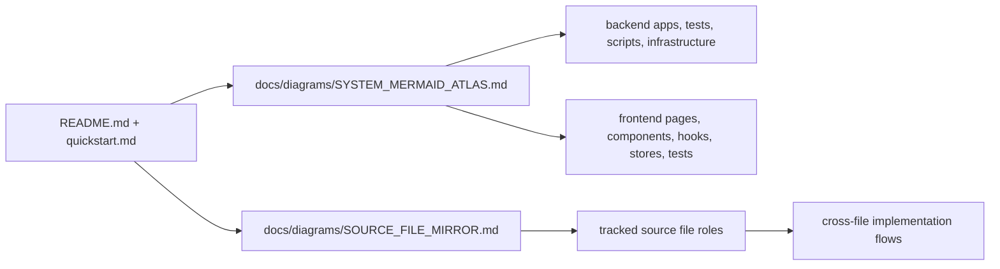
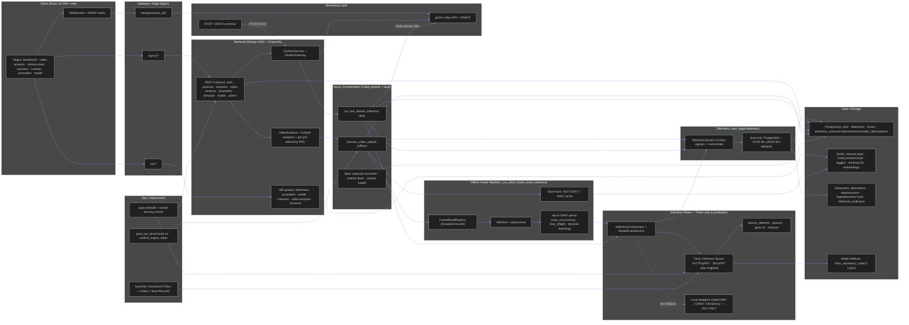
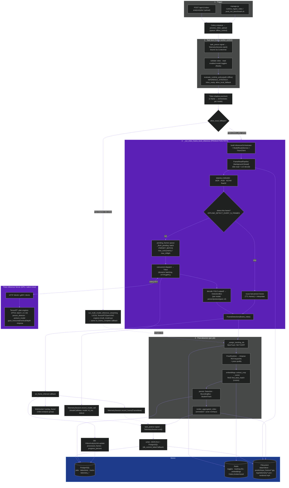
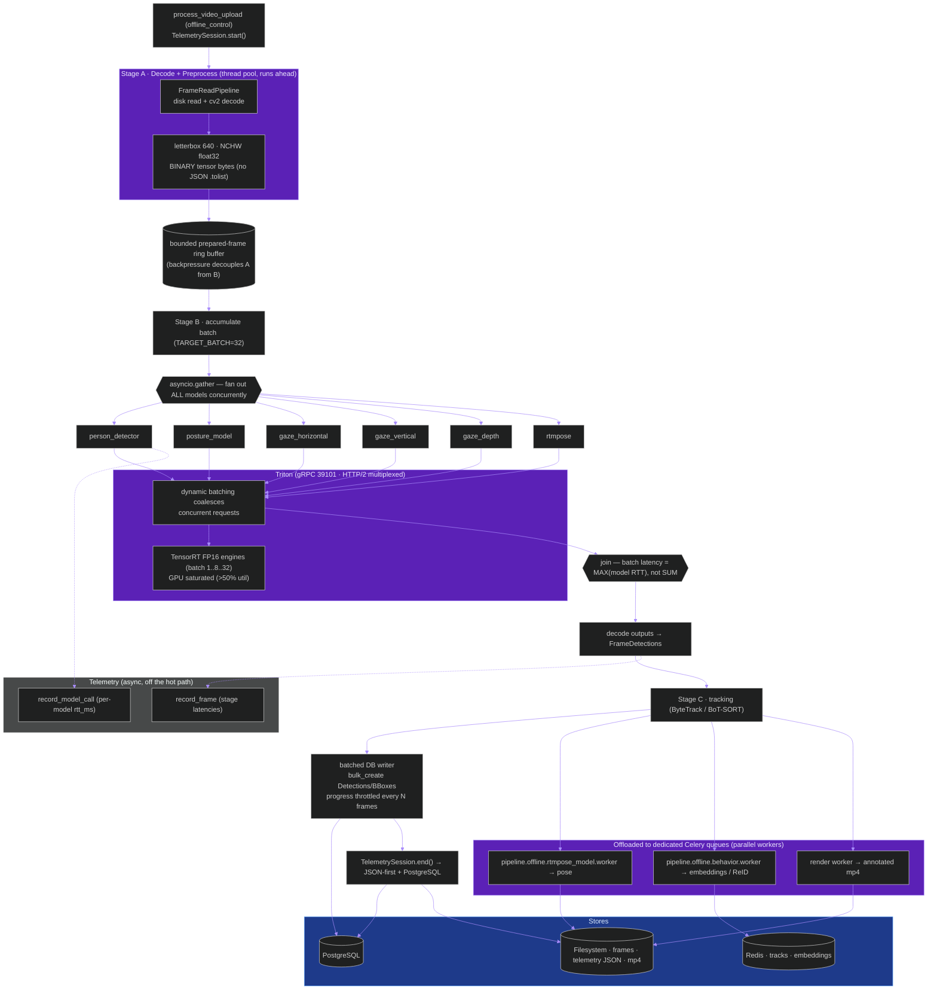
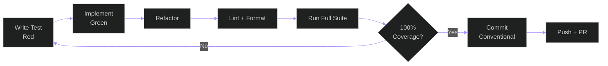

# Exam Monitoring Dashboard

Temporal behavioral intelligence platform with a Django backend, React
frontend, WebSocket live updates, offline video analysis, camera streaming
through go2rtc, and Triton-authoritative production inference.

**Maintainer:** Eng.Ahmed ElBamby

## Repository Status

- Active local branches: `master`, `006-modular-low-coupling`
- Primary remote branches present: `origin/001-exam-monitor-dashboard`, `origin/master`, `origin/006-modular-low-coupling`
- Documentation coverage status: the authored backend, frontend, script, and infrastructure inventory currently maps to `docs/` with `Missing docs: 0`
- Required documentation gate: `scripts/ci/verify_docs_diagrams.py` currently passes

## Documentation Map

- [Documentation index](docs/INDEX.md)
- [System Mermaid atlas](docs/diagrams/SYSTEM_MERMAID_ATLAS.md)
- [Source file mirror](docs/diagrams/SOURCE_FILE_MIRROR.md)
- [Backend architecture docs](docs/backend/architecture/)
- [Frontend docs](docs/frontend/)
- [Script docs](docs/scripts/)
- [Infrastructure docs](docs/infra/)



The flowchart shows how the root project documentation fans out into the architecture atlas, inventory mirror, and per-entity reference pages.

## Implemented System Areas

- Authentication, roles, and admin account management
- Cameras, go2rtc registration, and live feed status
- Monitoring sessions and dashboard views
- Live detections, anomaly triage, and comments
- Recordings and session exports
- Offline video upload, processing, playback, and overlay visibility
- Shared pipeline, tracking, and runtime policy logic
- Health monitoring and release-gate verification scripts

## High-Level Architecture



This diagram reflects the **currently implemented** runtime contracts in code.
Video-analysis and camera APIs launch Celery `process_video_upload` (offline) and
`run_live_stream_inference` (live) pipelines. The offline pipeline decodes frames
on a background thread (`FrameReadPipeline`), preprocesses them, and feeds an
**async batch queue** that dispatches concurrent, dynamically-batched requests to
Triton through the `InferenceOrchestrator` + `ModelRouteService`. Every run is
captured by the **telemetry layer** (`apps.telemetry`) via Celery signals and a
ContextVar, written atomically to PostgreSQL tables and a JSON file. Tracking
(ByteTrack/BoT-SORT) and ReID embeddings are cached in Redis; Celery **beat**
drives the stale-job reconciler and periodic maintenance. Under
`.specify/memory/constitution.md`, the local OpenVINO/ONNX/Ultralytics adapters
are **development-only** — production inference is native-Linux, GPU-backed,
**Triton-only**, with exactly one active live or offline endpoint profile at a time.

## Triton Model Inference End to End lifecycle (Sequential Order )

This is the **currently implemented** offline inference lifecycle, in the real
execution order: trigger → Celery task boot → runtime-policy decision → the
Triton-only frame pipeline (threaded decode → preprocess → async batch queue →
Triton/TensorRT) → per-frame side effects (DB progress, WebSocket overlay,
telemetry) → post-detection stages (tracking → pose → embeddings/ReID →
persistence → render) → telemetry session flush. The hybrid local path is shown
dashed; it is development-only and bypassed in production.



> **Known limitation (sequential):** within a frame-batch the 5–6 models are
> dispatched one after another (`for task_key in task_keys`), so per-batch
> latency is the **sum** of model RTTs; frame-batches and post-stages also run
> serially, and tensors are JSON-encoded. These are the targets of the
> parallelization plan below.

## Triton Model Inference End to End (Parallel )

This is the **intended parallelized** design (see
[docs/inference_parallelization_plan.md](docs/inference_parallelization_plan.md),
the project's current **highest-priority** performance plan). It overlaps the
decode/preprocess, dispatch, and post/persist stages (double/triple buffering),
**fans out all models concurrently** with `asyncio.gather` so per-batch latency
is the **max** model RTT instead of the sum, sends **binary tensors over gRPC**
(no JSON `.tolist()`), lets **Triton dynamic batching** coalesce concurrent
requests into large GPU batches, **batches DB writes**, and **offloads** pose /
embeddings / render to dedicated Celery queue workers.



> Stages A/B/C run **overlapped**: while batch *K* is inferring (B), batch *K+1*
> is decoding/preprocessing (A) and batch *K−1* is persisting (C). Expected
> trajectory: today ~0.5–5 fps (GPU ~1%) → Phase 1 (binary + concurrent models)
> ~15–40 fps → Phase 3 (gRPC) ~40–80 fps → Phase 4–5 (batched DB + GPU batching)
> 100+ fps with GPU >50%. Every phase is measured via the telemetry layer.

## Repository Layout

```text
grad_project/
  backend/                Django apps, config, core, tests, tools
  frontend/               React SPA, tests, Vite config
  docs/                   Mermaid-backed documentation suite
  infra/                  Docker and systemd support files
  scripts/                CI and Triton helper scripts
  specs/                  Feature specs and evidence
  docker-compose.dev.yml  Dev services
  nginx.conf              Reverse proxy rules
  go2rtc.yaml             Streaming bridge config
  quickstart.md           Step-by-step local setup
```

## Linux Deployment Custom Notes (No Docker, No sudo)

For constrained Linux deployment servers where Docker and sudo are not allowed, Triton and TensorRT require a custom user-space setup.

What is different from standard setup:

- Triton server is built from source in user space (no container build).
- TensorRT runtime is installed in project venv and linked through `LD_LIBRARY_PATH`.
- Extra third-party headers/libraries are vendored in user space:
  - RapidJSON
  - Boost headers
  - libb64 headers and static lib
  - TensorRT headers (for backend compilation)
- Triton TensorRT backend plugin is built separately and installed into Triton backends.

Recommended paths used in production deployment:

- Triton source: `/home/bamby/services/triton_src`
- Triton build tree: `/home/bamby/services/triton_build_r2502`
- Triton runtime binary: `/home/bamby/services/triton_build_r2502/tritonserver/install/bin/tritonserver`
- Triton model repository (CUDA12 profile): `/home/bamby/grad_project/backend/models/triton_repository_cuda12`

Key requirement:

- Always start Triton with explicit backend directory:
  - `--backend-directory=/home/bamby/services/triton_build_r2502/tritonserver/install/backends`
- Validate exactly one active production endpoint profile before admitting
  inference: live `39000/39001/39002` or offline `39100/39101/39102`.
- Treat local inference adapters as non-production only; unavailable Triton
  causes a fail-closed or explicitly non-authoritative degraded state.

See [quickstart.md](/E:/grad_project/quickstart.md) section `Linux Deployment Runbook (No Docker, No sudo)` for exact commands.

## Backend Surface

- Django 5.1.5
- Channels 4.2.2 with Daphne
- DRF 3.15.2
- Celery 5.4.0
- PostgreSQL 16
- Redis 7
- Ultralytics 8.3.61
- ONNX 1.21.0
- ONNX Runtime 1.25.1
- OpenVINO 2026.1.0

Installed backend apps from `backend/config/settings/base.py`:

- `apps.accounts`
- `apps.cameras`
- `apps.detections`
- `apps.anomalies`
- `apps.sessions`
- `apps.recordings`
- `apps.exams`
- `apps.exports`
- `apps.audit`
- `apps.health`
- `apps.pipeline`
- `apps.video_analysis`
- `apps.tracking`

## Frontend Surface

- React 19.2.0
- TypeScript 5.9
- Vite 7.3.1
- Zustand 5.0.11
- Axios 1.13.6
- React Router 7.13.1
- Vitest 4.0.18
- Playwright 1.58.2

Implemented protected routes from `frontend/src/App.tsx`:

- `/dashboard`
- `/sessions`
- `/sessions/:id`
- `/camera-feed`
- `/cameras`
- `/predictions`
- `/video-analysis`
- `/video-analysis/:jobId`
- `/anomalies`
- `/recordings`
- `/recordings/:id`
- `/health`
- `/settings`
- `/change-password`

Public route:

- `/login`

## Frontend Quality Gates (Spec 001 Cross-Cutting)

- UI consistency (FR-033): shared UI primitives are centralized in `frontend/src/components/ui` and consumed across pages/components (see `docs/frontend/src/components/README.md`).
- Loading states (FR-034): all async page/workflow fetches expose loading UX (`LoadingSpinner`, button busy states, or section placeholders).
- Keyboard navigation (FR-035): modal focus trap, skip-link to `#main-content`, focusable sidebar/header controls, and page-level route navigation remain keyboard-operable.
- Error handling (FR-036): page-level `ErrorBoundary` wrappers in `frontend/src/App.tsx` provide user-safe fallback messages and structured `console.error` diagnostics.
- 1920×1080 baseline (FR-037): app shell, header, and collapsible sidebar preserve functionality at minimum supported desktop resolution.
- Auto-restart policy (FR-049): dev compose services use `restart: unless-stopped` for supervisor-style automatic recovery.
- WCAG contrast audit (T164): run `cd frontend && npm run audit:contrast` to validate theme token pairs against AA (4.5:1) thresholds.

## Environment Files

The root `.env` is the active runtime file used by Django, Celery, pipeline services, and some shared frontend defaults. `.env.example` is the starter template. `frontend/.env.example` documents the frontend-only variables used by the Vite dev server and browser build.

The tables below document:

- every variable present in the checked-in root `.env.example`
- additional variables currently present in the active root `.env`
- the frontend-specific variables present in `frontend/.env.example`

### Root App And Service Variables

| Variable | Example / Default | Used by | Why it exists | Acceptable values | Role / operational effect |
| --- | --- | --- | --- | --- | --- |
| `DJANGO_SECRET_KEY` | `change-me` | `backend/config/settings/base.py` | Provides Django cryptographic signing for sessions, CSRF, and internal secrets. | Any long random string. Production should use a high-entropy secret. | Changing it invalidates existing signed sessions/tokens. Weak values reduce application security. |
| `DJANGO_DEBUG` | `True` in `.env.example` | Not currently consumed by the active settings modules | Present as a common Django convenience variable, but this repository currently decides debug mode from the selected settings module (`development.py` vs `production.py`). | `True` / `False` / `1` / `0` if you keep it for operator clarity. | At the moment it has no direct effect unless the settings layout is changed to read it. |
| `DJANGO_ALLOWED_HOSTS` | `localhost,127.0.0.1` | `backend/config/settings/base.py`, `backend/config/settings/production.py` | Controls which `Host` headers Django accepts. | Comma-separated hostnames/IPs, for example `localhost,127.0.0.1,example.com`. | Wrong values cause `DisallowedHost` errors; overly broad values weaken host-header protection. |
| `POSTGRES_DB` | `exam_monitor` | `backend/config/settings/base.py` | Selects the PostgreSQL database name. | Existing PostgreSQL database name string. | If it does not match the provisioned DB, backend startup and migrations fail. |
| `POSTGRES_USER` | `exam_user` | `backend/config/settings/base.py` | Selects the PostgreSQL login user. | Existing PostgreSQL username. | Wrong value prevents DB authentication. |
| `POSTGRES_PASSWORD` | `exam_pass` | `backend/config/settings/base.py` | Supplies the PostgreSQL password. | Password matching the selected DB user. | Wrong value prevents DB authentication. |
| `POSTGRES_HOST` | `localhost` | `backend/config/settings/base.py` | Tells Django where PostgreSQL is reachable. | Hostname, service name, or IP. Example: `localhost`, `db`. | Wrong host breaks backend DB connectivity. |
| `POSTGRES_PORT` | `5432` | `backend/config/settings/base.py` | Tells Django which PostgreSQL port to use. | Integer port, usually `5432`. | Wrong port breaks backend DB connectivity. |
| `REDIS_URL` | `redis://localhost:6379/0` | `backend/config/settings/base.py` | Shared Redis endpoint used by Django Channels and some app storage paths. | Valid Redis URL with DB index. Example `redis://host:6379/0`. | Wrong value breaks channel layers and any Redis-backed coordination. |
| `CELERY_BROKER_URL` | `redis://localhost:6379/1` | `backend/config/celery.py` | Supplies Celery's task broker endpoint. | Valid broker URL; current stack expects Redis. | Wrong value prevents task dispatch and background job execution. |
| `CELERY_RESULT_BACKEND` | `redis://localhost:6379/2` | `backend/config/celery.py` | Stores Celery task state/results. | Valid backend URL; current stack expects Redis. | Wrong value removes or corrupts async task result tracking. |
| `CELERY_WORKER_POOL` | `solo` on Windows, `prefork` otherwise | `backend/config/celery.py` | Lets operators choose the Celery worker execution pool. Present in the active `.env`, not in `.env.example`. | Typical values: `solo`, `prefork`, `threads`. | Bad values can prevent workers from starting; `solo` is safest on Windows but lower throughput. |
| `CELERY_WORKER_CONCURRENCY` | `1` on Windows or CPU-count on Linux | `backend/config/celery.py` | Overrides Celery worker concurrency. Present in the active `.env`, not in `.env.example`. | Positive integer. | Higher values increase parallelism but also CPU/RAM pressure. |
| `FIELD_ENCRYPTION_KEY` | `change-me-generate-a-fernet-key` | `backend/apps/cameras/fields.py`, `backend/apps/cameras/migrations/0003_encrypt_existing_urls.py` | Encrypts camera connection URLs at rest. | A valid Fernet key generated by `cryptography.fernet.Fernet.generate_key()`. | Missing or invalid values break encrypted camera field access and the URL-encryption migration. |
| `GO2RTC_API_URL` | `http://localhost:1984` | `backend/apps/cameras/services.py` | Backend endpoint used to register/query go2rtc stream state. | Base HTTP URL for the go2rtc API. | Wrong value prevents stream provisioning and status calls. |
| `GO2RTC_WHEP_URL` | `http://localhost:8555` | Shared runtime documentation; current frontend WHEP flow uses `/whep` proxy instead of reading this variable directly | Documents the WHEP bridge endpoint used by the streaming topology. | HTTP URL for the WHEP-capable go2rtc endpoint. | Keep it aligned with the deployed go2rtc WHEP listener even if the browser path is currently proxied. |
| `ONVIF_USERNAME` | empty by default | `backend/apps/cameras/services.py` (`OnvifResolver`) | Username for ONVIF camera device-service authentication. | Valid ONVIF account username. | Required when connecting cameras via ONVIF device-service URLs. |
| `ONVIF_PASSWORD` | empty by default | `backend/apps/cameras/services.py` (`OnvifResolver`) | Password for ONVIF camera device-service authentication. | Valid ONVIF account password. | Required when connecting cameras via ONVIF device-service URLs. |
| `ONVIF_WSDL_DIR` | empty by default | `backend/apps/cameras/services.py` (`OnvifResolver`) | Filesystem path to ONVIF WSDL definitions used by the ONVIF client. | Absolute directory path containing ONVIF WSDL files. | Required for ONVIF resolution; missing path causes ONVIF connection failure. |
| `VITE_API_BASE_URL` | `http://localhost:8000/api/v1` | `frontend/src/api/client.ts` | Sets the browser-facing REST API base URL. | Absolute URL or a same-origin path such as `/api/v1`. | Wrong value breaks all frontend REST calls. |
| `VITE_WS_BASE_URL` | `ws://localhost:8000/ws` in root `.env.example` | `frontend/src/hooks/useWebSocket.ts` | Sets the WebSocket base used by the monitoring hook. | `ws://...`, `wss://...`, or leave unset to derive from page origin. | Wrong value breaks live socket subscriptions and reconnect flow. |
| `VITE_GO2RTC_WHEP_URL` | `http://localhost:8555` | Shared root env template only | Legacy/shared root variable documenting the WHEP listener. The current frontend hook uses the `/whep/{camera_id}/` proxy route and `frontend/.env.example` uses `VITE_GO2RTC_URL` instead. | HTTP URL. | Keep only if you want one root env to describe all streaming endpoints; it is not the browser variable currently consumed by `useWhepClient.ts`. |

### Root Pipeline And Model Variables

| Variable | Example / Default | Used by | Why it exists | Acceptable values | Role / operational effect |
| --- | --- | --- | --- | --- | --- |
| `PYRAMID_MODELS_BASE_DIRECTORY` | `backend/models` | `backend/config/settings/base.py`, `backend/apps/pipeline/config.py` | Points the pipeline to the model artifact root. | Relative or absolute filesystem path. | Wrong path makes model resolution fail. |
| `PYRAMID_RAW_DATA_DIRECTORY` | `Raw Data` | `backend/config/settings/base.py`, `backend/apps/pipeline/config.py` | Points to raw dataset/test video material. | Relative or absolute filesystem path. | Wrong path breaks dataset-backed validation and some test/development flows. |
| `PYRAMID_INFERENCE_BACKEND` | `tensorrt` | `backend/apps/pipeline/config.py` | Chooses a local adapter for development or expressly non-production validation only. | `onnx`, `openvino`, `tensorrt`. | MUST NOT satisfy production inference authority. |
| `PYRAMID_PERSON_DETECTOR_PATH` | `student_teacher/weights/student_teacher.engine` | `backend/config/settings/base.py`, `backend/apps/pipeline/config.py` | Selects the person detector artifact. | Relative path under the models base directory or absolute path. | Wrong path breaks student/teacher detection. |
| `PYRAMID_PERSON_DETECTOR_RUNTIME` | `TensorRT` | `backend/apps/pipeline/config.py` | Per-model runtime override for the person detector. | `auto`, `onnx`, `openvino`, `tensorrt` and supported aliases. | Forces detector execution backend regardless of global backend. |
| `PYRAMID_POSTURE_MODEL_PATH` | `standing_sitting/weights/standing_sitting.engine` | `backend/config/settings/base.py`, `backend/apps/pipeline/config.py` | Selects the posture model artifact. | Valid model path. | Wrong path breaks standing/sitting classification. |
| `PYRAMID_POSTURE_MODEL_RUNTIME` | `TensorRT` | `backend/apps/pipeline/config.py` | Per-model runtime override for posture inference. | `auto`, `onnx`, `openvino`, `tensorrt`. | Overrides the runtime for this model family only. |
| `PYRAMID_HORIZONTAL_GAZE_MODEL_PATH` | `right_left/weights/right_left.engine` | `backend/config/settings/base.py`, `backend/apps/pipeline/config.py` | Selects the horizontal gaze model artifact. | Valid model path. | Wrong path breaks left/right gaze classification. |
| `PYRAMID_HORIZONTAL_GAZE_MODEL_RUNTIME` | `TensorRT` | `backend/apps/pipeline/config.py` | Per-model runtime override for horizontal gaze inference. | `auto`, `onnx`, `openvino`, `tensorrt`. | Overrides backend selection for this model family. |
| `PYRAMID_DEPTH_GAZE_MODEL_PATH` | `forward_backward/weights/forward_backward.engine` | `backend/config/settings/base.py`, `backend/apps/pipeline/config.py` | Selects the depth gaze model artifact. | Valid model path. | Wrong path breaks forward/backward gaze classification. |
| `PYRAMID_DEPTH_GAZE_MODEL_RUNTIME` | `TensorRT` | `backend/apps/pipeline/config.py` | Per-model runtime override for depth gaze inference. | `auto`, `onnx`, `openvino`, `tensorrt`. | Overrides backend selection for this model family. |
| `PYRAMID_VERTICAL_GAZE_MODEL_PATH` | `up_down/weights/up_down.engine` | `backend/config/settings/base.py`, `backend/apps/pipeline/config.py` | Selects the vertical gaze model artifact. | Valid model path. | Wrong path breaks up/down gaze classification. |
| `PYRAMID_VERTICAL_GAZE_MODEL_RUNTIME` | `TensorRT` | `backend/apps/pipeline/config.py` | Per-model runtime override for vertical gaze inference. | `auto`, `onnx`, `openvino`, `tensorrt`. | Overrides backend selection for this model family. |
| `PYRAMID_TRACKING_MODEL_RUNTIME` | `TensorRT` | `backend/apps/pipeline/config.py` | Runtime override for the tracking model path where applicable. | `auto`, `onnx`, `openvino`, `tensorrt`. | Can change tracker hardware/runtime behavior. |
| `PYRAMID_TRACKING_ALGORITHM` | `bytetrack` | `backend/apps/pipeline/config.py` | Default tracker family. | Common values in this codebase: `bytetrack`, `botsort`. | Sets the default tracker when no user preference overrides it. |
| `PYRAMID_TRACKING_REID_ALGORITHM` | `botsort` | `backend/apps/pipeline/config.py` | Declares which tracker is considered ReID-capable. | Typically `botsort` or another configured tracker key. | Used when users enable tracking IDs and appearance matching. |
| `PYRAMID_TRACKING_LOW_COMPUTE_ALGORITHM` | `bytetrack` | `backend/apps/pipeline/config.py` | Defines the lower-cost tracker used when users disable tracking IDs. | Typical value `bytetrack`. | Reduces compute cost for ID-free overlays. |
| `PYRAMID_TRACKING_REID_ENABLED` | `true` | `backend/apps/pipeline/config.py` | Master flag for appearance-based re-identification. | Boolean-like values: `true/false`, `1/0`, `yes/no`. | If `false`, ReID is disabled even when a ReID-capable tracker is selected. |
| `PYRAMID_TRACKING_IOU_THRESHOLD` | `0.3` | `backend/apps/pipeline/config.py` | Threshold for frame-to-frame IoU association. | Float from `0.0` to `1.0`. | Lower values allow looser matching; higher values are stricter and can fragment tracks. |
| `PYRAMID_TRACKING_MAX_CENTER_DISTANCE` | `160.0` | `backend/apps/pipeline/config.py` | Maximum centroid distance for association. | Positive float, validated up to `4096.0`. | Larger values permit more aggressive reassociation across movement. |
| `PYRAMID_TRACKING_REID_SIMILARITY_THRESHOLD` | `0.85` | `backend/apps/pipeline/config.py` | Similarity cutoff for ReID matching. | Float from `0.0` to `1.0`. | Higher values reduce false matches but can miss legitimate re-links. |
| `PYRAMID_EMBEDDING_REDIS_TTL_SECONDS` | `2592000` | `backend/apps/pipeline/config.py` | TTL for student embedding entries stored in Redis. | Integer from `60` to `31536000`. | Higher TTL keeps ReID memory longer but increases stale-data lifetime. |
| `PYRAMID_RTSP_OVER_TCP` | `true` | `backend/apps/cameras/services.py`, `backend/apps/pipeline/config.py` | Forces RTSP transport over TCP on unstable networks. | Boolean-like values. | Improves reliability on lossy networks, sometimes at latency cost. |
| `PYRAMID_RTSP_TRANSPORT` | `tcp` | `backend/apps/cameras/services.py`, `backend/apps/pipeline/config.py` | Declares the preferred RTSP transport mode. | `tcp`, `udp`, `auto`. | Affects how RTSP URLs are normalized before going to go2rtc/pipeline code. |
| `PYRAMID_INFERENCE_AUDIT_ENABLED` | `true` | `backend/apps/pipeline/config.py`, `backend/apps/video_analysis/tasks.py` | Persists detailed inference audit JSON for offline analysis jobs. | Boolean-like values. | Enables/disables audit artifact generation under the video storage tree. |
| `PYRAMID_INFERENCE_AUDIT_LIVE_ENABLED` | `true` | `backend/apps/pipeline/config.py` | Persists audit events for live streaming flows. | Boolean-like values. | Controls live-stream audit persistence overhead. |
| `PYRAMID_DEVICE` | `cuda` | `backend/config/settings/base.py`, `backend/apps/pipeline/config.py` | Preferred device for non-production local adapter work. | `cpu`, `cuda`, `mps`. | Does not govern native Triton production execution. |
| `PYRAMID_OPENVINO_DEVICE` | `intel:gpu` | `backend/apps/pipeline/config.py` | Target device string for OpenVINO execution. | Strings such as `intel:gpu`, `intel:cpu`, `intel:npu`. | Changes OpenVINO deployment target. |
| `PYRAMID_PERSON_CONFIDENCE_THRESHOLD` | `0.5` | `backend/config/settings/base.py`, `backend/apps/pipeline/config.py` | Minimum confidence for person detection acceptance. | Float from `0.0` to `1.0`. | Higher values reduce false positives but can drop real detections. |
| `PYRAMID_BEHAVIOR_CONFIDENCE_THRESHOLD` | `0.5` | `backend/config/settings/base.py`, `backend/apps/pipeline/config.py` | Minimum confidence for posture/gaze/behavior acceptance. | Float from `0.0` to `1.0`. | Higher values reduce noisy labels but can suppress valid behavior events. |
| `PYRAMID_WORKER_COUNT` | `4` | `backend/config/settings/base.py`, `backend/apps/pipeline/config.py` | Parallel worker count for inference workloads. | Integer from `1` to `16` in config validation. | Higher values improve throughput until CPU/GPU saturation. |
| `PYRAMID_INFERENCE_TIMEOUT` | `30.0` | `backend/config/settings/base.py`, `backend/apps/pipeline/config.py` | Per-inference timeout in seconds for local model execution. | Float from `1.0` to `300.0`. | Prevents stuck inference calls from hanging the job indefinitely. |
| `PYRAMID_BENCHMARK_WARMUP_ITERATIONS` | `10` | `backend/config/settings/base.py`, `backend/apps/pipeline/config.py` | Warm-up cycle count for benchmark runs. | Integer from `0` to `100`. | More warm-up gives more stable benchmark data at higher startup cost. |
| `PYRAMID_BENCHMARK_SAMPLE_COUNT` | `100` | `backend/config/settings/base.py`, `backend/apps/pipeline/config.py` | Sample count for benchmark measurement. | Integer from `10` to `1000`. | Higher values improve benchmark stability but lengthen test runs. |

### Root `.env` Operational Extensions

These variables are present in the active root `.env` and are supported by the code, but they are not currently pre-seeded in the checked-in root `.env.example`.

| Variable | Example / Default | Used by | Why it exists | Acceptable values | Role / operational effect |
| --- | --- | --- | --- | --- | --- |
| `PYRAMID_PRESERVE_SOURCE_QUALITY` | `true` | `backend/apps/pipeline/config.py`, `backend/apps/pipeline/multi_model.py`, `backend/apps/tracking/video_exporter.py` | Keeps annotated output closer to source fidelity. | Boolean-like values. | When `true`, output encoding defaults stay closer to source quality; when `false`, exports can be more compressed. |
| `PYRAMID_INFERENCE_IMGSZ` | `0` | `backend/apps/pipeline/config.py`, `backend/apps/pipeline/detector.py`, `backend/apps/pipeline/multi_model.py`, `backend/apps/tracking/tracker.py` | Global inference image-size override. | Integer from `0` to `4096`. `0` means use backend defaults. | Larger sizes can improve accuracy but increase latency and memory. |
| `PYRAMID_STREAM_INFERENCE_IMGSZ` | `0` | `backend/apps/pipeline/config.py` and stream inference call sites | Stream-specific image-size override. | Integer from `0` to `4096`. `0` falls back to `PYRAMID_INFERENCE_IMGSZ` or backend defaults. | Lets live streaming use a different inference size from offline jobs. |
| `PYRAMID_OUTPUT_MAX_WIDTH` | `0` | `backend/apps/pipeline/config.py`, `backend/apps/pipeline/multi_model.py` | Caps annotated output width. | Integer from `0` to `8192`. `0` keeps source width. | Useful to downscale exports and reduce file size. |
| `PYRAMID_OUTPUT_MAX_HEIGHT` | `0` | `backend/apps/pipeline/config.py`, `backend/apps/pipeline/multi_model.py` | Caps annotated output height. | Integer from `0` to `8192`. `0` keeps source height. | Useful to downscale exports and reduce file size. |
| `PYRAMID_OUTPUT_VIDEO_CRF` | `18` | `backend/apps/pipeline/config.py`, `backend/apps/pipeline/multi_model.py`, `backend/apps/tracking/video_exporter.py` | Sets H.264 CRF for annotated outputs. | Integer from `0` to `51`. Lower means better quality and larger files. | Directly controls output video quality/size tradeoff. |
| `PYRAMID_OUTPUT_VIDEO_PRESET` | `medium` | `backend/apps/pipeline/config.py`, `backend/apps/pipeline/multi_model.py`, `backend/apps/tracking/video_exporter.py` | Sets FFmpeg H.264 preset. | Typical FFmpeg presets such as `ultrafast`, `fast`, `medium`, `slow`. | Faster presets reduce CPU cost but usually produce larger files. |
| `PYRAMID_OUTPUT_VIDEO_BITRATE` | empty string or values like `6M` | `backend/apps/pipeline/config.py`, `backend/apps/pipeline/multi_model.py`, `backend/apps/tracking/video_exporter.py` | Optional explicit bitrate target. | Empty string or FFmpeg bitrate notation such as `4M`, `6000k`. | If set, it steers output bitrate instead of CRF-only encoding. |
| `PYRAMID_OUTPUT_JPEG_QUALITY` | `95` | `backend/apps/pipeline/config.py`, `backend/apps/tracking/video_exporter.py` | Controls JPEG quality for intermediate images. | Integer from `1` to `100`. | Higher values improve image fidelity and increase storage size. |
| `TRITON_ENABLED` | `0` in base defaults, `1` in development defaults | `backend/config/settings/base.py`, `backend/config/settings/development.py`, inference client factory, runtime policy, video analysis tasks | Transitional switch for local/dev wiring; production MUST enable Triton authority. | Boolean-like values. | Production startup MUST reject disabled Triton inference. |
| `TRITON_FORCE_DOCKER` | `0` in base defaults, `1` in development defaults | `backend/config/settings/base.py`, `backend/config/settings/development.py`, runtime policy, multi-model loader | Development Docker-specific behavior only. | Boolean-like values. | MUST NOT be a native Linux production dependency. |
| `TRITON_HYBRID_LOCAL_PERSISTENCE` | `1` | `backend/config/settings/base.py`, runtime policy, multi-model loader | Allows local model persistence while Triton routing is enabled. | Boolean-like values. | If `false` with forced Triton, local model loading is intentionally disabled. |
| `TRITON_REQUIRED_OFFLINE` | `0` in base defaults, `1` in development defaults | `backend/config/settings/base.py`, `backend/config/settings/development.py`, runtime policy, offline analysis tasks | Requires Triton for offline jobs. | Boolean-like values. | MUST be true for production offline activation. |
| `TRITON_REQUIRED_LIVE` | `0` in base defaults, `1` in development defaults | `backend/config/settings/base.py`, `backend/config/settings/development.py`, runtime policy | Requires Triton for live streaming analysis. | Boolean-like values. | MUST be true for production live activation. |
| `TRITON_URL` | `http://localhost:8000` | `backend/config/settings/base.py`, health views, inference client factory, video analysis tasks, core configuration | Base HTTP endpoint for Triton inference and health checks. | Reachable Triton HTTP URL. | Wrong value breaks Triton health checks and inference calls. |
| `TRITON_TIMEOUT_MS` | `1500` in base defaults | `backend/config/settings/base.py`, inference client factory, video analysis tasks, core configuration | Default per-request Triton timeout. | Positive integer milliseconds. | Lower values fail fast; overly low values can create false timeouts. |
| `TRITON_MAX_TIMEOUT_MS` | `5000` in base defaults | `backend/config/settings/base.py`, inference client factory, video analysis tasks, core configuration | Upper bound for requested Triton timeout. | Positive integer milliseconds greater than or equal to the normal timeout. | Prevents callers from requesting unbounded Triton waits. |
| `TRITON_RETRY_ATTEMPTS` | `2` | `backend/config/settings/base.py` | Retry count for Triton request logic. | Non-negative integer. | Higher values improve resilience but increase worst-case latency. |
| `TRITON_RETRY_TIMEOUT_SCALE` | `2.0` | `backend/config/settings/base.py` | Backoff scale applied between Triton retries. | Positive float. | Higher values back off more aggressively between attempts. |
| `TRITON_OFFLINE_FRAME_STRIDE` | `10` | `backend/config/settings/base.py`, `backend/apps/video_analysis/tasks.py` | Thins frame submission cadence for offline Triton processing. | Positive integer. | Higher values reduce load and accuracy granularity; lower values process more frames. |
| `TRITON_CROP_BEHAVIOR_INPUT_SIZE` | `640` | `backend/config/settings/base.py`, `backend/apps/video_analysis/tasks.py` | Selects the square crop-frame input size used only for posture/gaze behavior crops. | Integer >= 32 divisible by 32. Values below 640 require matching TensorRT plans and Triton configs built by `tools/prod/prod_enable_roi_crop_behavior.sh`. | Reduces crop-frame behavior pixels and Python/gRPC tensor traffic when paired with matching engines; mismatched configs make Triton reject requests. |
| `TRITON_BEHAVIOR_ENSEMBLE` | `0` in base defaults, `1` in optimized production helper | `backend/config/settings/base.py`, `backend/apps/video_analysis/tasks.py`, `backend/apps/pipeline/services/triton_client.py`, `tools/prod/prod_start_triton.sh` | Routes crop-frame behavior fan-out through `behavior_ensemble` so one crop tensor upload feeds posture plus the three gaze models. | Boolean-like values. Requires `behavior_ensemble` in `TRITON_LOAD_MODEL` and a valid Triton ensemble config. | When enabled, reduces behavior request fragmentation; rollback is setting this to `0`, which restores the four standalone model calls. |
| `GAZE_HORIZONTAL_HEAD_VARIANT` | `coco80`; accepted production profile sets `slice`; `gaze2` is rejected | `backend/config/settings/base.py`, `backend/apps/video_analysis/tasks.py`, `tools/prod/prod_start_triton.sh`, `tools/prod/prod_enable_gaze_horizontal_gaze2.sh`, `tools/prod/prod_enable_gaze_horizontal_slice.sh` | Selects the horizontal-gaze output contract. `coco80` expects `[84,2100]`; `gaze2` expects `[6,2100]` from the rejected standalone `gaze_horizontal_gaze2_model`; `slice` expects `[6,2100]` from exact server-side slicing after the legacy model. | `coco80`, `gaze2`, or `slice`. Non-`coco80` values require matching model route overrides and Triton configs. | `slice` is the accepted exact-output-fusion route from production benchmark `cycle9b-exactslice-crop-frame-20260601T233211`; compact class IDs remap back to legacy DB IDs `4/5`; rollback is `coco80` via `prod_enable_parallel_flow.sh --profile per-frame-signals`. |

### Frontend `frontend/.env.example` Variables

These are the frontend-specific names currently documented by the Vite app.

| Variable | Example / Default | Used by | Why it exists | Acceptable values | Role / operational effect |
| --- | --- | --- | --- | --- | --- |
| `VITE_API_BASE_URL` | `http://localhost:8000/api/v1` | `frontend/src/api/client.ts` | Sets the REST base URL for Axios. | Absolute URL or same-origin path. | Wrong value breaks REST requests in the browser. |
| `VITE_WS_BASE_URL` | `ws://localhost:8000` | `frontend/src/hooks/useWebSocket.ts` | Sets the WebSocket host base; the hook appends route paths such as `/ws/monitor`. | `ws://...` or `wss://...`, no trailing slash preferred. | Wrong value breaks monitor socket connections. |
| `VITE_GO2RTC_URL` | `http://localhost:1984` | `frontend/src/hooks/useWhepClient.ts`, `frontend/vite.config.ts` `/whep` proxy design context | Documents the go2rtc base endpoint used by the WebRTC/WHEP streaming flow. | HTTP URL for go2rtc. | Keep this aligned with the deployed go2rtc instance and the Vite/nginx proxy target expectations. |

Frontend Vite proxy behavior from `frontend/vite.config.ts`:

- `/api` proxies to `VITE_API_PROXY_TARGET` or `http://localhost:8000`
- `/ws` proxies to the matching WebSocket target derived from the API proxy target
- `/whep` proxies to `http://localhost:1984` and rewrites requests into the go2rtc `/api/webrtc?src=camera_{id}` format

### ONVIF Endpoints

ONVIF integration is available through camera API endpoints:

- `POST /api/v1/cameras/onvif/resolve/` with JSON body `{"connection_url":"http://<host>/onvif/device_service"}` resolves ONVIF to RTSP URL.
- `POST /api/v1/cameras/onvif/test/` validates resolved RTSP using the active stream provider (default `gst_mediamtx` path).
- `POST /api/v1/cameras/{camera_id}/onvif/sync/` resolves RTSP for a stored ONVIF camera.

Required env vars for ONVIF resolution:

- `ONVIF_USERNAME`
- `ONVIF_PASSWORD`
- `ONVIF_WSDL_DIR`

## Development Commands

### Infrastructure

```powershell
docker compose -f docker-compose.dev.yml up -d
docker compose -f docker-compose.dev.yml down
docker compose -f docker-compose.dev.yml logs -f postgres
docker compose -f docker-compose.dev.yml --profile triton up -d triton
```

### Backend

```powershell
cd backend
uv sync --dev
uv run python manage.py migrate
uv run python manage.py createsuperuser
uv run python manage.py runserver
uv run celery -A config worker -l info
uv run celery -A config beat -l info
uv run pytest
```

### Frontend

```powershell
cd frontend
npm install
npm run dev
npm run lint
npm run type-check
npm run test
npm run test:coverage
npm run test:e2e
npm run build
```

### Documentation and CI Gates

```powershell
python scripts\ci\verify_docs_diagrams.py
python scripts\ci\verify_module_boundaries.py
python scripts\ci\verify_release_gate.py --phase blocking --unit-result success --integration-result success --contract-result success
```

### Triton Helper Scripts

```powershell
.\scripts\pull-triton-image.ps1
.\scripts\pull-triton-image.ps1 -BuildProjectImage
.\scripts\export-tensorrt-models.ps1
.\scripts\sync-triton-tensorrt-repository.ps1
```

## Quick Setup

Use [quickstart.md](quickstart.md) for the full step-by-step workflow. The short version is:

1. Copy `.env.example` to `.env`
2. Start `docker-compose.dev.yml`
3. Sync backend dependencies with `uv`
4. Run backend migrations and services
5. Install frontend dependencies and start Vite
6. Optionally start Triton using the compose profile
7. Run verification commands

## Beta Sign-off

For consolidated release-readiness status, open [docs/release-beta-signoff-checklist.md](docs/release-beta-signoff-checklist.md).

Current consolidated state (as of 2026-05-21): `CONDITIONAL GO` with explicit remaining risks and non-green gates documented in that checklist.

## Known Issues And Fixes

### 1. Celery beat schedule corruption on Windows

Symptoms:

- `celery beat` fails with schedule database errors

Fix:

```powershell
cd backend
Remove-Item -Force celerybeat-schedule -ErrorAction SilentlyContinue
uv run celery -A config beat -l info
```

### 2. Frontend cannot reach backend in development

Symptoms:

- API calls fail from `localhost:5173`
- WebSocket connection fails

Checks:

- Backend is running on `http://localhost:8000`
- `frontend/vite.config.ts` proxy is active
- `VITE_API_BASE_URL` and `VITE_WS_BASE_URL` are consistent with your chosen setup

### 3. go2rtc WHEP feed does not open

Checks:

- `docker compose -f docker-compose.dev.yml up -d go2rtc`
- `GO2RTC_API_URL` and `GO2RTC_WHEP_URL` are correct
- Camera source registration exists in the backend

### 4. Triton profile does not start

Checks:

- Use `docker compose -f docker-compose.dev.yml --profile triton up -d triton`
- NVIDIA GPU and Docker GPU runtime are available
- Model repository path `backend/models/triton_repository` exists

### 5. Missing encrypted camera URL key

Symptoms:

- Camera persistence or decrypt/encrypt operations fail

Fix:

```powershell
python -c "from cryptography.fernet import Fernet; print(Fernet.generate_key().decode())"
```

Put the generated value into `FIELD_ENCRYPTION_KEY` in `.env`.

### 6. Documentation drift

Run:

```powershell
python scripts\ci\verify_docs_diagrams.py
python scripts\ci\verify_module_boundaries.py
```

## Recommended Validation Sequence



The diagram shows the recommended development and validation loop used in the project workflow.

## Testing Notes

- Backend `pytest.ini` uses `config.settings.test`
- Frontend coverage thresholds in `vite.config.ts` are set to `80` for lines, functions, branches, and statements
- Playwright scripts are available through `npm run test:e2e` and `npm run test:e2e:ui`

## Next References

- [Quickstart](quickstart.md)
- [Backend README](backend/README.md)
- [Frontend README](frontend/README.md)
