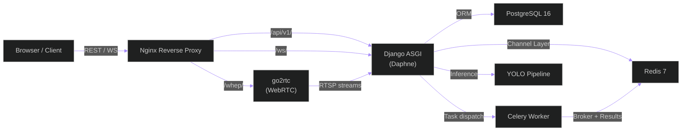
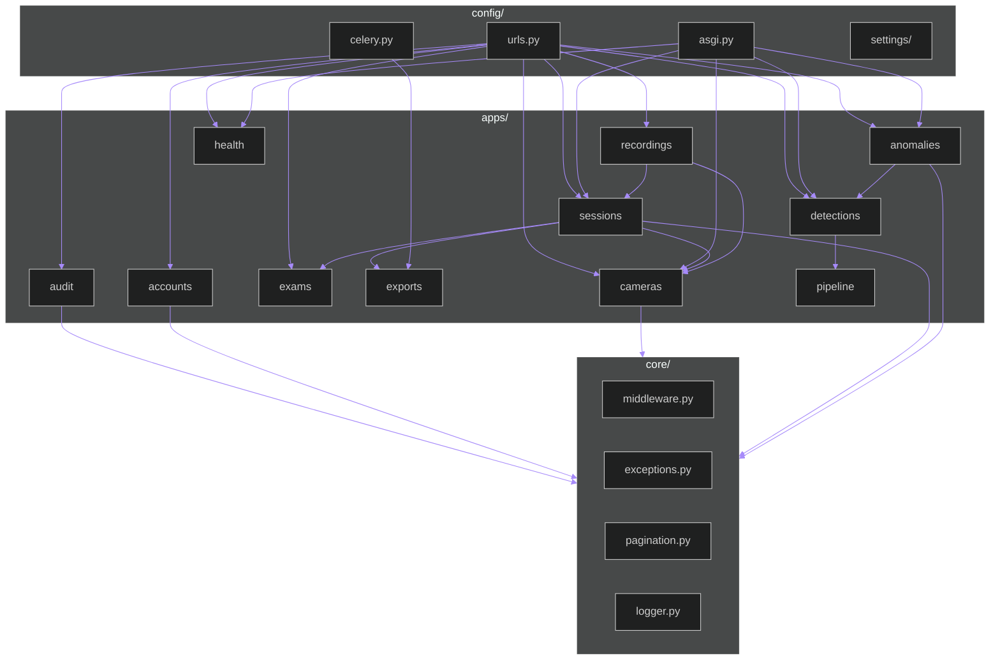
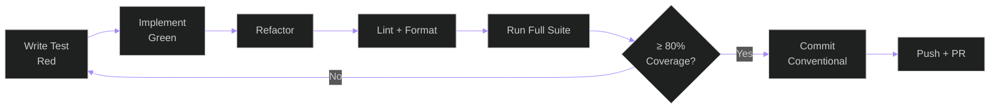

# Exam Monitoring Dashboard — Backend Module

Django REST + WebSocket API for real-time exam hall monitoring with YOLO-based
multi-layer detection, anomaly alerting, triage workflows, session recording,
and admin management.

---

## 1) Module Purpose

This module provides:

- Session-based authentication with RBAC (Role-Based Access Control)
- REST API for cameras, exams, sessions, recordings, anomalies, and admin operations
- Real-time WebSocket channels for live detection overlays, anomaly alerts, and health telemetry
- Multi-layer YOLO pyramid inference pipeline (posture + gaze analysis)
- Celery-powered async tasks for session exports and data cleanup
- Immutable append-only audit logging for all state-changing actions
- System health monitoring (database, Redis, WebSocket layer, storage)

---

## 2) Tech Stack

| Layer | Technology | Version |
|-------|-----------|---------|
| Framework | Django | 5.1.5 |
| REST API | Django REST Framework | 3.15.2 |
| Async / WebSocket | Django Channels + Daphne | 4.2.2 |
| Task Queue | Celery | 5.4.0 |
| Database | PostgreSQL | 16 |
| Cache / Broker / Channel Layer | Redis | 7 |
| ML Inference | Ultralytics (YOLO) | 8.3.61 |
| Validation | Pydantic | 2.10.6 |
| CORS | django-cors-headers | — |
| DB Adapter | psycopg | 3.2.5 |
| Testing | pytest + pytest-django + pytest-asyncio + factory_boy | — |

---

## 3) Prerequisites

| Tool | Version | Why |
|------|---------|-----|
| Python | 3.11+ | Backend runtime |
| PostgreSQL | 16 | Primary database |
| Redis | 7 | Channel layer, cache, Celery broker |
| go2rtc | ≥ 1.9 | RTSP → WebRTC sidecar for low-latency video |
| Docker | 20+ | Infrastructure containers (recommended) |
| Intel GPU + OpenVINO | 2026.1 (optional) | OpenVINO inference on Intel GPU |

---

## 4) Local Setup

### 4.1 Python Environment (uv)

```bash
cd backend
uv sync --dev
```

Use `uv run <command>` for all backend commands without manual activation.

If you still have an older manually-managed `.venv`, remove it before syncing
so uv creates a clean environment:

```bash
deactivate
rm -rf .venv
uv sync --dev
```

### 4.3 Start Infrastructure (Docker Compose)

From the repository root:

```bash
docker compose -f docker-compose.dev.yml up -d
```

This starts PostgreSQL 16, Redis 7, and go2rtc. If you prefer native
installs, create the database manually:

```sql
CREATE DATABASE exam_monitor;
CREATE USER exam_user WITH PASSWORD 'exam_pass';
GRANT ALL PRIVILEGES ON DATABASE exam_monitor TO exam_user;
```

### 4.4 Environment Variables

```bash
# From repository root
cp .env.example .env
```

Edit `.env` with your local values (see §5 for the full variable reference).

### 4.5 Database Migrations

```bash
uv run python manage.py migrate
```

Creates all 16 tables: `User`, `Role`, `Room`, `Exam`, `ExamStudent`,
`CameraSource`, `MonitoringSession`, `InstructorComment`, `DetectionFrame`,
`Detection`, `PyramidPrediction`, `AnomalyEvent`, `AnomalyNote`, `Recording`,
`AuditLogEntry`, `SessionExport`.

Built-in roles (**Admin**, **Instructor**) are seeded automatically by migration
`accounts.0004_seed_builtin_roles` during `migrate`.

### 4.6 Create Admin

```bash
uv run python manage.py createsuperuser  # first admin account
```

### 4.7 Run Development Server

```bash
# Single-terminal supervised mode (recommended on Windows for clean Ctrl+C shutdown)
uv run python scripts/dev_supervisor.py

# OR split terminals manually:
# Terminal 1 — Django ASGI server (HTTP + WebSocket)
uv run python manage.py runserver

# Terminal 2 — Celery worker
uv run celery -A config worker -l info

# Terminal 3 — Celery beat (periodic tasks)
uv run celery -A config beat -l info
```

The API is available at `http://localhost:8000/api/v1/`.

---

## 5) Environment Variables

| Variable | Default | Purpose |
|----------|---------|---------|
| `DJANGO_SECRET_KEY` | `dev-secret-key` | Django secret key |
| `DJANGO_DEBUG` | `True` | Debug mode |
| `DJANGO_ALLOWED_HOSTS` | `localhost,127.0.0.1` | Comma-separated allowed hosts |
| `DJANGO_SETTINGS_MODULE` | `config.settings.development` | Settings profile |
| `POSTGRES_DB` | `exam_monitor` | Database name |
| `POSTGRES_USER` | `exam_user` | Database user |
| `POSTGRES_PASSWORD` | `exam_pass` | Database password |
| `POSTGRES_HOST` | `localhost` | Database host |
| `POSTGRES_PORT` | `5432` | Database port |
| `REDIS_URL` | `redis://localhost:6379/0` | Channel layer (Redis DB 0) |
| `CELERY_BROKER_URL` | `redis://localhost:6379/1` | Celery broker (Redis DB 1) |
| `CELERY_RESULT_BACKEND` | `redis://localhost:6379/2` | Celery results (Redis DB 2) |
| `CELERY_LIVE_PERSON_QUEUE` | `pipeline.live.person_detector.worker` | Dedicated live queue for person-detector tasks |
| `CELERY_LIVE_POSE_QUEUE` | `pipeline.live.rtmpose_model.worker` | Dedicated live queue for RTMPose tasks |
| `CELERY_LIVE_BEHAVIOR_QUEUE` | `pipeline.live.behavior.worker` | Dedicated live queue for behavior/gaze/posture tasks |
| `CELERY_OFFLINE_PERSON_QUEUE` | `pipeline.offline.person_detector.worker` | Dedicated offline queue for person-detector tasks |
| `CELERY_OFFLINE_POSE_QUEUE` | `pipeline.offline.rtmpose_model.worker` | Dedicated offline queue for RTMPose tasks |
| `CELERY_OFFLINE_BEHAVIOR_QUEUE` | `pipeline.offline.behavior.worker` | Dedicated offline queue for behavior/gaze/posture tasks |
| `GO2RTC_API_URL` | `http://localhost:1984` | go2rtc REST API |
| `GO2RTC_WHEP_URL` | `http://localhost:8555` | go2rtc WebRTC/WHEP |
| `YOLO_MODEL_DIR` | `models/` | Directory for `.pt` model files |
| `YOLO_DEVICE` | `auto` | `auto` / `cuda:0` / `cpu` |
| `PYRAMID_PERSON_DETECTOR_RUNTIME` | `openvino` | Runtime override for person detection |
| `PYRAMID_POSTURE_MODEL_RUNTIME` | `openvino` | Runtime override for posture classification |
| `PYRAMID_HORIZONTAL_GAZE_MODEL_RUNTIME` | `openvino` | Runtime override for left/right gaze |
| `PYRAMID_DEPTH_GAZE_MODEL_RUNTIME` | `openvino` | Runtime override for forward/backward gaze |
| `PYRAMID_VERTICAL_GAZE_MODEL_RUNTIME` | `openvino` | Runtime override for up/down gaze |
| `PYRAMID_TRACKING_MODEL_RUNTIME` | `onnx` | Runtime override for the tracking wrapper |
| `PYRAMID_OPENVINO_DEVICE` | `intel:gpu` | OpenVINO target device |
| `TRITON_EXECUTION_PROFILE` | `throughput_guardrails` | Triton runtime policy profile (`throughput_guardrails` or `live_latency_first`; invalid values fall back to `throughput_guardrails`) |
| `OFFLINE_DETECT_EVERY_N_FRAMES` | `2` | Offline detector cadence while keeping frame-level rendering (`1..300`, fallback to `2`) |
| `LIVE_DETECT_EVERY_N_FRAMES` | `3` | Live detector cadence while keeping continuous overlay updates (`1..300`, fallback to `3`) |
| `OFFLINE_REUSE_LAST_BOXES_TTL_FRAMES` | `20` | Offline reuse window for last valid detections (`0..2000`, fallback to `20`) |
| `LIVE_REUSE_LAST_BOXES_TTL_FRAMES` | `8` | Live reuse window for last valid detections (`0..2000`, fallback to `8`) |
| `MEDIA_ROOT` | `media/` | Media file storage root |
| `RECORDING_STORAGE_PATH` | `media/recordings/` | Recording file storage |

> **Security**: Never commit `.env` to version control. Use `.env.example` as a template.

---

## 6) Commands Reference

| Task | Command |
|------|---------|
| Sync dependencies | `uv sync --dev` |
| Run Django + Celery with supervised shutdown | `uv run python scripts/dev_supervisor.py` |
| Run dev server | `uv run python manage.py runserver` |
| Run Celery worker | `uv run celery -A config worker -l info` |
| Run Celery beat | `uv run celery -A config beat -l info` |
| Django shell | `uv run python manage.py shell` |
| Create migration | `uv run python manage.py makemigrations` |
| Apply migrations | `uv run python manage.py migrate` |
| Create admin user | `uv run python manage.py createsuperuser` |
| Run all tests | `pytest` |
| Run with coverage | `pytest --cov=apps --cov=core --cov-report=term-missing` |
| Lint | `ruff check .` |
| Format | `ruff format .` |

---

## 7) Architecture Overview

### 7.1 Layering

```
backend/
├── config/              # Project configuration
│   ├── settings/        # base.py → development.py / production.py
│   ├── urls.py          # Root URL routing
│   ├── asgi.py          # ASGI entry point (HTTP + WebSocket)
│   ├── wsgi.py          # WSGI entry point (HTTP only)
│   └── celery.py        # Celery app + beat schedule
├── apps/                # 11 Django applications
│   ├── accounts/        # Users, roles, authentication
│   ├── cameras/         # Camera source management + go2rtc
│   ├── detections/      # Detection frames + predictions
│   ├── anomalies/       # Anomaly events + triage
│   ├── sessions/        # Monitoring sessions + comments
│   ├── recordings/      # Video recordings lifecycle
│   ├── exams/           # Exam scheduling + rooms + rosters
│   ├── exports/         # Async session export (Celery)
│   ├── audit/           # Immutable audit log
│   ├── health/          # System health checks
│   └── pipeline/        # YOLO inference pipeline
├── core/                # Shared utilities
│   ├── middleware.py     # ForcePasswordChangeMiddleware
│   ├── exceptions.py    # Custom exception handlers
│   ├── logger.py        # Centralized logging
│   └── pagination.py    # StandardResultsPagination
└── tests/               # Integration + system tests
```

### 7.2 Request Flow



---

## 8) App Directory

| App | Purpose | Key Models |
|-----|---------|------------|
| **accounts** | Users, roles, auth (login/logout/me), RBAC, admin user management | `User` (UUID PK, role FK, `must_change_password`, `theme_preference`), `Role` (`permitted_pages`, `permitted_actions`, `is_builtin`) |
| **cameras** | Camera source CRUD, go2rtc stream integration, connect/disconnect | `CameraSource` (connection_type: RTSP/local/file, status, room FK, resolution, frame_rate) |
| **detections** | Detection frame storage and per-frame individual detections | `DetectionFrame`, `Detection` (bbox, class, confidence, tracking_id), `PyramidPrediction` (posture, gaze axes) |
| **anomalies** | Anomaly event lifecycle, triage (acknowledge/dismiss/revert), notes | `AnomalyEvent` (severity, status, tracking_id, prediction_snapshot), `AnomalyNote` |
| **sessions** | Monitoring session lifecycle, instructor comments, dashboard data | `MonitoringSession` (user, exam, status, camera_ids), `InstructorComment` |
| **recordings** | Video recording start/stop/stream, admin deletion | `Recording` (camera FK, sessions M2M, video path, format, codec, duration, status) |
| **exams** | Exam scheduling, room management, student rosters | `Exam` (subject, type, room, instructors M2M), `Room`, `ExamStudent` |
| **exports** | Async session export via Celery, progress polling, download | `SessionExport` (status, progress_percent, file_path, file_size) |
| **audit** | Immutable append-only audit log (blocks updates and deletes) | `AuditLogEntry` (action_type, user_id, target_entity, details, ip_address) |
| **health** | System health checks: DB, Redis, WS layer, detection FPS, storage | No models — service-based |
| **pipeline** | Multi-layer YOLO pyramid inference with Strategy pattern | `BasePyramidLayer` ABC → Posture, HorizontalGaze, DepthGaze, VerticalGaze layers |

---

## 9) API Endpoints

| Prefix | App | Description |
|--------|-----|-------------|
| `/api/v1/auth/` | accounts | Login, logout, me, change password |
| `/api/v1/cameras/` | cameras | CRUD, connect, disconnect |
| `/api/v1/detections/` | detections | Detection frames + predictions playback |
| `/api/v1/anomalies/` | anomalies | List, detail, acknowledge, dismiss, revert, notes |
| `/api/v1/sessions/` | sessions | CRUD, end, comments, export |
| `/api/v1/recordings/` | recordings | CRUD, start, stop, stream, anomaly markers |
| `/api/v1/exams/` | exams | CRUD, my-exams, start-session, merged-sessions |
| `/api/v1/dashboard/` | sessions | Role-based dashboard aggregates |
| `/api/v1/health/` | health | Public health check, authenticated health dashboard |
| `/api/v1/admin/accounts/` | accounts | Admin user + role management |
| `/api/v1/admin/exams/` | exams | Admin exam + room management |
| `/api/v1/admin/sessions/` | sessions | Admin session oversight |
| `/api/v1/admin/anomalies/` | anomalies | Admin anomaly management |
| `/api/v1/admin/recordings/` | recordings | Admin recording deletion |
| `/api/v1/admin/audit/` | audit | Admin audit log viewer |

---

## 10) WebSocket Channels

| Endpoint | Consumer | Group Pattern | Message Types |
|----------|----------|---------------|---------------|
| `ws/cameras/<camera_id>/` | `CameraStatusConsumer` | `camera_{id}` | `camera.status` |
| `ws/detections/<session_id>/` | `DetectionConsumer` | `detections_{id}` | `detection.frame`, `prediction.update` |
| `ws/anomalies/<session_id>/` | `AnomalyConsumer` | `anomalies_{id}` | `anomaly.alert`, `anomaly.status_change`, `anomaly.behavior_end` |
| `ws/admin/anomalies/` | `AdminAnomalyFeedConsumer` | `admin_anomaly_feed` | `admin.anomaly_alert` |
| `ws/sessions/<session_id>/comments/` | `SessionCommentsConsumer` | `comments_{id}` | `comment.new` |
| `ws/health/` | `HealthConsumer` | `health_dashboard` | `health.update`, `storage.warning` |

All WebSocket connections use session cookie passthrough via `AuthMiddlewareStack`.

---

## 11) Authentication & Authorization

### 11.1 Session-Based Auth

- Django sessions stored server-side, session ID in `httponly` cookie
- `SESSION_COOKIE_AGE = 30 min`, `SameSite=Lax`
- CSRF protection via `X-CSRFToken` header from `csrftoken` cookie
- Frontend sends credentials via `withCredentials: true` on Axios

### 11.2 Role-Based Access Control

- `Role` model: `name`, `permitted_pages` (JSON list), `permitted_actions` (JSON list), `is_builtin`
- Two built-in roles: **Admin** and **Instructor** (seeded via migration `accounts.0004_seed_builtin_roles`)
- Custom roles created through admin UI
- Permission checks via `HasRolePermission` DRF permission class

### 11.3 Middleware

- **ForcePasswordChangeMiddleware**: redirects users with `must_change_password=True` to the change-password endpoint
- **AuditMiddleware**: logs all state-changing requests (POST, PUT, PATCH, DELETE) to the audit trail

---

## 12) YOLO Inference Pipeline

The pipeline uses the **Strategy pattern** with four classification layers stacked in a pyramid:

```
Detection → PostureLayer → HorizontalGazeLayer → DepthGazeLayer → VerticalGazeLayer → RuleEngine
```

| Layer | Input | Output |
|-------|-------|--------|
| `PostureLayer` | Raw detection | `posture` (standing/sitting) + confidence |
| `HorizontalGazeLayer` | Detection | `horizontal_gaze` (left/right/forward) + confidence |
| `DepthGazeLayer` | Detection | `depth_gaze` (forward/backward) + confidence |
| `VerticalGazeLayer` | Detection | `vertical_gaze` (up/down) + confidence |

- **RuleEngine**: evaluates combined predictions for suspicious patterns (e.g., lateral + vertical gaze = potential cheating)
- **TrackerService**: assigns persistent tracking IDs to students across frames
- **Model loading**: lazy — models loaded on first session that requires them from `YOLO_MODEL_DIR`

### Expected Model Files

```
backend/models/
├── yolo_base_detector.pt       # Base person detection (teacher/student)
├── yolo_posture.pt             # Standing/sitting classification
├── yolo_horizontal_gaze.pt    # Left/right gaze
├── yolo_depth_gaze.pt         # Forward/backward gaze
└── yolo_vertical_gaze.pt      # Up/down gaze
```

---

## 13) Celery Tasks

**Broker**: Redis DB 1 &nbsp;|&nbsp; **Result backend**: Redis DB 2

| Task | Trigger | Description |
|------|---------|-------------|
| `generate_session_export` | On-demand (POST) | Generates a ZIP archive of session data (detections, anomalies, recordings) |
| `cleanup_expired_exports` | Celery Beat (hourly) | Deletes exports older than 7 days with status `completed` or `failed` |

---

## 14) Settings Profiles

| Profile | File | Purpose |
|---------|------|---------|
| **base** | `config/settings/base.py` | Shared configuration (apps, middleware, DB, REST framework, channels, logging) |
| **development** | `config/settings/development.py` | `DEBUG=True`, `CORS_ALLOW_ALL_ORIGINS=True`, insecure cookies |
| **production** | `config/settings/production.py` | `DEBUG=False`, HSTS, secure cookies, SSL redirect, `X-FRAME-OPTIONS=DENY` |

Select via `DJANGO_SETTINGS_MODULE`:
```bash
# Development (default)
export DJANGO_SETTINGS_MODULE=config.settings.development

# Production
export DJANGO_SETTINGS_MODULE=config.settings.production
```

---

## 15) Database Schema Overview

16 tables across 11 apps:

| Table | App | Key Fields |
|-------|-----|------------|
| `accounts_user` | accounts | UUID PK, username, email, role FK, `must_change_password`, `theme_preference` |
| `accounts_role` | accounts | name, `permitted_pages`, `permitted_actions`, `is_builtin` |
| `exams_room` | exams | name, building, capacity |
| `exams_exam` | exams | subject, type, room FK, `scheduled_start/end`, instructors M2M |
| `exams_examstudent` | exams | student_name, university_id, seat_number, exam FK |
| `cameras_camerasource` | cameras | connection_type, url, status, room FK, resolution, frame_rate |
| `sessions_monitoringsession` | sessions | user FK, exam FK, status, `camera_ids` |
| `sessions_instructorcomment` | sessions | session FK, camera FK, content, timestamp |
| `detections_detectionframe` | detections | camera FK, session FK, timestamp |
| `detections_detection` | detections | frame FK, bbox, class_name, confidence, tracking_id |
| `detections_pyramidprediction` | detections | detection FK, posture, gaze axes, `constraint_violation` |
| `anomalies_anomalyevent` | anomalies | severity, status, tracking_id, `prediction_snapshot`, session FK |
| `anomalies_anomalynote` | anomalies | anomaly FK, user FK, content, timestamp |
| `recordings_recording` | recordings | camera FK, sessions M2M, video_file_path, format, codec, duration, status |
| `audit_auditlogentry` | audit | action_type, user_id, target_entity, details, ip_address |
| `exports_sessionexport` | exports | session FK, user FK, status, progress_percent, file_path |

---

## 16) Testing

### 16.1 Configuration

From `pytest.ini`:
- Settings module: `config.settings.development`
- Async mode: `auto`
- Coverage: `--cov=apps --cov=core --cov-fail-under=80`

### 16.2 Test Directories

```
backend/tests/
├── integration/    # Cross-app integration tests
└── system/         # End-to-end system tests
```

### 16.3 Commands

```bash
# All tests
pytest

# With coverage report
pytest --cov=apps --cov=core --cov-report=term-missing

# Specific app
pytest tests/integration/ -k "test_anomaly"

# Verbose output
pytest -v --tb=short
```

### 16.4 Coverage Gate

Both backend and frontend maintain **≥ 80% line coverage**. CI will fail if coverage drops below this threshold.

---

## 17) Troubleshooting

| Problem | Solution |
|---------|----------|
| `psycopg.OperationalError: connection refused` | Ensure PostgreSQL is running on port 5432 (`docker compose -f docker-compose.dev.yml up postgres -d`) |
| `redis.exceptions.ConnectionError` | Ensure Redis is running on port 6379 (`docker compose -f docker-compose.dev.yml up redis -d`) |
| `ModuleNotFoundError: ultralytics` | Run `uv sync --dev` to restore the managed environment |
| WebSocket connection fails | Use `runserver` (ASGI/Daphne), not `gunicorn` in dev mode |
| CUDA out of memory | Set `YOLO_DEVICE=cpu` in `.env` or reduce batch size |
| Frontend cannot reach API | Verify `VITE_API_BASE_URL` matches Django host:port |
| `PermissionError` on `media/` | Create the directory: `mkdir -p media/recordings` |
| Session cookie not sent | Ensure frontend uses `withCredentials: true` and same `SameSite` policy |
| Celery tasks not executing | Verify Celery worker is running and `CELERY_BROKER_URL` is correct |

---

## 18) Mermaid — Module Dependency Diagram



---

## 19) Development Workflow



1. **TDD cycle**: Write failing test → implement → refactor
2. **Lint**: `ruff check .`
3. **Format**: `ruff format .`
4. **Commit**: Use [Conventional Commits](https://www.conventionalcommits.org/) — `feat:`, `fix:`, `test:`, `docs:`
5. **Coverage**: Verify ≥ 80% before pushing

---

## 20) Deployment

### 20.1 Production Profile

- Use `config.settings.production` (`DJANGO_SETTINGS_MODULE=config.settings.production`).
- Set secure environment values (`DJANGO_SECRET_KEY`, database credentials, Redis endpoints, allowed hosts).
- Run behind Nginx (or equivalent reverse proxy) for `/api/v1/`, `/ws/`, and `/whep/<camera_id>/` routing.

### 20.2 Backend Deployment Steps

```bash
# 1) Install dependencies
uv sync --frozen

# 2) Apply migrations
uv run python manage.py migrate --noinput

# 3) Collect static files (if enabled in deployment profile)
uv run python manage.py collectstatic --noinput

# 4) Start app + workers
uv run python manage.py runserver 0.0.0.0:8000
uv run celery -A config worker -l info
uv run celery -A config beat -l info
```

### 20.3 Operational Checks

- Verify API health endpoint and authenticated health dashboard.
- Verify Redis connectivity for Channels + Celery.
- Verify go2rtc API reachability and authenticated WHEP path.
- Verify periodic Celery tasks are active (exports cleanup, camera health checks, event retention cleanup).
