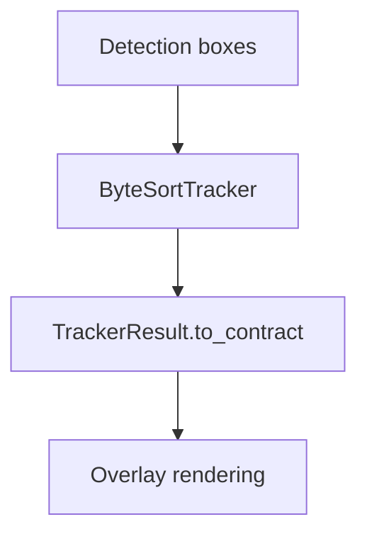

# Tracking Module

## Boundary Summary

| Field | Value |
| --- | --- |
| Purpose | Track identity continuity and rendering output |
| Responsibilities | Assign track identities; render overlay output |
| Public inputs | Detection boxes; frames |
| Public outputs | Track IDs; rendered overlays |
| Consumers | Detections, video analysis, frontend overlays |
| Dependencies | Pipeline result schemas |
| Failure behavior | Tracking degradation preserves detection results |

## Prediction And Tracking Flow

The flow mirrors the Ultralytics-aligned tracking path: detections enter the tracker, stable result contracts are emitted, and rendering consumes only contract fields.
