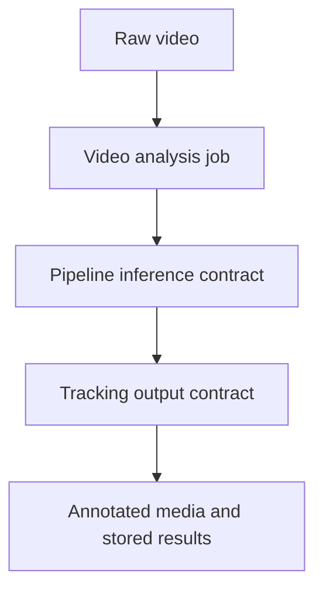

# Video Analysis Module

**Last updated:** 2026-05-23

## Boundary Summary

| Field | Value |
| --- | --- |
| Purpose | Offline upload, jobs, batch processing, and preview orchestration |
| Responsibilities | Manage offline jobs; publish processed video results |
| Public inputs | Raw video; job commands |
| Public outputs | Job status; stored results; annotated media |
| Consumers | Frontend offline video UI, exports, recordings |
| Dependencies | Pipeline, tracking, storage |
| Failure behavior | Job failures persist retry-safe error status |

## Offline Prediction Flow

The flow keeps offline orchestration behind job and pipeline contracts.

## Pose Kinematics Persistence, Artifacts, and API

Feature 013 wires the Human Pose Kinematics Layer into the existing
video-analysis boundary:

- `models.py` stores compact `PoseKinematicsRecord` rows and append-only
  `PoseKinematicsOverrideEvent` rows in PostgreSQL.
- `services/pose_kinematics_persistence.py` provides idempotent compact
  summary writes and event writes keyed by event identity.
- `services/pose_kinematics_artifacts.py` writes full keypoint evidence arrays
  to digest-addressed JSON artifacts.
- `tasks.py` enriches offline pose records after RTMPose quality enrichment and
  enriches live pose records with per-frame artifacts disabled.
- `serializers.py` and `views.py` expose `pose_kinematics` and
  `pose_kinematics_overrides` in frame and playback payloads.

The feature is disabled by default. When disabled, existing pose and behavior
flows continue and the validation scripts expect explicit unavailable/disabled
evidence rather than silent success.

## Telemetry REST Contract

Job-scoped telemetry endpoints project normalized persisted evidence:

- `GET /api/v1/video-analysis/jobs/{job_id}/telemetry/summary/`
- `GET /api/v1/video-analysis/jobs/{job_id}/telemetry/timeline/`
- `GET /api/v1/video-analysis/jobs/{job_id}/telemetry/artifacts/`
- `GET /api/v1/video-analysis/jobs/{job_id}/runtime-assignments/`
- `GET /api/v1/video-analysis/jobs/{job_id}/benchmark-comparison/`

Runtime dashboard endpoints are also served here (`/api/v1/video-analysis/runtime/*`) for sessions, frame/model events, summary, issues, filters, timeline, matrix, student timeline, and profiles.

## Telemetry WebSocket Contract

- Job transport route: `WS /ws/video-analysis/jobs/{job_id}/`
- Telemetry message types carried on this route include:
  - `telemetry.ready`
  - `telemetry.subscribed`
  - `telemetry.update`
- `telemetry.update` is also emitted for terminal job states (`completed`, `failed`) with `event_type` in payload.

## Authorization and Projection Rules

- Telemetry responses/events are authenticated and role-gated before projection.
- Timeline and list-style telemetry responses are bounded/paged by server limits.
- Serialized telemetry must remain PII-safe and aligned with normalized backend evidence.
- Dashboard telemetry delivery is isolated from MCP availability/failure.
