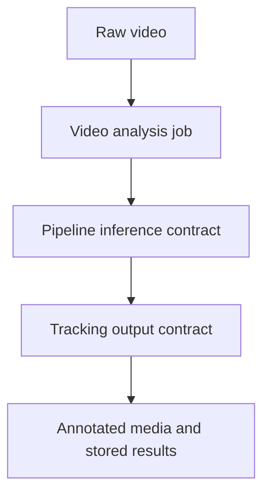

# Video Analysis Module

## Boundary Summary

| Field | Value |
| --- | --- |
| Purpose | Offline upload, jobs, batch processing, and preview orchestration |
| Responsibilities | Manage offline jobs; publish processed video results |
| Public inputs | Raw video; job commands |
| Public outputs | Job status; stored results; annotated media |
| Consumers | Frontend offline video UI, exports, recordings |
| Dependencies | Pipeline, tracking, storage |
| Failure behavior | Job failures persist retry-safe error status |

## Offline Prediction Flow

The flow keeps offline orchestration behind job and pipeline contracts.
