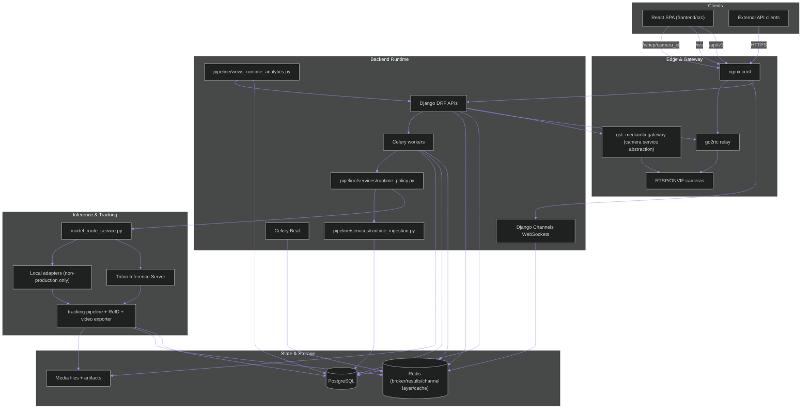
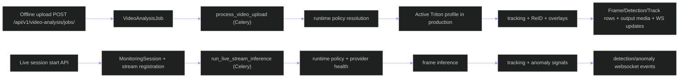
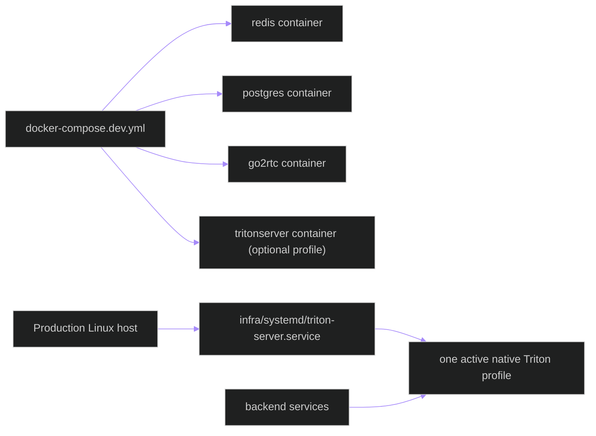
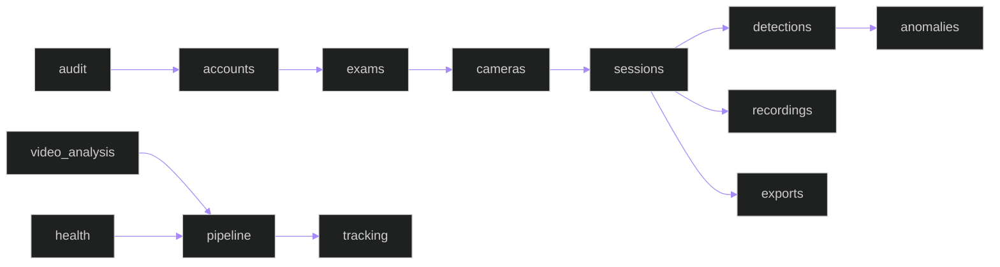

# System Architecture Overview

**Last updated:** 2026-05-25

This page is the architecture spine for the docs set. It reflects the implementation in `backend/`, `frontend/`, `infra/`, `docker-compose.dev.yml`, and `nginx.conf`, then links into deeper module-level docs.

## High-Level Runtime Topology

## End-to-End Execution Modes

Upload processing supports two runtime paths:
- `legacy_crop`: historical crop-first pipeline and primary tracking flow.
- `full_frame`: full-frame multi-model inference with shared detection packet schema and optional annotated export output.

These pipeline paths describe preprocessing and artifact behavior, not
production inference-provider choice. Production inference authority is native
Linux Triton-only, with exactly one active endpoint profile at a time. Local
adapter paths in the implementation are limited to development or explicitly
non-production validation and cannot satisfy production evidence gates.

## Deployment Boundary

Production runs do not depend on Docker or sudo. The live endpoint profile
uses `39000/39001/39002`; the offline endpoint profile uses
`39100/39101/39102`. Readiness acceptance requires the selected profile to be
healthy and the inactive profile to be unreachable.

## Domain Boundaries

## Related Deep Dives

- [Data Flow](backend/architecture/data-flow.md)
- [Deployment Topology](backend/architecture/deployment-topology.md)
- [Observability Runbook](backend/architecture/observability-runbook.md)
- [Triton Operations](backend/architecture/triton-operations.md)
- [System Mermaid Atlas](diagrams/SYSTEM_MERMAID_ATLAS.md)
