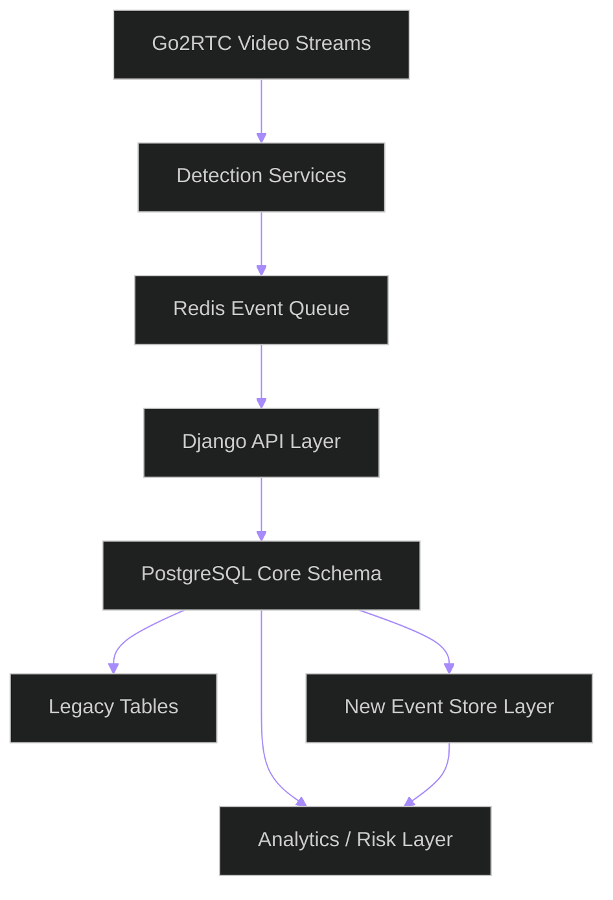
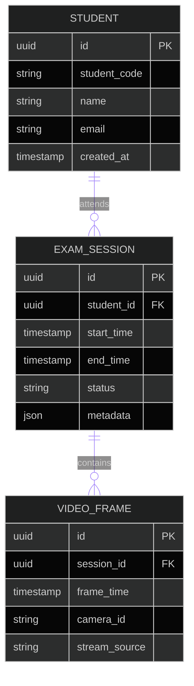
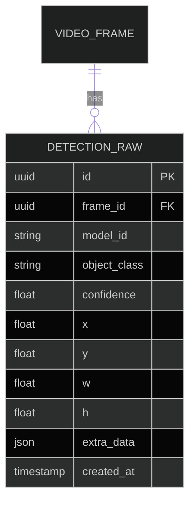
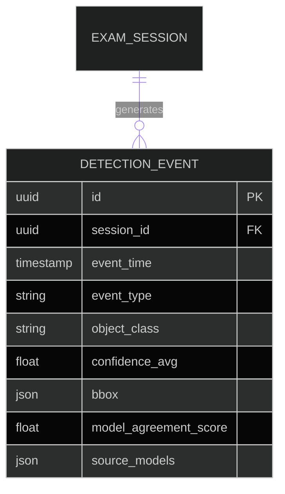
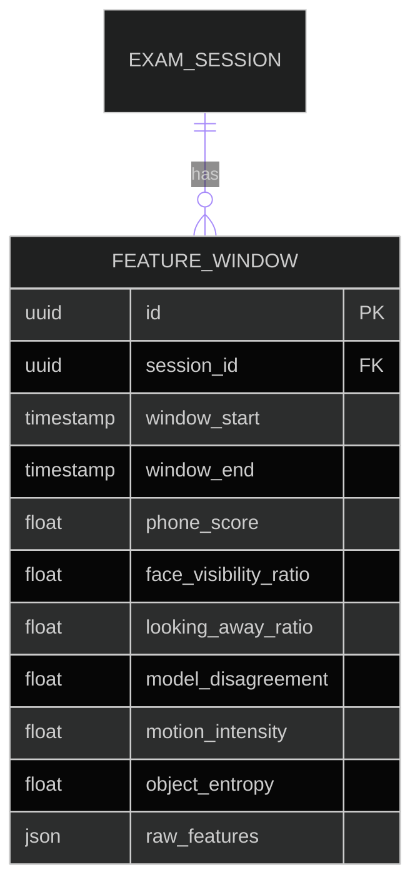
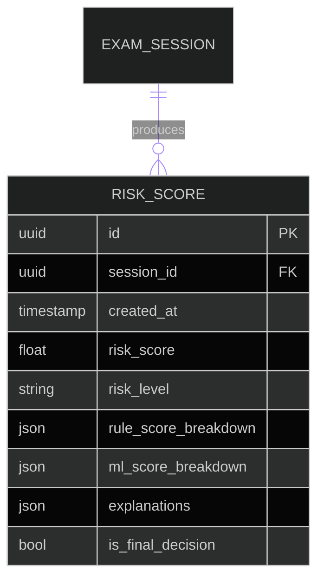
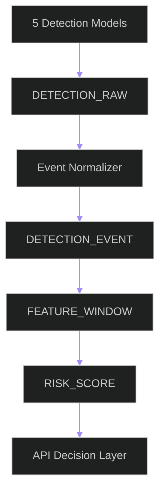
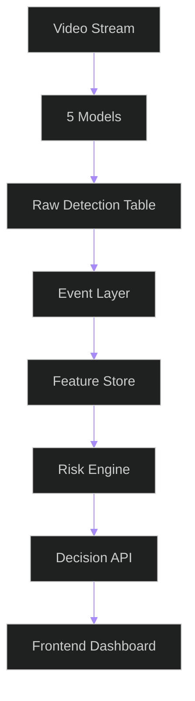

Below is a **senior-level PostgreSQL schema design** for your system, written as if you’re integrating into an **existing Django + Redis + Go2RTC + multi-model CV pipeline**.

This is not just a schema — it’s a **migration-safe, scalable event-driven architecture** for anomaly detection + exam monitoring.

---

# 🧠 SYSTEM CONTEXT (IMPORTANT)

You currently have:

* Django backend (existing system)
* 5 object detection models
* Redis (likely caching / streaming / queueing)
* Go2RTC (video streaming)
* PostgreSQL (already partially used, possibly legacy schema)

You want:

> A new **behavioral anomaly + cheating detection layer** WITHOUT breaking existing system

So we design:

### ✔ backward-compatible schema

### ✔ event-driven structure

### ✔ append-only logs (critical)

### ✔ separation of legacy vs new analytics layer

---

# 🏗️ 1. HIGH-LEVEL DATABASE ARCHITECTURE



---

# 🧱 2. DESIGN PRINCIPLES (CRITICAL)

Before schema:

## ✔ Principle 1 — Append-only event logs

Never overwrite detection data.

## ✔ Principle 2 — Separate raw vs processed data

* raw detections
* normalized events
* features
* risk outputs

## ✔ Principle 3 — Backward compatibility with Django

Don’t break existing tables — extend them.

## ✔ Principle 4 — Multi-model traceability

Every detection MUST know:

* which model produced it

---

# 🧩 3. CORE DATABASE MODULES

We split into 5 modules:

1. Sessions & Students
2. Raw Detection Storage (legacy-compatible)
3. Unified Event Layer (NEW)
4. Feature Store (NEW)
5. Risk & Decision Layer (NEW)

---

# 👤 4. MODULE 1 — STUDENTS & SESSIONS

## 4.1 Tables



---

## ⚠️ Notes / Warnings

### ❌ Mistake to avoid:

Storing frame data inside session table

### ✔ Correct:

Frames must be separate for time-series scaling

---

# 🎯 5. MODULE 2 — RAW DETECTION TABLE (LEGACY INTEGRATION)

This is where your 5 models write outputs.



---

## ⚠️ Key Design Warning

### ❌ Do NOT deduplicate here

Why?

* you lose model-level disagreement signals

### ✔ Keep everything raw

You need redundancy for:

* ensemble scoring
* disagreement detection

---

## 🔥 Integration with existing system

If Django already has detection tables:

👉 DO NOT DELETE
👉 CREATE EXTENSION TABLE:

```sql
ALTER TABLE detection ADD COLUMN model_id TEXT;
ALTER TABLE detection ADD COLUMN session_id UUID;
```

---

# 🔗 6. MODULE 3 — UNIFIED EVENT LAYER (NEW CORE)

This is the most important upgrade.

We normalize all detections into **events**



---

## 🎯 What is an “Event”?

Instead of raw detections:

You store semantic events like:

* PHONE_DETECTED
* FACE_NOT_VISIBLE
* MULTI_FACE_DETECTED
* LOOKING_AWAY
* OBJECT_INTERACTION

---

## ⚠️ Critical Design Mistake to avoid

❌ storing only raw detections
✔ must create semantic events layer

---

## Why this matters

This layer is:

> input for ALL anomaly detection logic

---

# 🧠 7. MODULE 4 — FEATURE STORE (RISK ENGINE INPUT)

This is your ML-ready layer.



---

## 🧠 Key idea:

Instead of computing features in real-time repeatedly:

👉 you store them once per time window

---

## ⚠️ Common mistake

❌ computing features on-demand from raw detections
✔ always precompute windows for performance

---

# 🚨 8. MODULE 5 — RISK SCORING LAYER (FINAL OUTPUT)



---

## 🎯 Why this exists

This stores:

* final cheating probability
* explanation trace
* audit logs

---

## ⚠️ VERY IMPORTANT

### ❌ Do not overwrite risk scores

Always:

* append new score
* never update old ones

Why:

* auditability
* debugging model behavior

---

# 🔄 9. DATA FLOW PIPELINE



---

# 🔗 10. REDIS INTEGRATION (IMPORTANT)

Redis should NOT store final truth.

Use it for:

* real-time streaming buffer
* temporary frame queue
* live risk updates

---

## Pattern:

```text
Redis → short-lived
Postgres → source of truth
```

---

## ⚠️ Common mistake

❌ using Redis as primary event store
✔ Redis is only buffer layer

---

# 🎥 11. GO2RTC INTEGRATION

Go2RTC feeds:

* frame timestamps
* camera IDs

Store:

```text
camera_id → VIDEO_FRAME.stream_source
```

---

## Warning:

Mismatch between:

* stream frame timestamps
* detection timestamps

👉 causes false anomaly spikes

---

# 🧨 12. COMMON FAILURES & RISKS

---

## 12.1 Duplicate detections

Cause:

* multiple models detect same object

Fix:

* event-level deduplication using IoU

---

## 12.2 Timestamp drift

Cause:

* async model inference

Fix:

* unify time via frame_id instead of system time

---

## 12.3 Schema mismatch with Django

Cause:

* legacy ORM models not updated

Fix:

* use Django migrations carefully
* avoid renaming existing tables

---

## 12.4 Feature explosion

Cause:

* too many derived features

Fix:

* keep feature store minimal + versioned

---

## 12.5 Database growth explosion

Cause:

* storing every frame + detection forever

Fix:

* partition tables by:

  * date
  * session_id

---

# 🧱 13. SCALING STRATEGY (IMPORTANT)

Use PostgreSQL partitioning:

```sql
PARTITION BY RANGE (created_at)
```

or:

* session-based partitioning

---

# 🧠 14. VERSIONING STRATEGY (VERY IMPORTANT)

You MUST version:

* feature schema
* event schema
* risk model logic

Add:

```text
schema_version
model_version
```

---

# 🧩 15. FINAL SYSTEM OVERVIEW



---

# 🧠 FINAL SENIOR ENGINEERING NOTES

## What makes or breaks your system:

### ✔ Good:

* event-driven architecture
* time-window features
* multi-model disagreement tracking
* append-only logs

### ❌ Bad:

* overwriting detections
* skipping event normalization
* mixing Redis and Postgres roles
* computing features on the fly

---
