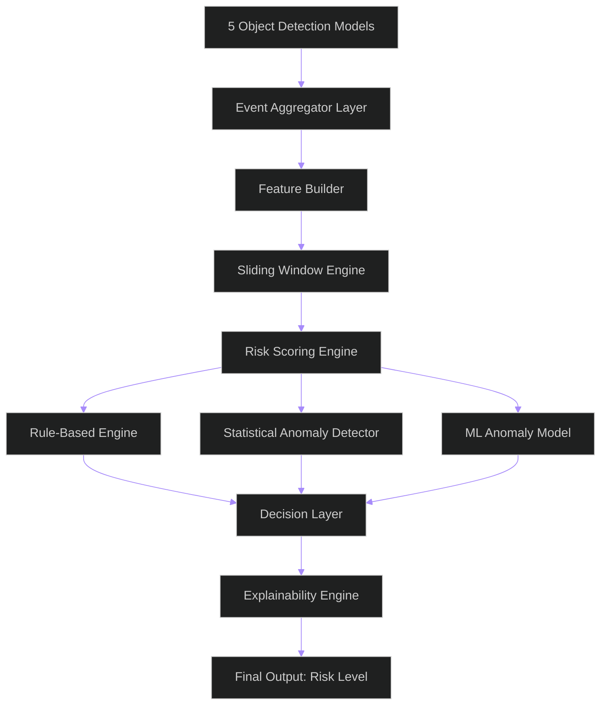
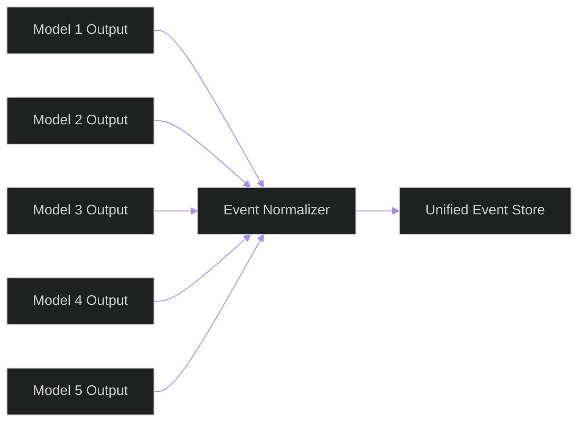
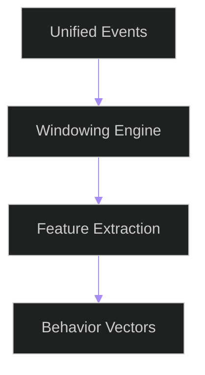
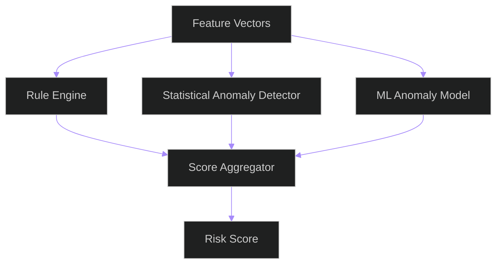
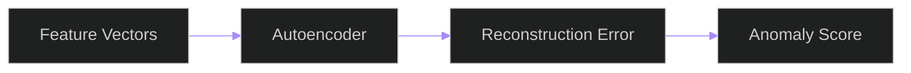
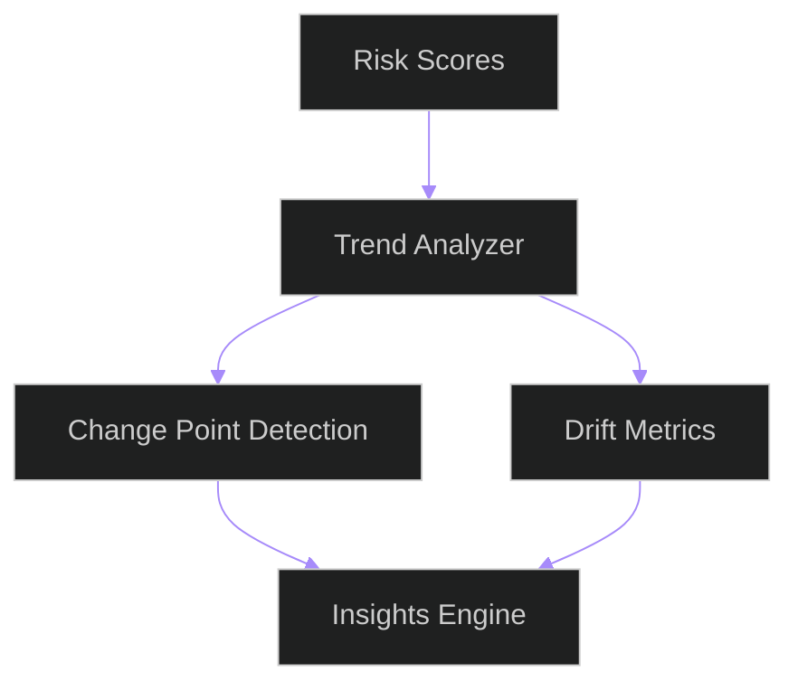
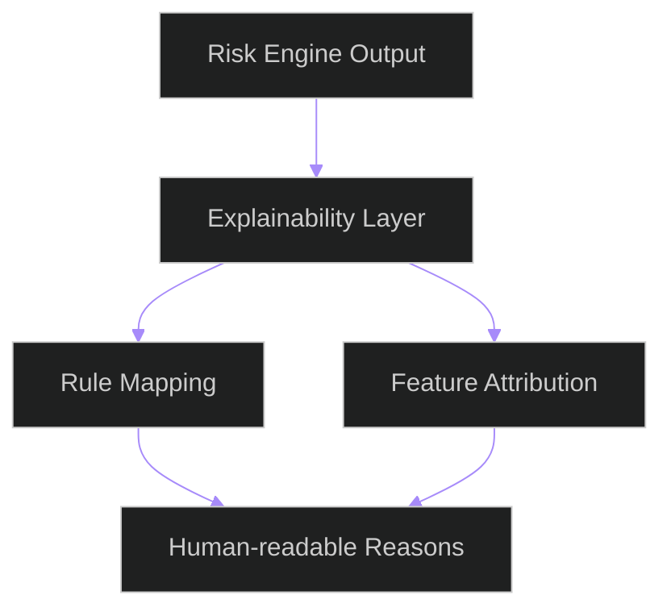
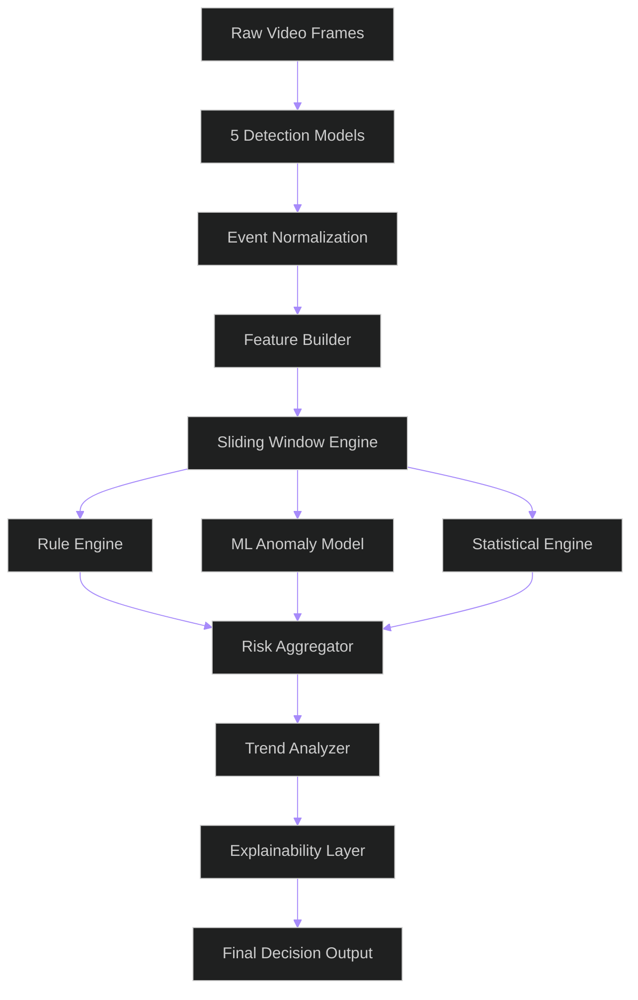

Below is a **full production-grade plan** for your system, written so you can directly drop it into a `.md` file.

It includes:

* system architecture
* phased roadmap
* risk scoring engine (deep explanation)
* data design
* failure modes & risks
* pre-requirements
* Mermaid diagrams for everything

---

# 🚨 Student Cheating Detection System (Multi-Model Anomaly Engine)

---

# 1. System Overview

You are building a:

> **Multi-model, unsupervised behavioral anomaly detection system for exam monitoring**

### Core idea:

Instead of “detecting cheating”, you are:

> Modeling normal exam behavior → detecting deviations → scoring risk

---

## 🧠 High-Level Architecture



---

# 2. PRE-REQUIREMENTS (Critical Before You Build Anything)

## 2.1 Data Requirements

You MUST ensure:

### Event logs per frame contain:

* timestamp
* student_id / session_id
* model_id
* detected class
* bounding box (x, y, w, h)
* confidence score

---

### ⚠️ Common mistake:

❌ Only storing final detections
✔ You must store **raw model outputs**

---

## 2.2 Time Synchronization Requirement

All 5 models must be aligned:

* same frame timestamp OR normalized timestamp
* otherwise risk engine becomes meaningless

---

## 2.3 Storage Requirement

You need:

* Time-series database OR structured logs

Recommended:

* PostgreSQL (structured)
* OR MongoDB (flexible)
* OR ClickHouse (best for scale)

---

## 2.4 System Assumption (IMPORTANT)

You assume:

> 90–98% of behavior is NORMAL

This assumption is required for unsupervised learning.

---

## 2.5 Known Risk

| Risk                 | Impact                 |
| -------------------- | ---------------------- |
| bad model alignment  | false cheating flags   |
| missing detections   | incorrect risk spikes  |
| camera angle changes | false anomalies        |
| model drift          | system decay over time |

---

# 3. PHASE 1 — DATA UNIFICATION LAYER

## Goal:

Convert raw model outputs into a unified event stream.

---

## 3.1 Architecture



---

## 3.2 What happens here

You normalize all outputs into:

```json
{
  "timestamp": 123456,
  "student_id": "S1",
  "object": "phone",
  "bbox": [x,y,w,h],
  "confidence": 0.91,
  "model_id": "model_3"
}
```

---

## 3.3 Common Mistakes

❌ different coordinate systems between models
❌ not deduplicating same object across models
❌ missing timestamp alignment

---

## 3.4 Deduplication Strategy

If multiple models detect same object:

* compute IoU overlap
* merge if IoU > threshold (e.g., 0.6)
* keep max confidence

---

# 4. PHASE 2 — FEATURE BUILDER

## Goal:

Convert raw detections → behavioral signals

---

## 4.1 Architecture



---

## 4.2 Sliding Window Strategy

Use:

* 5 sec window (fast detection)
* 30 sec window (behavior context)
* full session window (trend analysis)

---

## 4.3 Feature Vector Example

For each window:

```text
phone_count
phone_confidence_mean
face_visibility_ratio
looking_away_ratio
hand_near_face_events
object_entropy
model_disagreement_score
motion_intensity
```

---

## 4.4 Key Feature Definitions

### 🔹 Model disagreement score

```text
variance of detections across 5 models
```

High value → suspicious uncertainty

---

### 🔹 Object entropy

Measures randomness of detected objects:

* low entropy → stable exam behavior
* high entropy → erratic behavior

---

### 🔹 Looking away ratio

Derived from:

* face direction
* bounding box orientation
* gaze model (if available)

---

## 4.5 Common Mistakes

❌ overfitting features to known cheating patterns
❌ ignoring missing detection bias
❌ not normalizing feature scales

---

# 5. PHASE 3 — RISK SCORING ENGINE (CORE SYSTEM)

---

# 🧠 Concept

Instead of classification:

> You compute a **continuous risk score over time**

---

# 5.1 Architecture



---

# 5.2 Risk Score Formula

You combine 3 components:

---

## 🔴 1. Rule-Based Score

Hard signals:

* phone detected
* multiple faces
* no face visible

```text
RuleScore =
  phone * 5 +
  multiple_faces * 4 +
  no_face_time * 3
```

---

## 🟡 2. Statistical Score

Detect deviation from normal behavior:

```text
Z-score deviation of features
```

Example:

```text
high deviation in looking-away ratio → anomaly
```

---

## 🟢 3. ML Anomaly Score

Model types:

* Isolation Forest
* Autoencoder reconstruction error

Output:

* anomaly probability

---

# 5.3 Final Risk Score

```text
RiskScore =
  0.5 * RuleScore +
  0.3 * StatisticalScore +
  0.2 * MLScore
```

---

# 5.4 Risk Levels

| Score | Level      |
| ----- | ---------- |
| 0–20  | Normal     |
| 20–40 | Suspicious |
| 40–70 | High Risk  |
| 70+   | Critical   |

---

# 5.5 Temporal Smoothing (VERY IMPORTANT)

To avoid false spikes:

```text
final_score = EMA(risk_score)
```

Or:

* rolling average (10–30 sec)
* peak persistence filter

---

# 5.6 Decision Stability Rule

A student is flagged ONLY if:

* risk > threshold
* AND duration > N seconds

---

# 6. PHASE 4 — ML ANOMALY MODEL

---

## 6.1 Why needed?

Rules alone:

* too rigid
* high false positives

---

## 6.2 Recommended model

### Isolation Forest

* no labels needed
* learns normal behavior distribution

OR

### Autoencoder

* learns reconstruction of normal behavior
* anomaly = reconstruction error

---

## 6.3 Training strategy

You assume:

> most sessions = normal

So train on ALL data initially.

---

## 6.4 Architecture



---

# 7. PHASE 5 — TREND & DRIFT ANALYSIS

---

## 7.1 Goal

Detect:

* behavioral changes over exam
* system drift
* suspicious patterns over time

---

## 7.2 Methods

### A. Change Point Detection

Detect sudden changes in behavior.

---

### B. Moving averages

* phone detection trend
* looking-away trend

---

### C. Distribution drift

Compare:

* first 10 min vs last 10 min

---

## 7.3 Architecture



---

# 8. PHASE 6 — EXPLAINABILITY ENGINE

---

## Why needed?

You MUST answer:

> “Why was this student flagged?”

---

## Output format:

```json
{
  "risk_level": "high",
  "score": 72,
  "reasons": [
    "Phone detected 3 times",
    "High face absence duration",
    "Model disagreement spike",
    "Repeated looking-away pattern"
  ]
}
```

---

## Architecture



---

# 9. COMMON SYSTEM FAILURES (VERY IMPORTANT)

---

## 9.1 False Positives

Causes:

* camera angle changes
* occlusion
* lighting issues

Fix:

* temporal smoothing
* multi-model consensus

---

## 9.2 False Negatives

Causes:

* missed detections
* weak models

Fix:

* ensemble voting across 5 models

---

## 9.3 Model disagreement noise

Fix:

* require consensus threshold (e.g., 3/5 models)

---

## 9.4 Drift over time

Fix:

* periodic retraining of anomaly model

---

# 10. FINAL SYSTEM FLOW



---

# 11. FINAL NOTES (IMPORTANT DESIGN INSIGHTS)

### Key idea you must remember:

> You are NOT building a classifier.
> You are building a **behavioral deviation scoring system**

---

## Best practices:

* always use time windows (never single frame decisions)
* always combine rule + ML
* always explain decisions
* always assume noisy vision inputs
* always smooth risk over time

---

If you want next step, I can help you build:

* actual database schema (SQL/Mongo)
* feature extraction code
* real risk scoring Python service
* or API architecture for your full stack system
