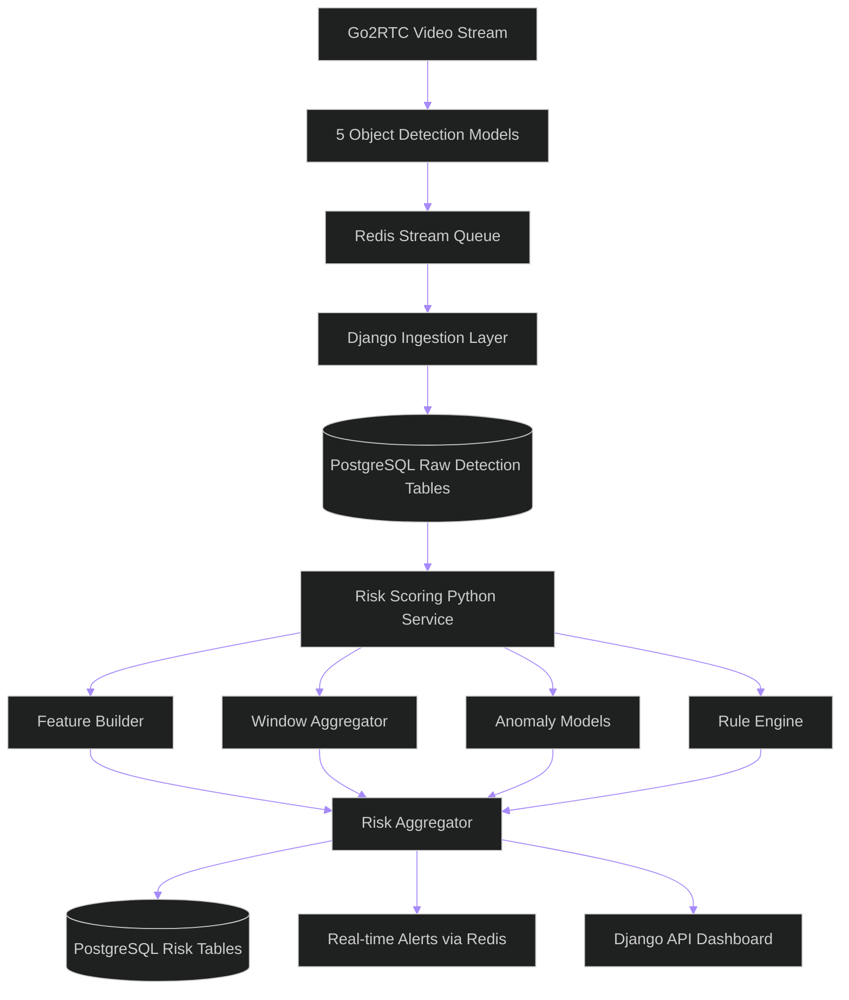
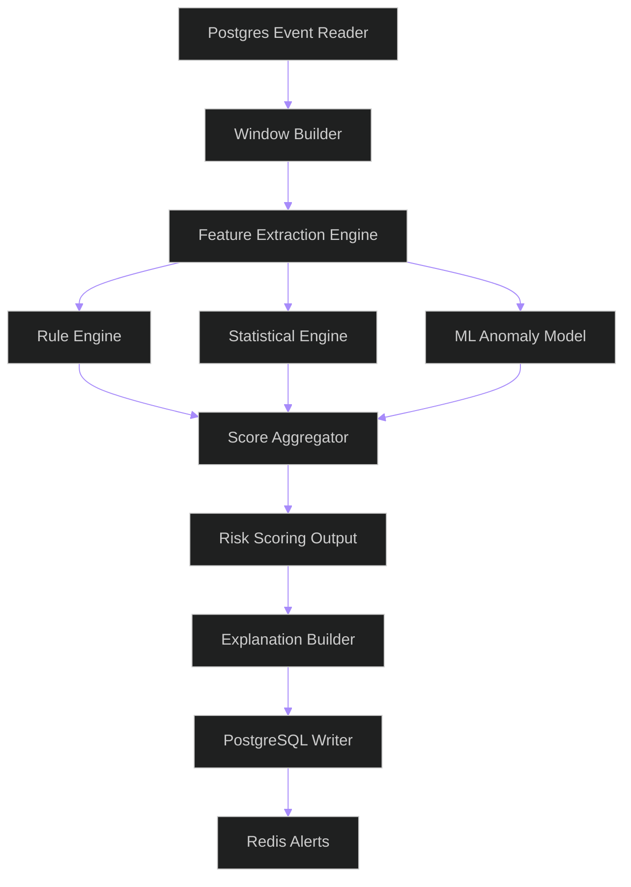
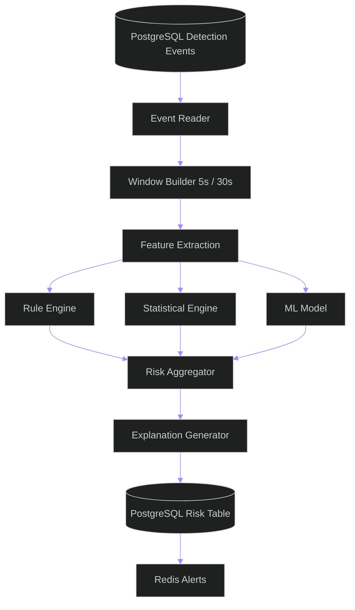
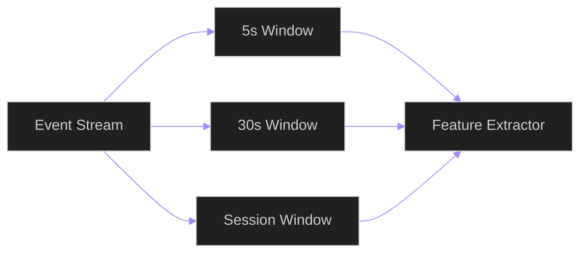
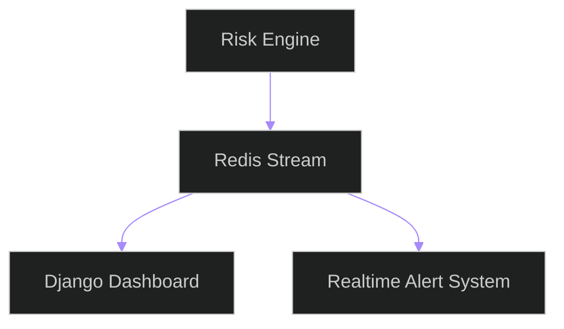
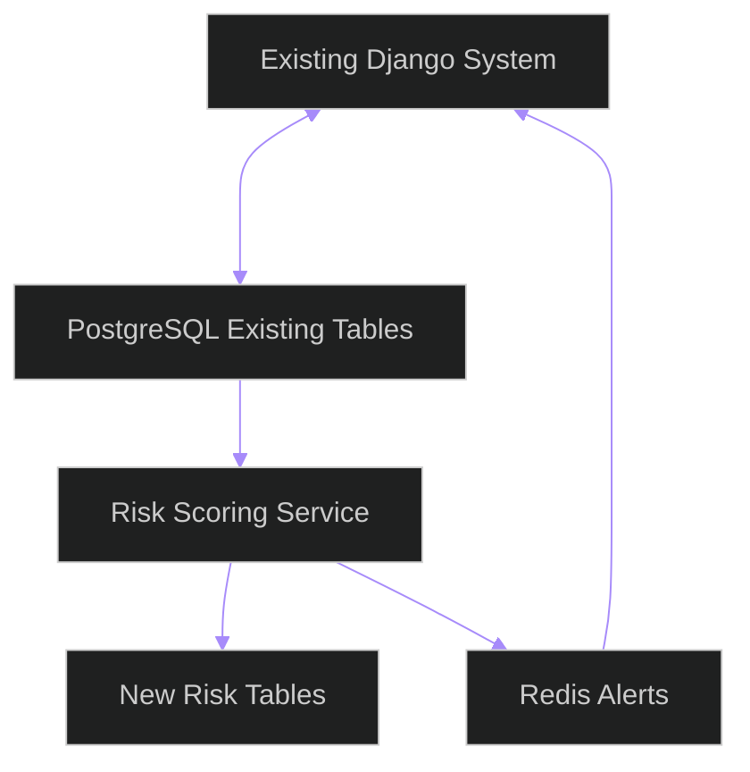

Below is a **senior-level, production-oriented Risk Scoring Python Service design** that fits into your existing ecosystem:

* Django (existing backend)
* PostgreSQL (existing + extended schema)
* Redis (streaming / queue / cache)
* 5 object detection models
* Go2RTC (video streaming)

This is designed explicitly as:

> ⚠️ A **non-breaking add-on service**, NOT a replacement of your current system

---

# 🚨 IMPORTANT ARCHITECTURE ANNOUNCEMENT

Before anything else:

> This Risk Scoring Service is an **overlay intelligence layer**, not a replacement system.

### ✔ It MUST:

* integrate with existing Django tables
* consume existing detection outputs
* write back risk scores as new tables
* never modify raw detection pipeline behavior
* never replace Redis / Go2RTC / model inference pipeline

### ❌ It MUST NOT:

* rewrite current detection system
* replace Django logic
* become single point of failure for inference

---

# 🧠 1. HIGH-LEVEL SYSTEM ARCHITECTURE



---

# 🧩 2. SERVICE RESPONSIBILITY

This Python service does ONLY:

### ✔ Consumes:

* PostgreSQL detection data
* Redis streaming events (optional real-time layer)

### ✔ Produces:

* risk scores
* explanations
* anomaly flags

### ✔ Does NOT:

* run object detection
* modify video stream
* control camera ingestion

---

# 🏗️ 3. SERVICE INTERNAL ARCHITECTURE



---

# ⚙️ 4. CORE PYTHON SERVICE DESIGN

## 📁 Suggested folder structure

```text id="svc_struct"
risk_service/
│
├── main.py
├── config.py
├── db/
│   ├── postgres_client.py
│   ├── queries.py
│
├── ingestion/
│   ├── event_reader.py
│   ├── window_builder.py
│
├── features/
│   ├── feature_extractor.py
│   ├── normalization.py
│
├── models/
│   ├── isolation_forest.py
│   ├── autoencoder.py
│
├── scoring/
│   ├── rule_engine.py
│   ├── statistical_engine.py
│   ├── aggregator.py
│
├── output/
│   ├── risk_writer.py
│   ├── explanation_builder.py
│
└── utils/
    ├── logging.py
    ├── time_utils.py
```

---

# 🔄 5. DATA FLOW INSIDE SERVICE



---

# 🧠 6. CORE RISK SCORING ENGINE (DETAILED)

---

## 6.1 Input Data

Each window contains:

```json id="input_window"
{
  "session_id": "S1",
  "window_start": 100,
  "window_end": 110,

  "features": {
    "phone_count": 2,
    "face_visibility_ratio": 0.4,
    "looking_away_ratio": 0.7,
    "model_disagreement": 0.6
  }
}
```

---

# 🔴 6.2 RULE ENGINE

Hard deterministic signals.

```python id="rule_engine"
def rule_score(features):
    score = 0

    if features["phone_count"] > 0:
        score += 5

    if features["face_visibility_ratio"] < 0.3:
        score += 4

    if features["looking_away_ratio"] > 0.6:
        score += 3

    if features["model_disagreement"] > 0.7:
        score += 2

    return score
```

---

## ⚠️ Rule Engine Risks

### ❌ Mistake:

Overweighting rules → too many false positives

### ✔ Fix:

Cap rule score:

```text id="cap_rule"
max_rule_score = 10
```

---

# 🟡 6.3 STATISTICAL ENGINE

Detect deviation from normal behavior baseline.

```python id="zscore_engine"
def statistical_score(features, baseline):
    score = 0

    for key in features:
        z = (features[key] - baseline[key]["mean"]) / baseline[key]["std"]

        if abs(z) > 2:
            score += abs(z)

    return score
```

---

## ⚠️ Risks

* bad baseline → useless system
* must be per-student OR per-exam-type

---

# 🟢 6.4 ML ANOMALY ENGINE

## Option: Isolation Forest

```python id="iso_forest"
from sklearn.ensemble import IsolationForest

model = IsolationForest(contamination=0.02)

def ml_score(features):
    return -model.decision_function([features])[0]
```

---

## ⚠️ Risk

* training on already-anomalous data corrupts model

---

# ⚖️ 6.5 FINAL AGGREGATION ENGINE

```python id="final_score"
def compute_risk(rule, stat, ml):
    return (
        0.5 * rule +
        0.3 * stat +
        0.2 * ml
    )
```

---

# 🚨 7. TIME WINDOWING ENGINE



---

## ⚠️ Critical Mistake

❌ using single-frame scoring
✔ always use time windows

---

# 🧾 8. OUTPUT WRITER (POSTGRESQL)

## Risk Table

```sql id="risk_table"
CREATE TABLE risk_scores (
    id UUID PRIMARY KEY,
    session_id UUID,
    window_start TIMESTAMP,
    window_end TIMESTAMP,

    risk_score FLOAT,
    risk_level TEXT,

    rule_score FLOAT,
    stat_score FLOAT,
    ml_score FLOAT,

    explanation JSONB,
    created_at TIMESTAMP DEFAULT NOW()
);
```

---

## ⚠️ Important

* NEVER update rows → append only
* ensures auditability

---

# 📡 9. REDIS ALERT SYSTEM



---

## Example alert payload:

```json id="alert"
{
  "session_id": "S1",
  "risk_level": "HIGH",
  "score": 78
}
```

---

# 🧠 10. EXPLANATION ENGINE

```python id="explain"
def build_explanation(features, scores):
    reasons = []

    if features["phone_count"] > 0:
        reasons.append("Phone detected")

    if features["face_visibility_ratio"] < 0.3:
        reasons.append("Face not visible")

    if features["looking_away_ratio"] > 0.6:
        reasons.append("Frequent looking away")

    return reasons
```

---

# ⚠️ 11. COMMON MISTAKES (VERY IMPORTANT)

---

## ❌ Mistake 1: Replacing Django logic

✔ Fix: treat Django as source of truth

---

## ❌ Mistake 2: Real-time ML inside request cycle

✔ Fix: async worker (Celery / FastAPI worker)

---

## ❌ Mistake 3: No time windowing

✔ Fix: always aggregate over time

---

## ❌ Mistake 4: No model versioning

✔ Fix:

```text id="versioning"
model_version, feature_version
```

---

## ❌ Mistake 5: Overfitting rules

✔ Fix:

* keep rules minimal
* rely on ML for subtle anomalies

---

# ⚠️ 12. SYSTEM RISKS

| Risk                 | Impact            | Fix                 |
| -------------------- | ----------------- | ------------------- |
| timestamp mismatch   | wrong scoring     | unify frame time    |
| duplicate detections | inflated risk     | dedup via IoU       |
| missing frames       | false anomaly     | smoothing           |
| model drift          | degraded accuracy | periodic retraining |
| Redis overload       | lag spikes        | batching            |

---

# 🔗 13. INTEGRATION STRATEGY (MOST IMPORTANT)

## Your system MUST integrate like this:



---

## 🔥 Key rule:

> DO NOT replace existing system — EXTEND it

---

# 🧠 FINAL SENIOR NOTES

### This system succeeds if:

✔ You treat everything as time-series
✔ You separate raw vs processed data
✔ You keep scoring explainable
✔ You avoid real-time blocking dependencies

---
