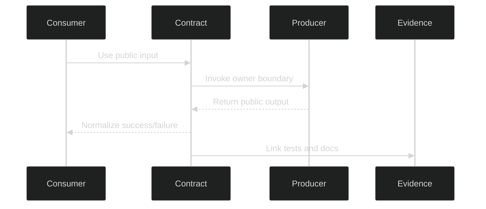

# Compatibility Contract Index

**Last updated:** 2026-05-09

## Related Documents

- [module boundary map](module-boundary-map.md)
- [coupling risk register](coupling-risk-register.md)
- [runtime scenario matrix](runtime-scenario-matrix.md)
- [module boundary contract](../../specs/006-modular-low-coupling/contracts/module-boundary-contract.md)
- [runtime scenario contract](../../specs/006-modular-low-coupling/contracts/runtime-scenario-contract.md)

## Purpose

This index lists the compatibility contracts that modules must use instead of reaching into another module's internals. Each contract records producer, consumer, input shape, output shape, failure modes, and validation evidence.

## Contract Interaction Flow

The sequence shows the allowed interaction pattern. Consumers call a documented contract, the owning producer handles internal behavior, and evidence links prove the contract remains stable.

## Contract Index

| Contract ID | Producer | Consumer | Input Shape | Output Shape | Failure Modes | Tests |
| --- | --- | --- | --- | --- | --- | --- |
| `contract.frontend.auth` | `backend.accounts` | `frontend.auth-state` | Login/logout/profile requests | Auth token, user profile, auth error | Invalid credentials, expired token | Frontend e2e, backend auth tests |
| `contract.frontend.camera` | `backend.cameras` | `frontend.live-monitoring-ui` | Camera CRUD and stream requests | Camera records, stream descriptors | Invalid RTSP, unavailable stream | Camera e2e, backend camera tests |
| `contract.frontend.session` | `backend.sessions` | `frontend.live-monitoring-ui` | Session start/stop/read requests | Session state and channel events | Session unavailable, degraded channel | Session integration tests |
| `contract.live.detection` | `backend.detections` | `runtime.live-stream` | Frame/result events | Detection overlays and result records | Detection timeout, degraded inference | Live equivalence tests |
| `contract.pipeline.inference` | `backend.pipeline` | `backend.detections`, `backend.video_analysis` | Frames/crops/model route requests | Prediction result DTOs, health state | Timeout, unavailable provider, invalid model | Inference provider swap tests |
| `contract.tracking.output` | `backend.tracking` | `backend.detections`, `backend.video_analysis`, frontend overlays | Detection boxes and frames | Track IDs, rendered overlay data | Tracking degradation, identity reset | Tracking isolation tests |
| `contract.offline.video-job` | `backend.video_analysis` | `frontend.offline-video-ui` | Upload/job commands | Job status, progress, stored result refs | Invalid media, processing failure | Offline system tests |
| `contract.anomaly.triage` | `backend.anomalies` | `frontend.anomaly-ui` | Alert status/note commands | Updated alert records | Invalid transition, permission denial | Anomaly e2e/unit tests |
| `contract.recording.export` | `backend.recordings`, `backend.exports` | `frontend.recording-export-ui` | Recording/export requests | Playback URL, export status/link | Missing artifact, export failure | Recording/export e2e tests |
| `contract.health.status` | `backend.health` | `frontend.health-settings-ui`, deployment | Health probe requests | Service/model/dependency health reports | Dependency unavailable | Health regression tests |
| `contract.deployment.dev-docker` | `deployment.dev-docker` | Developers/test automation | Compose profile/env commands | Dev service topology | Container failure | Docker health evidence |
| `contract.deployment.prod-linux` | `deployment.prod-linux` | Operators/release gate | Native service config | Native service topology | Service unavailable | Native Linux contract tests |

## Dependency Direction Rules

- Frontend code depends on `frontend.api` and typed DTOs, not backend implementation details.
- Backend domain apps depend on public contracts or service functions, not another app's private module internals.
- `backend.pipeline` owns model-serving details; consumers depend on stable inference contracts.
- `backend.tracking` owns tracking identity and rendering outputs; consumers depend on output contracts.
- Docker development contracts must not be referenced as production requirements.

## Allowed Dependency Directions

| Source | Allowed Targets |
| --- | --- |
| `frontend.*` | `frontend.api`, frontend stores, shared UI, typed DTOs |
| `backend.cameras` | Accounts, sessions, go2rtc configuration |
| `backend.sessions` | Cameras, Channels, database |
| `backend.detections` | Pipeline contract, tracking contract, sessions |
| `backend.video_analysis` | Pipeline contract, tracking contract, storage |
| `backend.anomalies` | Detections, sessions, accounts |
| `backend.recordings` | Video analysis, storage |
| `backend.exports` | Sessions, anomalies, recordings, storage |
| `backend.health` | Read-only health probes, pipeline health, Redis, database, Triton health |
| `deployment.prod-linux` | Native service config and health checks |
| `deployment.dev-docker` | Compose profiles and dev/test topology |

## Forbidden Dependency Directions

| Source | Forbidden Targets |
| --- | --- |
| `frontend.*` | Backend database models or Django implementation modules |
| `backend.cameras` | Tracking internals and inference implementation details |
| `backend.sessions` | Offline video job internals |
| `backend.detections` | Direct model files or model runtime internals |
| `backend.pipeline` | Frontend stores and Django views outside contracts |
| `backend.tracking` | Camera/session persistence internals |
| `backend.video_analysis` | Live session internals |
| `backend.anomalies` | Pipeline model internals |
| `backend.recordings` | Pipeline internals |
| `backend.exports` | Inference internals |
| `backend.health` | Business workflow mutation |
| `deployment.prod-linux` | Docker availability as a production requirement |
