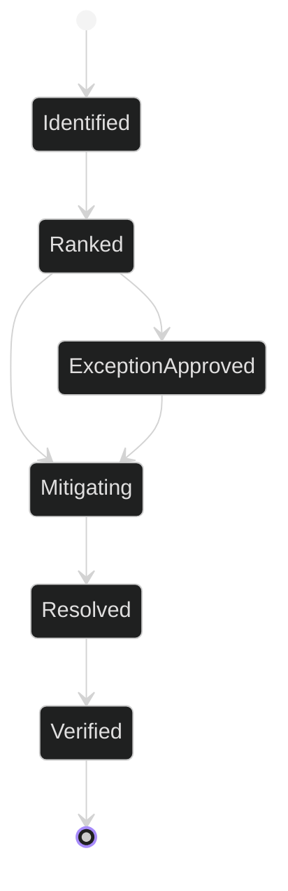

# Coupling Risk Register

## Related Documents

- [module boundary map](module-boundary-map.md)
- [compatibility contracts](compatibility-contracts.md)
- [runtime scenario matrix](runtime-scenario-matrix.md)
- [feature plan](../../specs/006-modular-low-coupling/plan.md)
- [coupling risk contract](../../specs/006-modular-low-coupling/contracts/coupling-risk-contract.md)

## Purpose

This register identifies coupling risks that can cause unrelated modules to change together or fail together during the modular restructuring. High-risk items are release blockers; medium and low items require owner, expiry, removal plan, regression coverage, and approval if temporarily retained.

## Risk Lifecycle

The state diagram follows the feature contract. Every risk starts identified, must be ranked, and then either moves toward resolution or receives a temporary exception when eligible. High-risk coupling cannot remain exception-approved.

## Severity Rules

| Severity | Criteria | Exception Eligibility |
| --- | --- | --- |
| High | Can break baseline workflows, hide data corruption, bypass security/privacy boundaries, block live/offline inference validation, or prevent native Linux production operation. | Not eligible |
| Medium | Can slow future changes or create localized regression risk while preserving runtime correctness. | Eligible with owner, expiry, removal plan, regression coverage, and approval |
| Low | Creates documentation or maintainability friction without runtime risk. | Eligible with owner, expiry, removal plan, regression coverage, and approval |

## Initial Register

| Risk ID | Source Boundary | Target Boundary | Type | Severity | Impact | Mitigation | Owner | Verification | Exception Eligible | Status |
| --- | --- | --- | --- | --- | --- | --- | --- | --- | --- | --- |
| `CR-001` | `backend.pipeline` | Environment configuration | Hidden dependency | High | Backend tests fail when unrelated `.env` keys are loaded into `PipelineConfig`. | Scope pipeline settings to pipeline keys or allow documented extra env safely. | Backend | Backend pytest collection and config tests | No | Identified |
| `CR-002` | `frontend.eslint` | Playwright output | Generated-artifact coupling | Low | Lint can fail before source checks when generated output paths are scanned. | Ignore generated Playwright output in flat ESLint config. | Frontend | `npm run lint` reaches source findings | Yes | Mitigating |
| `CR-003` | `backend.video_analysis` | `backend.pipeline` | Direct cross-module access | High | Offline jobs can couple to inference internals and block provider swaps. | Introduce stable pipeline contracts and route offline orchestration through them. | Backend | Inference provider swap contract tests | No | Identified |
| `CR-004` | `backend.detections` | `backend.tracking` | Shared result shape | Medium | Overlay consumers can break when tracking output shape changes. | Publish detection/tracking output contracts and validate consumers. | Backend | Dependency direction and contract tests | Yes | Identified |
| `CR-005` | `frontend.stores` | Backend response shapes | Hidden dependency | Medium | Store state can silently assume backend DTO internals. | Add typed API contracts and store boundary tests. | Frontend | Frontend modular contract tests | Yes | Identified |
| `CR-006` | `deployment.dev-docker` | `deployment.prod-linux` | Runtime assumption leak | High | Production docs or gates could accidentally require Docker. | Separate Docker development topology from native Linux production topology. | DevOps | Native Linux deployment contract tests | No | Identified |
| `CR-007` | Documentation | Implementation boundaries | Diagram gap | Medium | Reviewers cannot trace changed boundaries from docs alone. | Add diagram coverage register and render/cross-link validation. | Docs | Documentation diagram tests and signoff | Yes | Identified |

## Exception Fields

Any approved medium/low exception must include `exception_id`, `risk_id`, owner, expiry, removal plan, regression coverage, and reviewer approval. High-risk items must be resolved before final signoff.

## Temporary Exceptions

| Exception ID | Risk ID | Severity | Owner | Expiry | Removal Plan | Regression Coverage | Approval | Status |
| --- | --- | --- | --- | --- | --- | --- | --- | --- |
| `EX-001` | `CR-004` | Medium | Backend | 2026-06-30 | Continue moving overlay consumers to `contract.tracking.output` and remove any direct shape assumptions. | Tracking isolation tests, dependency-direction tests | Architecture review | Approved |
| `EX-002` | `CR-005` | Medium | Frontend | 2026-06-30 | Replace remaining direct backend DTO assumptions with API adapter normalizers. | Frontend backend-contract tests, type-check | Architecture review | Approved |

No high-risk exceptions are approved. `CR-001`, `CR-003`, and `CR-006` must remain resolved or actively mitigating before final release signoff.
