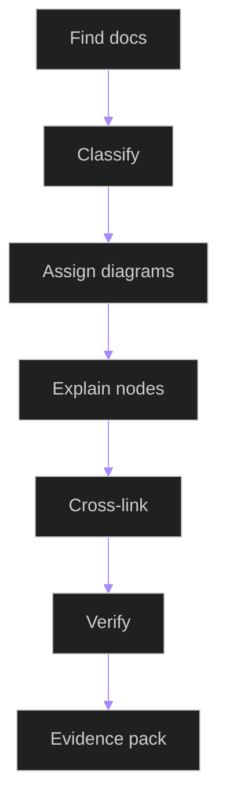

# Documentation Diagram Coverage Register

## Related Documents

- [module boundary map](module-boundary-map.md)
- [compatibility contracts](compatibility-contracts.md)
- [runtime scenario matrix](runtime-scenario-matrix.md)
- [documentation diagram contract](../../specs/006-modular-low-coupling/contracts/documentation-diagram-contract.md)
- [evidence pack](../../specs/006-modular-low-coupling/evidence/evidence-pack.md)

## Purpose

This register classifies affected Markdown documents and tracks required Mermaid diagram coverage, explanation status, cross-links, and verification status.

## Coverage Workflow

The workflow starts by finding affected docs and classifying each one. Required diagrams are then assigned based on document type. Every diagram needs node and edge explanations, related-document links, and verification before it can be included in the evidence pack.

## Required Diagram Types

| Document Type | Code Structure | System Interaction | Cross Interaction | State | ER/Class |
| --- | --- | --- | --- | --- | --- |
| `source-doc` | Required | When runtime-facing | When multi-module | When stateful | When data/contracts exist |
| `module-readme` | Required | When runtime-facing | When multi-module | When stateful | When data/contracts exist |
| `system-doc` | When source ownership appears | Required | Required when multi-module | When lifecycle exists | When persisted data appears |
| `feature-doc` | When source ownership appears | Required | Required when multi-module | When lifecycle exists | When entities/contracts appear |

## Initial Register

| Document Path | Type | Code Structure | System Interaction | Cross Interaction | State/ER/Class | Explanation | Cross Links | Verification |
| --- | --- | --- | --- | --- | --- | --- | --- | --- |
| `docs/architecture/module-boundary-map.md` | system-doc | Present | Present | Present | Not applicable | Complete | Complete | Pending tests |
| `docs/architecture/coupling-risk-register.md` | system-doc | Not applicable | Present | Present | State present | Complete | Complete | Pending tests |
| `docs/architecture/compatibility-contracts.md` | system-doc | Not applicable | Present | Present | Not applicable | Complete | Complete | Pending tests |
| `docs/architecture/runtime-scenario-matrix.md` | system-doc | Not applicable | Present | Present | Not applicable | Complete | Complete | Pending tests |
| `docs/architecture/documentation-diagram-coverage.md` | system-doc | Not applicable | Present | Present | Not applicable | Complete | Complete | Pending tests |
| `docs/backend/architecture/data-flow.md` | system-doc | Pending audit | Pending audit | Pending audit | Pending audit | Pending audit | Pending audit | Pending |
| `docs/backend/architecture/deployment-topology.md` | system-doc | Pending audit | Pending audit | Pending audit | Pending audit | Pending audit | Pending audit | Pending |
| `docs/backend/architecture/observability-runbook.md` | system-doc | Pending audit | Pending audit | Pending audit | Pending audit | Pending audit | Pending audit | Pending |
| `docs/backend/architecture/triton-operations.md` | system-doc | Pending audit | Pending audit | Pending audit | Pending audit | Pending audit | Pending audit | Pending |
| `docs/backend/apps/tracking/README.md` | module-readme | Pending audit | Pending audit | Pending audit | Pending audit | Pending audit | Pending audit | Pending |
| `docs/backend/apps/video_analysis/README.md` | module-readme | Pending audit | Pending audit | Pending audit | Pending audit | Pending audit | Pending audit | Pending |
| `docs/frontend/src/components/README.md` | module-readme | Pending audit | Pending audit | Pending audit | Pending audit | Pending audit | Pending audit | Pending |
| `docs/architecture/modular-system-overview.md` | system-doc | Present | Present | Present | Class present | Complete | Complete | Verified |
| `docs/ARCHITECTURE.md` | system-doc | Not applicable | Present | Present | Not applicable | Complete | Complete | Verified |
| `docs/frontend/src/api/README.md` | module-readme | Present | Present | Present | Class present | Complete | Complete | Verified |

## Acceptance

Missing diagrams are blocking for docs touched by this feature. Pending audit rows must be resolved or explicitly scoped before final diagram signoff.
