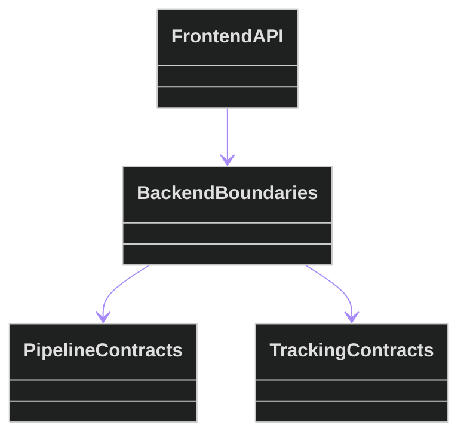
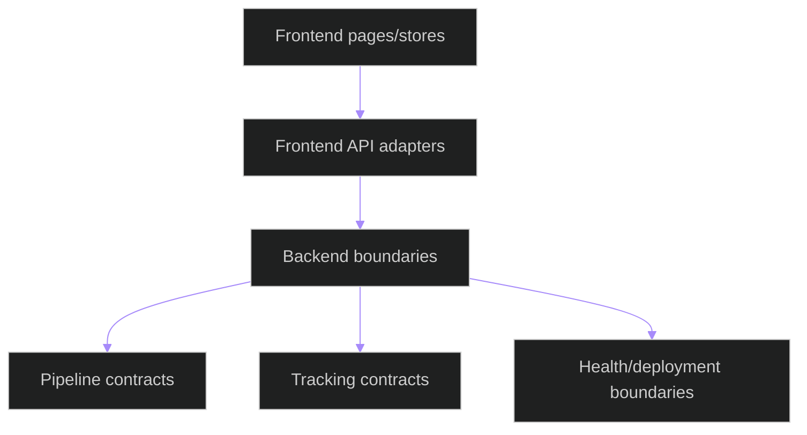
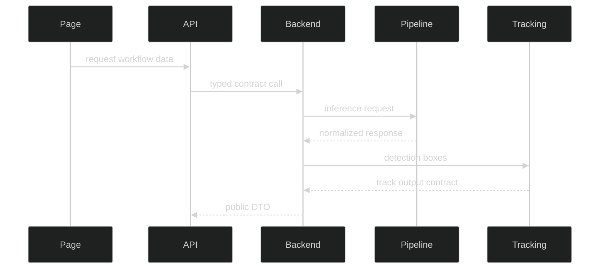

# Modular System Overview

**Last updated:** 2026-05-09

## Related Documents

- [module boundary map](module-boundary-map.md)
- [runtime scenario matrix](runtime-scenario-matrix.md)
- [compatibility contracts](compatibility-contracts.md)

## Code Structure

The class diagram shows frontend adapters consuming backend boundary records while backend workflows consume pipeline and tracking contracts.

## System Interaction

The flowchart captures the allowed runtime direction from UI through adapters into backend public contracts.

## Cross Interaction

The sequence diagram shows cross-module communication through DTOs and contract serializers.
