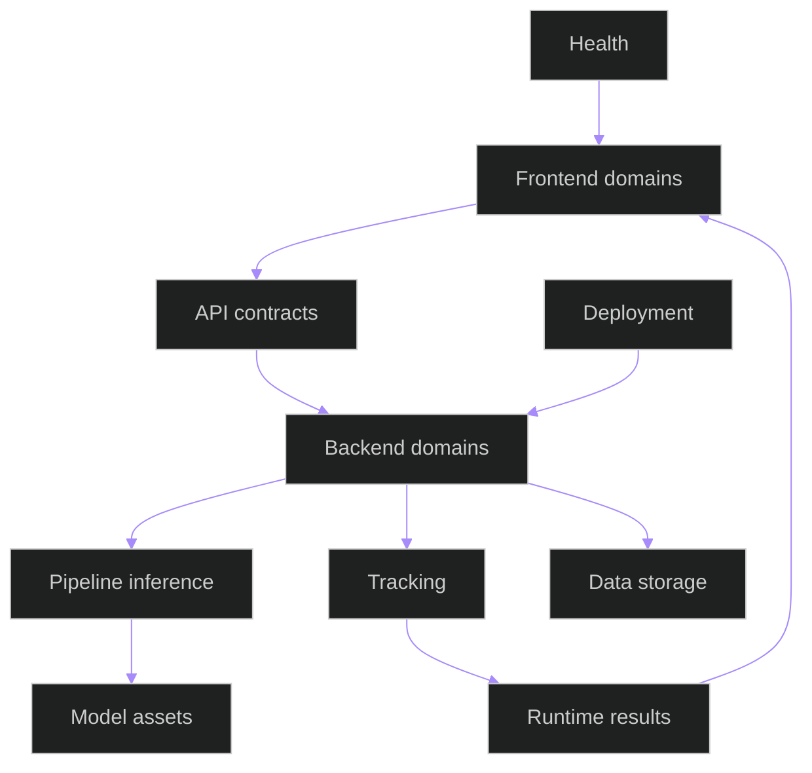

# Module Boundary Map

## Related Documents

- [compatibility contracts](compatibility-contracts.md)
- [coupling risk register](coupling-risk-register.md)
- [runtime scenario matrix](runtime-scenario-matrix.md)
- [documentation diagram coverage](documentation-diagram-coverage.md)
- [feature plan](../../specs/006-modular-low-coupling/plan.md)
- [module boundary contract](../../specs/006-modular-low-coupling/contracts/module-boundary-contract.md)

## Purpose

This map defines the primary owner, public surface, allowed consumers, dependencies, forbidden dependencies, and failure behavior for the major backend, frontend, runtime, and deployment boundaries in the hybrid modular model.

## Boundary Interaction Overview

The diagram shows the allowed high-level direction. Frontend domains consume API contracts rather than backend internals. Backend domains own business behavior. Pipeline and tracking own inference/tracking behavior and publish results back through backend contracts. Deployment provides runtime assumptions but must not become a business dependency.

## Backend Boundaries

| Boundary ID | Owner | Responsibilities | Public Inputs | Public Outputs | Consumers | Dependencies | Forbidden Dependencies | Failure Behavior |
| --- | --- | --- | --- | --- | --- | --- | --- | --- |
| `backend.accounts` | Accounts | Authentication, roles, user profile access | Credentials, user/session requests | Auth state, user records | Frontend auth, admin workflows | Django auth, database | Video/inference internals | Non-specific auth error, protected route denial |
| `backend.audit` | Audit | Audit event capture and retention | Security and workflow events | Audit records | Admin review, compliance | Database, logger | Frontend state internals | Durable event failure logged with degraded audit status |
| `backend.exams` | Exams | Exam setup and exam metadata | Exam commands, room/session links | Exam records, schedules | Sessions, dashboard | Accounts, database | Inference provider internals | Validation error without changing unrelated workflows |
| `backend.cameras` | Cameras | Camera inventory and stream source configuration | Camera CRUD, RTSP/WHEP metadata | Camera records, stream descriptors | Sessions, live UI, health | Accounts, sessions, go2rtc config | Tracking internals | Invalid stream is reported as camera degradation |
| `backend.sessions` | Sessions | Live monitoring session lifecycle | Start/stop/session events | Session state, channel events | Cameras, detections, frontend live UI | Cameras, channels, database | Offline video internals | Session reports stopped/degraded state |
| `backend.detections` | Detections | Detection records and live detection consumers | Detection frames/results | Detection payloads, overlays | Live UI, anomalies, exports | Pipeline, tracking, sessions | Direct model file access | Detection failure emits actionable degraded result |
| `backend.pipeline` | Pipeline inference | Model loading, inference clients, model route decisions | Frames, crops, model requests | Prediction results, health states | Detections, video analysis, tracking | Model repository, Triton/OpenVINO/ONNXRuntime | Frontend stores, Django views outside contracts | Timeout/fallback/degraded inference status |
| `backend.tracking` | Tracking | Track identity continuity and rendering output | Detection boxes, frames | Track IDs, rendered overlays | Detections, video analysis, frontend overlays | Pipeline result schemas | Camera/session persistence internals | Tracking degradation preserves detection results |
| `backend.video_analysis` | Video analysis | Offline upload, jobs, batch processing, preview/export orchestration | Raw video, job commands | Job status, stored results, annotated media | Frontend offline UI, exports, recordings | Pipeline, tracking, storage | Live session internals | Job failure with persisted error status |
| `backend.anomalies` | Anomalies | Anomaly triage, status, notes, severity | Detection/tracking events, triage commands | Alerts, triage records | Dashboard, exports, audit | Detections, sessions, accounts | Pipeline model internals | Alert marked degraded or validation error |
| `backend.recordings` | Recordings | Recording metadata and playback references | Recording queries, playback requests | Recording records, playback URLs | Offline UI, exports, anomalies | Video analysis, storage | Pipeline internals | Playback unavailable state |
| `backend.exports` | Exports | Export job initiation, progress, and download links | Export requests | Export status, artifact links | Frontend export UI, recordings | Sessions, anomalies, recordings, storage | Inference internals | Export failed status with retry path |
| `backend.health` | Health | Service, model, stream, and dependency health | Health probes, dependency checks | Health reports, degraded states | Dashboard, deployment, operators | Pipeline health, Redis, database, Triton health | Business workflow mutation | Read-only health degradation report |

## Boundary Declaration Sources

| Boundary Group | Source |
| --- | --- |
| Backend accounts/audit/exams | `backend/apps/accounts/boundary.py`, `backend/apps/audit/boundary.py`, `backend/apps/exams/boundary.py` |
| Backend live workflow | `backend/apps/cameras/boundary.py`, `backend/apps/sessions/boundary.py`, `backend/apps/detections/boundary.py` |
| Backend inference/tracking/offline | `backend/apps/pipeline/boundary.py`, `backend/apps/tracking/boundary.py`, `backend/apps/video_analysis/boundary.py` |
| Backend review/ops | `backend/apps/anomalies/boundary.py`, `backend/apps/recordings/boundary.py`, `backend/apps/exports/boundary.py`, `backend/apps/health/boundary.py` |
| Frontend public records | `frontend/src/types/boundaries.ts` |

The declaration files are the implementation-facing records. This map remains the documentation-facing index and must list every backend, frontend, runtime, and deployment boundary ID declared in code.

## Frontend Boundaries

| Boundary ID | Owner | Responsibilities | Public Inputs | Public Outputs | Consumers | Dependencies | Forbidden Dependencies | Failure Behavior |
| --- | --- | --- | --- | --- | --- | --- | --- | --- |
| `frontend.api` | API clients | Typed HTTP/WebSocket access | Request DTOs, auth token | Response DTOs, normalized errors | Stores, pages | Axios, router config | Backend database/model internals | User-visible actionable error |
| `frontend.auth-state` | Auth store | Auth session state and protected route decisions | Login/logout commands | User state, auth token | Pages, API clients | API auth endpoints | Camera/session internals | Redirect to login or non-specific login error |
| `frontend.live-monitoring-ui` | Live UI | Camera grid, stream controls, overlays | Camera/session state, detection events | Rendered feed shell and controls | Instructor workflow | Camera store, detection store, API | Pipeline internals | Degraded stream state with retry affordance |
| `frontend.offline-video-ui` | Offline UI | Upload, job progress, playback review | Video files, job state | Review UI, overlays, export actions | Admin workflow | Upload store, API, recording components | Live session internals | Failed job or upload error state |
| `frontend.anomaly-ui` | Anomaly UI | Alert list and triage actions | Alert records, status commands | Status updates, notes | Dashboard, admin workflow | Anomaly store, API | Detection internals | Validation error with unchanged alert list |
| `frontend.recording-export-ui` | Recording/export UI | Recording playback and export status | Recording records, export commands | Playback controls, export link/status | Admin workflow | API, stores | Pipeline internals | Download unavailable/progress error |
| `frontend.health-settings-ui` | Health/settings UI | Health views and operator settings | Health DTOs, settings commands | Health panels, settings state | Operators | API clients, stores | Model internals | Degraded dependency panel |
| `frontend.shared-ui` | Shared components | Reusable controls, layout, badges, feedback | Props, callbacks | Accessible UI components | All pages | React, styles | Domain store mutation | Local component fallback or validation state |

## Runtime And Deployment Boundaries

| Boundary ID | Owner | Responsibilities | Inputs | Outputs | Consumers | Dependencies | Forbidden Dependencies | Failure Behavior |
| --- | --- | --- | --- | --- | --- | --- | --- | --- |
| `runtime.live-stream` | Live runtime | Orchestrate camera/session/detection/tracking/anomaly path | Live camera feed, session commands | Feed state, overlays, anomaly updates | Instructor workflow | Cameras, sessions, detections, tracking, health | Offline job internals | Reconnect, degraded health, actionable stream error |
| `runtime.offline-video` | Offline runtime | Orchestrate upload/job/inference/tracking/review path | Raw video, job commands | Job state, stored results, playback overlays | Admin workflow | Video analysis, pipeline, tracking, recordings, exports | Live session internals | Failed job status, retry-safe error |
| `runtime.non-video-dashboard` | Dashboard runtime | Preserve auth, exams, rooms/cameras, sessions, anomalies, exports, health, settings, navigation | User actions | Page state, records, reports | All dashboard users | Accounts, exams, cameras, sessions, anomalies, exports, health | Direct model inference | Isolated page-level error |
| `deployment.dev-docker` | Dev infrastructure | Docker Compose services for development/test | Compose commands, env files | Local service topology | Developers, CI validation | Docker, Redis, PostgreSQL, Triton | Production hard requirement | Container health failure only affects dev/test |
| `deployment.prod-linux` | Production infrastructure | Native Linux service assumptions | systemd/service config, env | Native backend/frontend/model serving runtime | Operators | Native Redis/PostgreSQL/process supervision | Docker availability | Native service health and rollback path |

## Verification

Boundary declarations and dependency-direction tests must align with this map before user story implementation is considered foundation-ready.
