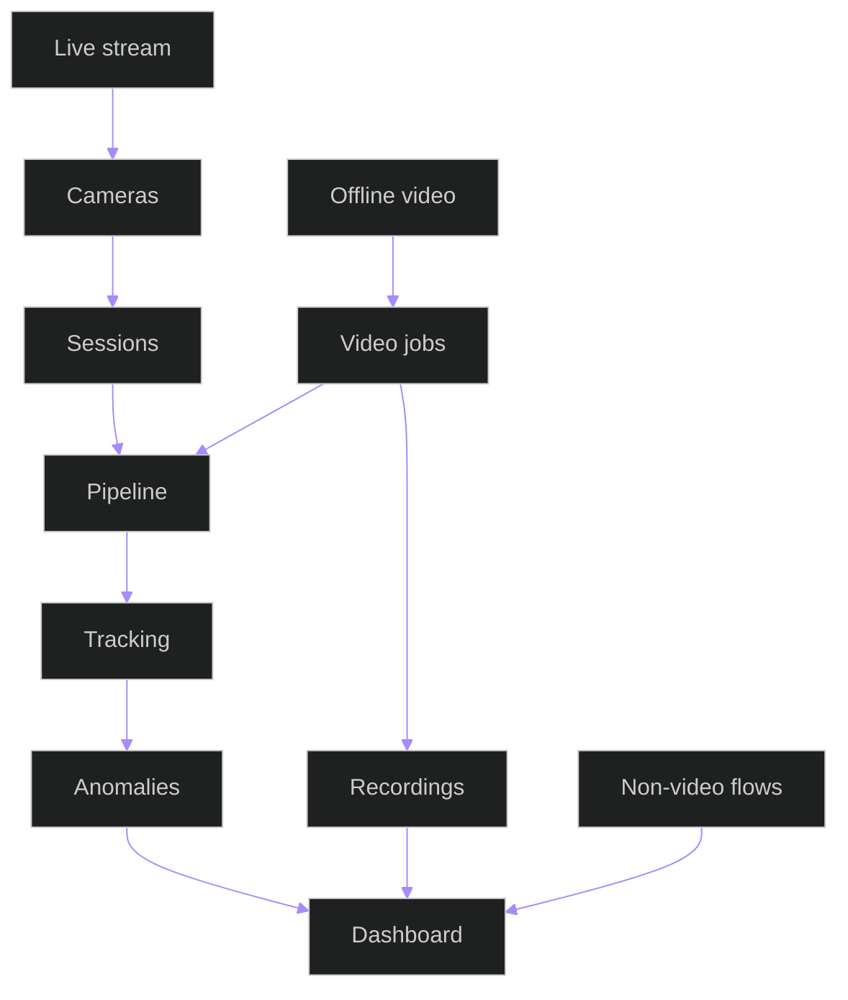
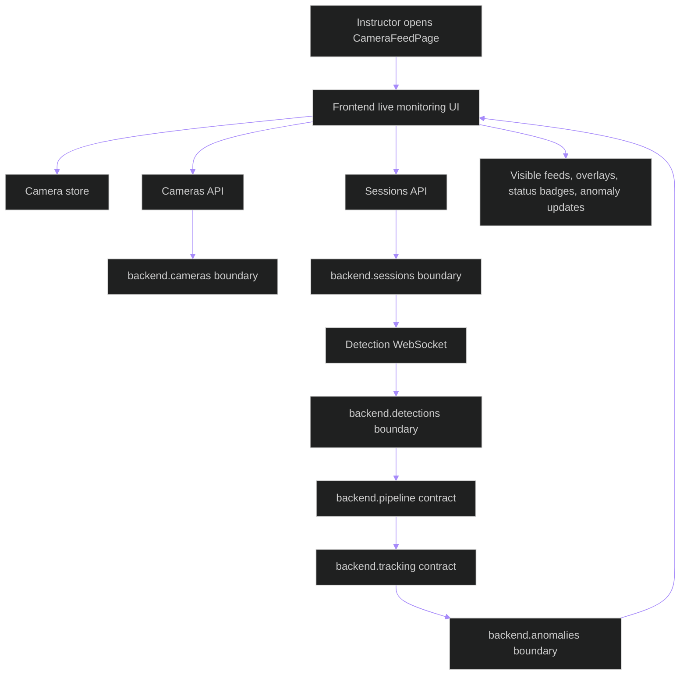
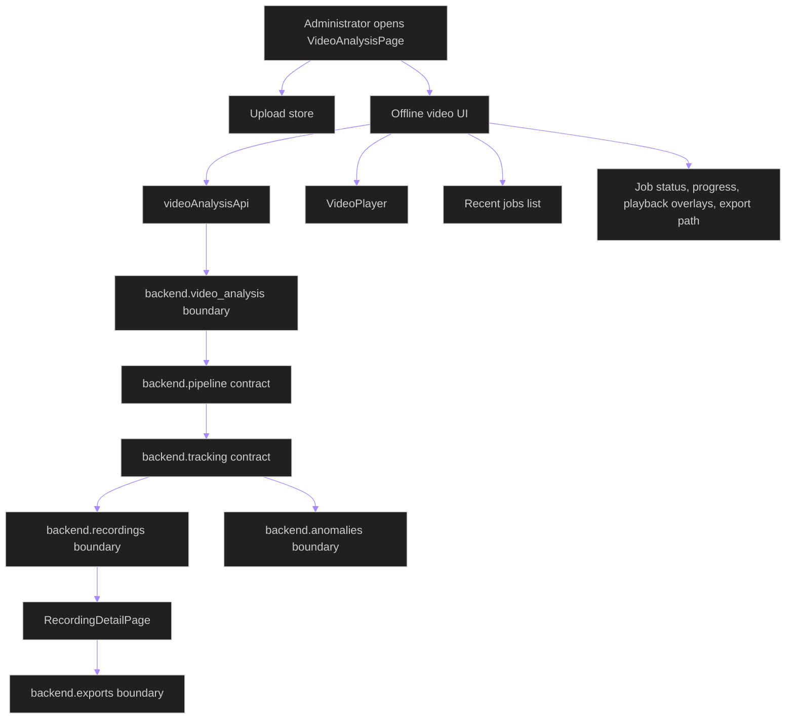
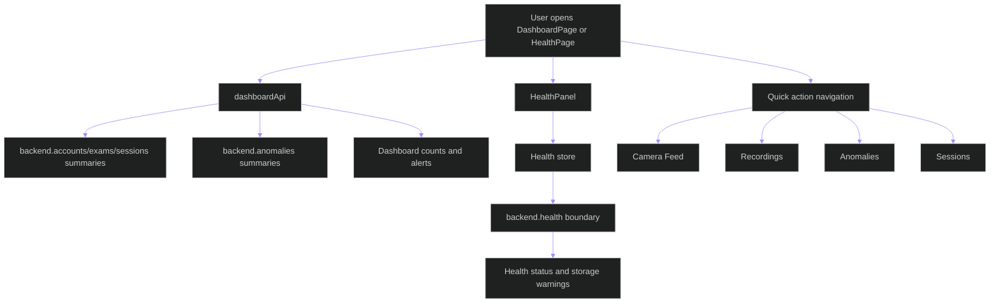

# Runtime Scenario Matrix

## Related Documents

- [module boundary map](module-boundary-map.md)
- [compatibility contracts](compatibility-contracts.md)
- [coupling risk register](coupling-risk-register.md)
- [runtime scenario contract](../../specs/006-modular-low-coupling/contracts/runtime-scenario-contract.md)
- [full delivered baseline](../../specs/006-modular-low-coupling/evidence/baseline/full-delivered-baseline.md)

## Purpose

This matrix defines the mandatory live-stream, offline-video, and non-video dashboard scenarios used to prove that modular restructuring preserves delivered behavior.

## Runtime Flow

The flowchart shows shared and distinct runtime paths. Live stream starts from cameras and sessions. Offline video starts from video jobs. Both use pipeline and tracking contracts before results reach anomalies, recordings, exports, and dashboard surfaces. Non-video flows keep dashboard workflows protected from accidental regressions.

## Live Stream Flow

The live-stream flow keeps page interactions, camera-store transitions, session state, detection output, tracking IDs, and anomaly updates behind explicit boundaries. The frontend page contract and camera-store selector provide the user-visible evidence point for this scenario.

## Offline Video Flow

The offline-video flow isolates upload state, job status, inference routing, tracking output, persisted recording review, and exports. The upload-store selector and video/recording page contracts are the preserved frontend evidence points.

## Non-Video Dashboard Flow

The non-video dashboard flow proves dashboard and health workflows remain separated from inference internals. Navigation, summary counts, health status, and storage warnings are the public outputs; page-level failures must not mutate live or offline processing state.

## Scenario Matrix

| Scenario ID | Entry Point | Boundaries Involved | Contracts Exercised | Required Real Data | User-Visible Outputs | Failure/Recovery Evidence | Tests |
| --- | --- | --- | --- | --- | --- | --- | --- |
| `live-stream` | Instructor starts or views monitoring session | Cameras, sessions, detections, pipeline, tracking, anomalies, health, frontend live UI | `contract.frontend.camera`, `contract.frontend.session`, `contract.live.detection`, `contract.pipeline.inference`, `contract.tracking.output`, `contract.health.status` | Real model weights and raw/live media | Feed state, overlays, tracking IDs, anomaly updates, controls | Stream unavailable, reconnect, degraded health, production Triton fail-closed/degraded state | Live equivalence system tests and frontend e2e |
| `offline-video` | Administrator uploads or selects raw video | Video analysis, pipeline, tracking, detections/results, recordings, exports, anomalies, frontend offline UI | `contract.offline.video-job`, `contract.pipeline.inference`, `contract.tracking.output`, `contract.recording.export`, `contract.anomaly.triage` | Real model weights and raw video data | Job status, progress, stored results, playback overlays, export link | Invalid media, batch failure, long-running processing, export failure | Offline equivalence system tests and recording e2e |
| `non-video-dashboard` | User performs dashboard workflow | Accounts, exams, rooms/cameras, sessions, anomalies, exports, health, settings, frontend navigation/state | `contract.frontend.auth`, `contract.anomaly.triage`, `contract.recording.export`, `contract.health.status` | Not required unless workflow crosses video/inference | Login, navigation, setup, records, health/settings panels | Page-level error, permission denial, dependency degraded state | Backend baseline, frontend unit/e2e |

## Performance Thresholds

The plan allows no more than 10% regression in live-stream frame/result propagation, offline processing throughput, dashboard navigation, or health/export workflows unless explicitly approved as a separate feature.
