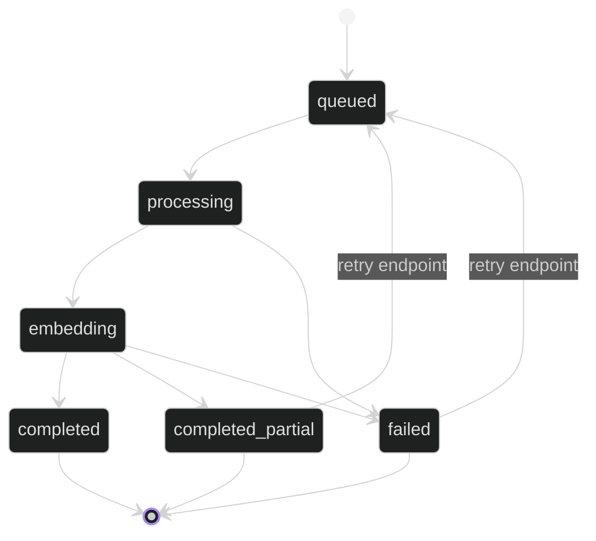

# Job State Diagram

## Purpose

Captures the lifecycle of a video analysis job, including the clarified partial-success path.

## Walkthrough

The job starts queued, moves into processing and embedding, and then finishes as either completed, completed_partial, or failed.

## Key Takeaways

- `completed_partial` is a first-class terminal state.
- `failed` is reserved for unrecoverable processing errors.
- The state flow is intentionally simple so the UI can present progress unambiguously.

## Related Documents

- [Video Analysis App](apps/video_analysis/README.md)
- [API README](api/README.md)
