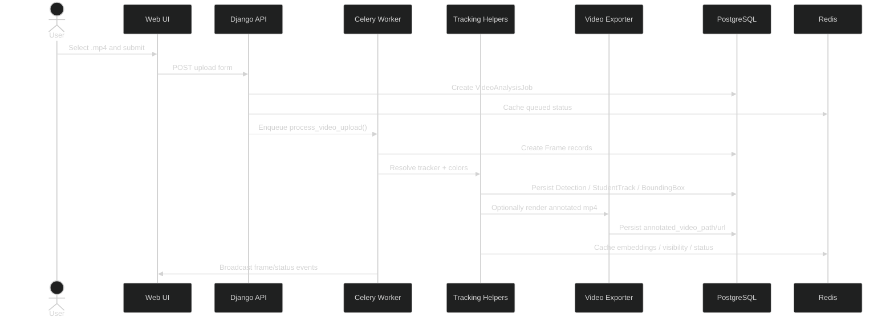

# Video Upload Sequence

## Purpose

Shows the end-to-end journey from user upload to stored overlays and playback-ready data.

## Walkthrough

Read left to right: the user uploads a file, the API creates the job, Celery processes frames, tracking assigns IDs/colors, and storage persists the outputs for later playback.

## Key Takeaways

- Upload handling is asynchronous.
- Tracking and rendering are separate steps.
- Redis holds fast-changing state; PostgreSQL keeps the durable records.

## Related Documents

- [Job State Diagram](JOB_STATE_DIAGRAM.md)
- [Architecture](../ARCHITECTURE.md)
