# backend/apps/cameras/exceptions.py

## Related Documents

- [source](../../../../backend/apps/cameras/exceptions.py)
- [system atlas](../../../diagrams/SYSTEM_MERMAID_ATLAS.md)
- [source mirror](../../../diagrams/SOURCE_FILE_MIRROR.md)

## Executive View

This document reflects the backend feature module exactly as it is implemented in the repository today.

## Architectural Role

Python implementation module that contributes behavior to the repository runtime.

## Reflected Surface

| Symbol | Kind | Reflection |
|------|------|------------|
| `ErrorContext` | Class | Reflected directly from the current top-level implementation surface. |
| `CameraConnectionError` | Class | Reflected directly from the current top-level implementation surface. |
| `RtspNetworkTimeoutError` | Class | Reflected directly from the current top-level implementation surface. |
| `RtspNetworkRefusedError` | Class | Reflected directly from the current top-level implementation surface. |
| `RtspNetworkDnsError` | Class | Reflected directly from the current top-level implementation surface. |
| `RtspNetworkError` | Class | Reflected directly from the current top-level implementation surface. |
| `RtspAuthOrPathError` | Class | Reflected directly from the current top-level implementation surface. |
| `RtspHandshakeTimeoutError` | Class | Reflected directly from the current top-level implementation surface. |
| `RtspNoVideoDataError` | Class | Reflected directly from the current top-level implementation surface. |
| `RtspVideoTimeoutError` | Class | Reflected directly from the current top-level implementation surface. |
| `RtspProbeTimeoutError` | Class | Reflected directly from the current top-level implementation surface. |

## Architecture Diagram

```mermaid
%%{init: {'theme': 'dark', 'themeVariables': {'primaryColor': '#7C3AED', 'lineColor': '#A78BFA'}}}%%
flowchart TB
    subgraph Source["Current Module"]
        SRC["backend/apps/cameras/exceptions.py\nThis document reflects the backend feature module exactly as it is implemented i"]
    end
    subgraph Dependencies["Project Dependencies"]
        I0["No project-local imports captured
File is locally scoped or infrastructure-only"]
    end
    subgraph Surface["Reflected Surface"]
        E1["ErrorContext\nClass"]
        E2["CameraConnectionError\nClass"]
        E3["RtspNetworkTimeoutError\nClass"]
        E4["RtspNetworkRefusedError\nClass"]
        E5["RtspNetworkDnsError\nClass"]
        E6["RtspNetworkError\nClass"]
        E7["RtspAuthOrPathError\nClass"]
        E8["RtspHandshakeTimeoutError\nClass"]
        E9["RtspNoVideoDataError\nClass"]
        E10["RtspVideoTimeoutError\nClass"]
        E11["RtspProbeTimeoutError\nClass"]
    end
    subgraph Role["Architectural Role"]
        R1["Python implementation module that contributes behavior to the repository runtime."]
    end
    SRC --> I0
    SRC --> E1
    SRC --> E2
    SRC --> E3
    SRC --> E4
    SRC --> E5
    SRC --> E6
    SRC --> E7
    SRC --> E8
    SRC --> E9
    SRC --> E10
    SRC --> E11
    SRC --> R1
```

This diagram uses the same visual language as the root architecture view: one subgraph for the current module, one for concrete repository dependencies, one for the reflected implementation surface, and one for the architectural role that the file currently occupies.

## Detailed Reflection

This module sits at `backend/apps/cameras/exceptions.py` and acts as a concrete implementation boundary inside the repository. Python implementation module that contributes behavior to the repository runtime.

From a dependency perspective, the file currently reaches into no project-local imports in the captured surface. Those links were read from the real source file so the diagram reflects the actual local coupling rather than an inferred architecture.

From a surface perspective, the top-level implementation currently exposes or declares `ErrorContext`, `CameraConnectionError`, `RtspNetworkTimeoutError`, `RtspNetworkRefusedError`, `RtspNetworkDnsError`, `RtspNetworkError`, `RtspAuthOrPathError`, `RtspHandshakeTimeoutError`. That reflected surface is intentionally tied to the source file itself, so if the code changes the document should be regenerated with it.

From an accuracy perspective, this page focuses on project-local structure: repository imports, top-level classes/functions/constants, and the architectural role implied by the file location and concrete implementation type. External library imports are intentionally omitted from the diagram so the repository interaction map remains readable while staying faithful to the codebase.
