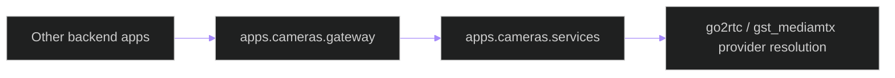

# backend/apps/cameras/gateway.py

## Source
- [backend/apps/cameras/gateway.py](../../../../backend/apps/cameras/gateway.py)

## What this file does

`gateway.py` is a narrow re-export boundary so other apps import camera relay access through one stable module instead of coupling directly to `apps.cameras.services`.

## Exposed API

- `get_stream_gateway`
- `get_stream_gateway_for_camera`
- `resolve_stream_pipeline_profile`

## Dependency flow

## Cross-links

- [services.md](services.md)
- [../pipeline/services/runtime_policy.md](../pipeline/services/runtime_policy.md)

