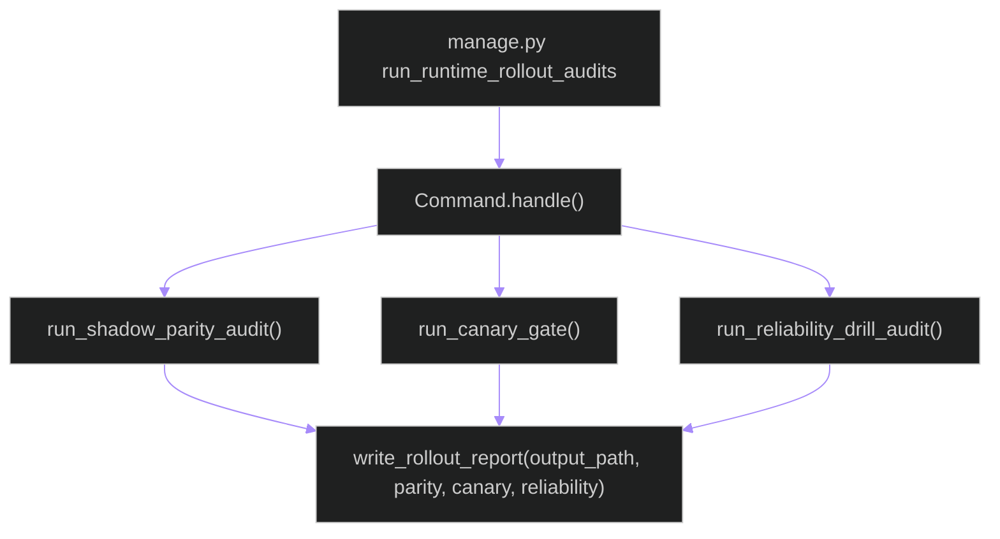

# backend/apps/pipeline/management/commands/run_runtime_rollout_audits.py

## Source
- [backend/apps/pipeline/management/commands/run_runtime_rollout_audits.py](../../../../../../backend/apps/pipeline/management/commands/run_runtime_rollout_audits.py)

## Purpose

Defines a Django management command that executes rollout evidence checks (shadow parity, canary gate, reliability drill) and writes a markdown report into feature evidence.

## Execution flow

## Runtime dependencies

- Django settings (`settings.BASE_DIR`) to compute default output path.
- `apps.pipeline.services.rollout_execution` for the actual audit logic.

## Cross-links

- [../../services/rollout_execution.md](../../services/rollout_execution.md)
- [../../../architecture/triton-operations.md](../../../architecture/triton-operations.md)

