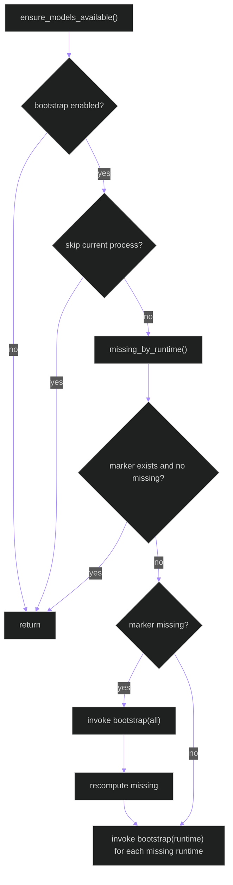

# backend/apps/pipeline/model_bootstrap.py

## Source
- [backend/apps/pipeline/model_bootstrap.py](../../../../../backend/apps/pipeline/model_bootstrap.py)

## Purpose

Startup guard that ensures required model artifacts are present for configured runtime backends before inference workloads begin.

## Key behaviors

1. Reads bootstrap toggles and paths from env (`PYRAMID_MODEL_BOOTSTRAP_*`).
2. Skips bootstrap in test or maintenance commands (`pytest`, `makemigrations`, `collectstatic`, `shell`).
3. Resolves missing model files per role/runtime using pipeline config.
4. Invokes platform script (`bootstrap-models.ps1` on Windows, `.sh` on non-Windows).
5. Uses marker file `.model_bootstrap_complete` to avoid redundant full bootstrap.

## Bootstrap decision path

## Cross-links

- [config.md](config.md)
- [services/runtime_policy.md](services/runtime_policy.md)
- [../../scripts/check_rtmpose_paths.md](../../scripts/check_rtmpose_paths.md)

