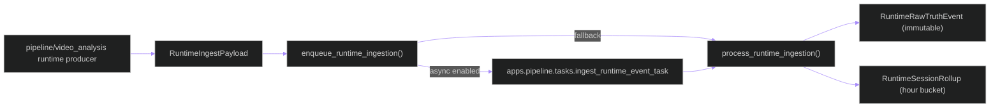

# backend/apps/pipeline/runtime_ingestion.py

## Source
- [backend/apps/pipeline/runtime_ingestion.py](../../../../../backend/apps/pipeline/runtime_ingestion.py)

## Purpose

Persists runtime telemetry as immutable raw events plus hourly rollups, with optional async ingestion through Celery.

## Main structures and functions

- `RuntimeIngestPayload`: typed ingest contract with `to_dict/from_dict`.
- `ingest_runtime_event(...)`: writes `RuntimeRawTruthEvent` with ordered `ingest_sequence`.
- `update_runtime_rollup(...)`: upserts `RuntimeSessionRollup` and updates counters/latency.
- `process_runtime_ingestion(...)`: synchronous ingest pipeline.
- `enqueue_runtime_ingestion(...)`: async-first with inline fallback.

## Data path

## Cross-links

- [tasks.md](tasks.md)
- [services/runtime_comparison.md](services/runtime_comparison.md)
- [../../architecture/data-flow.md](../../architecture/data-flow.md)

