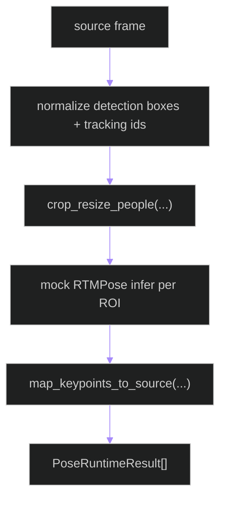

# backend/apps/pipeline/services/pose_runtime.py

## Source
- [backend/apps/pipeline/services/pose_runtime.py](../../../../../../backend/apps/pipeline/services/pose_runtime.py)

## Purpose

Defines the RTMPose runtime boundary over source-frame detections: ROI crop/resize, pose inference adapter, and keypoint remap to source coordinates.

## Runtime contract

- Input: source frame + person detections (`bounding_box` / `bbox` / `xyxy`).
- Output: `PoseRuntimeResult` list (`tracking_id`, keypoints, scores, source bbox).
- Current infer implementation uses deterministic `_mock_rtmpose_infer` placeholder to keep mapping contract stable until backend-specific RTMPose engine call is wired.

## Flow

## Cross-links

- [rtmpose_pipeline.md](rtmpose_pipeline.md)
- [../layers/posture.md](../layers/posture.md)
- [../../../../scripts/test_rtmpose_inference_backends.md](../../../../scripts/test_rtmpose_inference_backends.md)

## Provider + Fallback Fields
- Runtime now exposes provider selection (cpu/cuda/mock) and fallback reason codes via map_provider_fallback_reason (provider_error, 	imeout, model_unavailable).
- Benchmark helper compute_pose_benchmark_metrics emits pose_fps, 2e_latency_ms_p95, 2e_latency_ms_mean.
