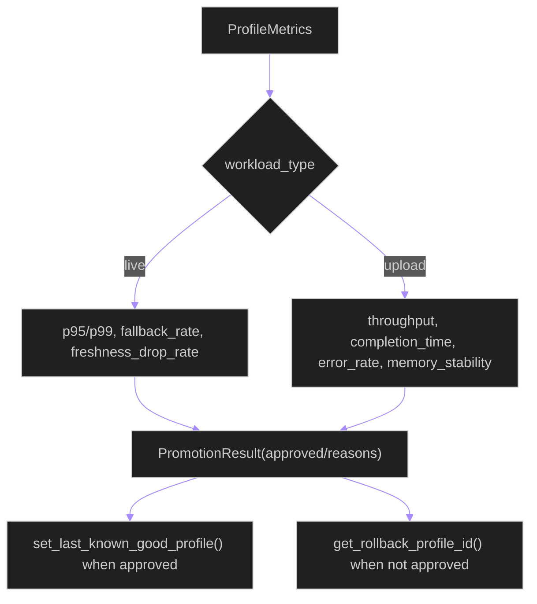

# backend/apps/pipeline/services/profile_promotion.py

## Source
- [backend/apps/pipeline/services/profile_promotion.py](../../../../../../backend/apps/pipeline/services/profile_promotion.py)

## Purpose

Implements promotion/rollback gate evaluation for runtime profiles and stores last-known-good profile state in cache.

## Core logic

- `PromotionThresholds`: SLO limits for live/upload workloads.
- `ProfileMetrics`: measured metrics used by gate.
- `evaluate_promotion_gate(...)`: returns `PromotionResult` with explicit failure reasons.
- `set/get_last_known_good_profile(...)`: stores stable rollback target in cache.
- `get_rollback_profile_id(...)`: resolves safe profile when candidate regresses.

## Promotion gate branches

## Cross-links

- [runtime_policy.md](runtime_policy.md)
- [rollout_execution.md](rollout_execution.md)

