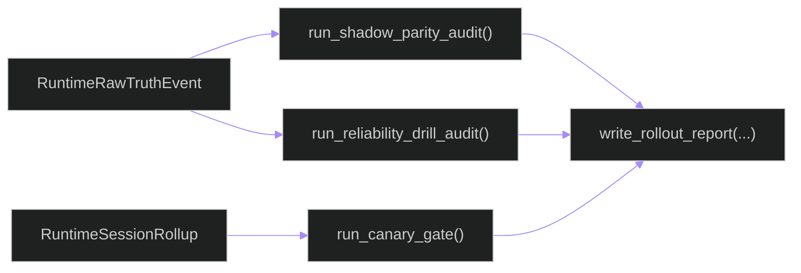

# backend/apps/pipeline/services/rollout_execution.py

## Source
- [backend/apps/pipeline/services/rollout_execution.py](../../../../../../backend/apps/pipeline/services/rollout_execution.py)

## Purpose

Computes rollout evidence from runtime telemetry tables and writes markdown evidence for shadow/canary/cutover decisions.

## Audit functions

- `run_shadow_parity_audit`: compares live vs upload error-rate parity for canary authorities.
- `run_canary_gate`: aggregates rollups and checks latency/fallback/error thresholds.
- `run_reliability_drill_audit`: authority-level frame lifecycle counts.
- `write_rollout_report`: serializes outcome to markdown artifact.

## Telemetry-to-evidence flow

## Cross-links

- [../management/commands/run_runtime_rollout_audits.md](../management/commands/run_runtime_rollout_audits.md)
- [../runtime_ingestion.md](../runtime_ingestion.md)
- [../../../architecture/triton-operations.md](../../../architecture/triton-operations.md)

