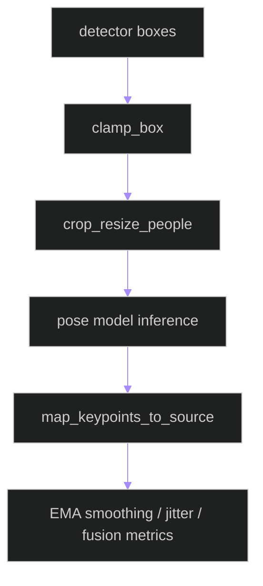

# backend/apps/pipeline/services/rtmpose_pipeline.py

## Source
- [backend/apps/pipeline/services/rtmpose_pipeline.py](../../../../../../backend/apps/pipeline/services/rtmpose_pipeline.py)

## Purpose

Low-level RTMPose preprocessing/postprocessing helpers for ROI clamp, crop-resize tensor preparation, source-space mapping, temporal smoothing, and geometric metrics.

## Key utilities

- `clamp_box`: bounds-safe integer ROI.
- `crop_resize_people`: produces CHW normalized tensors and `RoiTransform`.
- `map_keypoints_to_source`: reprojects keypoints from model input space.
- `smooth_keypoints_ema`, `jitter_metric`, `fusion_valid_ratio`, `group_by_centroid_distance`: temporal/quality signals used by higher pipeline stages.

## Processing pipeline

## Cross-links

- [pose_runtime.md](pose_runtime.md)
- [../../tracking/reid.md](../../tracking/reid.md)

