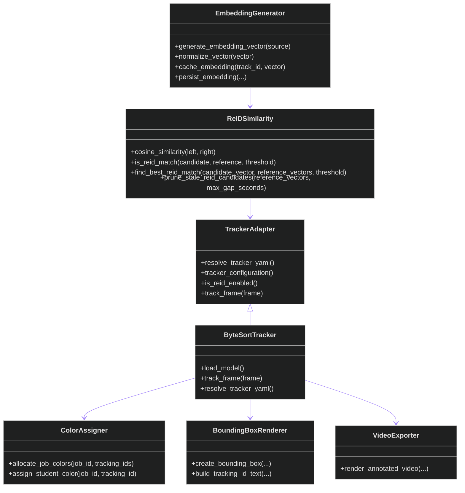

# tracking Class Diagram

## Purpose

Summarizes the helper types and service-style objects used by the tracking package.

## Walkthrough

Read left to right: tracker input is normalized, embeddings are generated, re-ID checks similarity, and rendering converts tracked state into stored overlay records.

## Key Takeaways

- `ByteSortTracker` is the concrete adapter used in the pipeline.
- `TrackerAdapter` captures the resolved tracker configuration and allows future extension without changing callers.
- Re-ID operates on embeddings, while rendering operates on persisted overlay records.

## Related Documents

- [Tracking README](README.md)
- [Color Assignment Flowchart](color-assignment-flowchart.md)
- [Re-ID Flowchart](reid-flowchart.md)
