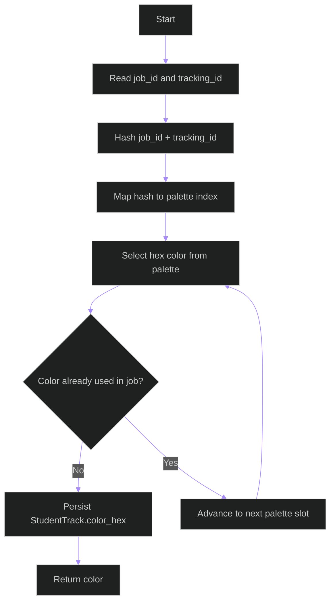

# Color Assignment Flowchart

## Purpose

Explains how a stable color is derived for each student track so the same student keeps the same color across all overlays.

## Walkthrough

The flow starts with a `job_id` and `tracking_id`, hashes them into a palette index, and then checks the per-job uniqueness constraint before finalizing the color.

## Key Takeaways

- The assignment is deterministic.
- The unique-per-job constraint prevents two students in the same video from sharing a color.
- The palette is large enough to support a crowded classroom without immediate collisions.

## Related Documents

- [Tracking README](README.md)
- [Class Diagram](class-diagram.md)
