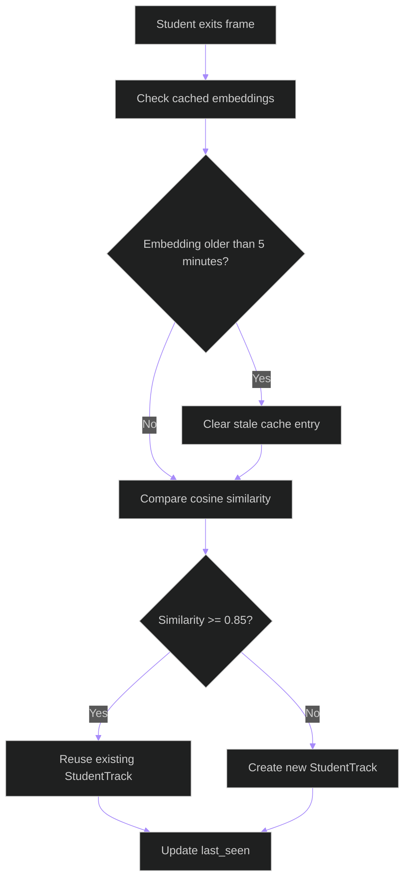

# Re-ID Flowchart

## Purpose

Documents how the pipeline decides whether a returning student keeps an existing ID or receives a new one.

## Walkthrough

Read top to bottom: the pipeline checks cached embeddings first, prunes stale candidates, compares cosine similarity, and either reuses the existing track or creates a new one.

## Key Takeaways

- Re-entry is treated as a matching problem, not a frame-level heuristic.
- The 0.85 threshold is the decision boundary.
- Candidates older than five minutes are not reused.

## Related Documents

- [Tracking README](README.md)
- [Class Diagram](class-diagram.md)
