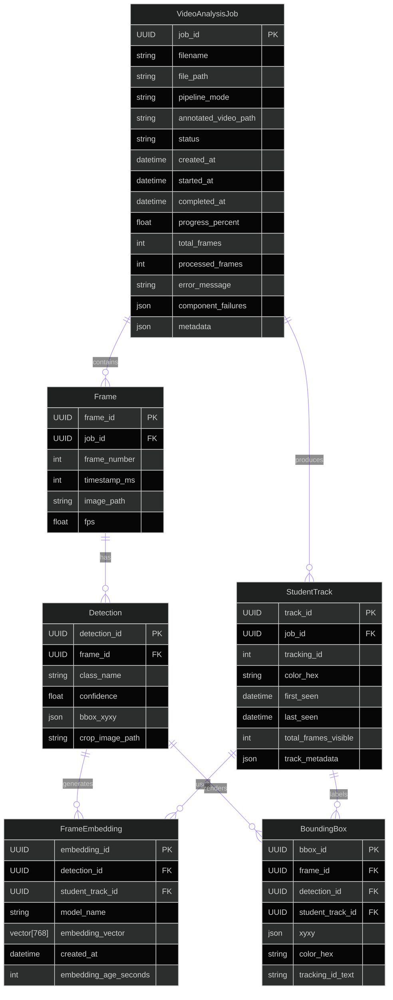

# video_analysis Data Model

## Purpose

Shows how uploads, frames, detections, student tracks, embeddings, and bounding boxes connect across the analysis pipeline.

## Walkthrough

Read top to bottom: a `VideoAnalysisJob` owns frames and student tracks; frames hold detections; detections can produce embeddings; student tracks own the stable identity and color used by all overlays.

## Key Takeaways

- `VideoAnalysisJob` is the lifecycle root.
- `StudentTrack.color_hex` is the identity anchor for every overlay rendered for that student.
- `BoundingBox` is a derived render record; visibility is applied at retrieval time, not stored as the source of truth.

## Related Documents

- [App README](README.md)
- [API README](../../api/README.md)
- [Tracking README](../tracking/README.md)
