# backend/apps/video_analysis/tasks.py

## Related Documents

- [source](../../../../backend/apps/video_analysis/tasks.py)
- [system atlas](../../../diagrams/SYSTEM_MERMAID_ATLAS.md)
- [source mirror](../../../diagrams/SOURCE_FILE_MIRROR.md)

## Executive View

Celery tasks for video upload processing and tracking.

## Architectural Role

Background execution layer that offloads long-running or asynchronous workflows to Celery.

## Reflected Surface

| Symbol | Kind | Reflection |
|------|------|------------|
| `build_job_status_contract` | Function | Reflected directly from the current top-level implementation surface. |
| `_is_triton_enabled` | Function | Reflected directly from the current top-level implementation surface. |
| `_build_triton_orchestrator` | Function | Reflected directly from the current top-level implementation surface. |
| `_normalize_channel_payload` | Function | Reflected directly from the current top-level implementation surface. |
| `_redis_client` | Function | Reflected directly from the current top-level implementation surface. |
| `_broadcast_job_event` | Function | Reflected directly from the current top-level implementation surface. |
| `_set_job_status` | Function | Reflected directly from the current top-level implementation surface. |
| `VideoTaskTimeoutError` | Class | Reflected directly from the current top-level implementation surface. |
| `_video_job_root` | Function | Reflected directly from the current top-level implementation surface. |
| `_build_inference_audit` | Function | Reflected directly from the current top-level implementation surface. |
| `_append_inference_audit_event` | Function | Reflected directly from the current top-level implementation surface. |
| `_broadcast_live_event` | Function | Reflected directly from the current top-level implementation surface. |

## Architecture Diagram

```mermaid
%%{init: {'theme': 'dark', 'themeVariables': {'primaryColor': '#7C3AED', 'lineColor': '#A78BFA'}}}%%
flowchart TB
    subgraph Source["Current Module"]
        SRC["backend/apps/video_analysis/tasks.py\nCelery tasks for video upload processing and tracking."]
    end
    subgraph Dependencies["Project Dependencies"]
        I1["apps.pipeline.openvino_compat\nProject Module"]
        I2["apps.tracking.colors\nProject Module"]
        I3["apps.tracking.embeddings\nProject Module"]
        I4["apps.tracking.pipeline\nProject Module"]
        I5["apps.tracking.pipeline_mode\nProject Module"]
        I6["apps.tracking.tracker\nProject Module"]
        I7["apps.tracking.video_exporter\nProject Module"]
        I8["apps.tracking.reid\nProject Module"]
    end
    subgraph Surface["Reflected Surface"]
        E1["build_job_status_contract\nFunction"]
        E2["_is_triton_enabled\nFunction"]
        E3["_build_triton_orchestrator\nFunction"]
        E4["_normalize_channel_payload\nFunction"]
        E5["_redis_client\nFunction"]
        E6["_broadcast_job_event\nFunction"]
        E7["_set_job_status\nFunction"]
        E8["VideoTaskTimeoutError\nClass"]
        E9["_video_job_root\nFunction"]
        E10["_build_inference_audit\nFunction"]
        E11["_append_inference_audit_event\nFunction"]
        E12["_broadcast_live_event\nFunction"]
    end
    subgraph Role["Architectural Role"]
        R1["Background execution layer that offloads long-running or asynchronous workflows to Celery."]
    end
    SRC --> I1
    SRC --> I2
    SRC --> I3
    SRC --> I4
    SRC --> I5
    SRC --> I6
    SRC --> I7
    SRC --> I8
    SRC --> E1
    SRC --> E2
    SRC --> E3
    SRC --> E4
    SRC --> E5
    SRC --> E6
    SRC --> E7
    SRC --> E8
    SRC --> E9
    SRC --> E10
    SRC --> E11
    SRC --> E12
    SRC --> R1
```

This diagram uses the same visual language as the root architecture view: one subgraph for the current module, one for concrete repository dependencies, one for the reflected implementation surface, and one for the architectural role that the file currently occupies.

## Detailed Reflection

This module sits at `backend/apps/video_analysis/tasks.py` and acts as a concrete implementation boundary inside the repository. Background execution layer that offloads long-running or asynchronous workflows to Celery.

From a dependency perspective, the file currently reaches into `apps.pipeline.openvino_compat`, `apps.tracking.colors`, `apps.tracking.embeddings`, `apps.tracking.pipeline`, `apps.tracking.pipeline_mode`, `apps.tracking.tracker`. Those links were read from the real source file so the diagram reflects the actual local coupling rather than an inferred architecture.

From a surface perspective, the top-level implementation currently exposes or declares `build_job_status_contract`, `_is_triton_enabled`, `_build_triton_orchestrator`, `_normalize_channel_payload`, `_redis_client`, `_broadcast_job_event`, `_set_job_status`, `VideoTaskTimeoutError`. That reflected surface is intentionally tied to the source file itself, so if the code changes the document should be regenerated with it.

From an accuracy perspective, this page focuses on project-local structure: repository imports, top-level classes/functions/constants, and the architectural role implied by the file location and concrete implementation type. External library imports are intentionally omitted from the diagram so the repository interaction map remains readable while staying faithful to the codebase.

## Runtime Wrapper Notes

- Upload and live task entrypoints now delegate shared runtime bootstrap/start-event logic to:
  - `_build_upload_runtime(...)`
  - `_build_live_runtime(...)`
- This keeps wrapper responsibilities focused on setup and sink wiring while lifecycle emission remains centralized.

## Streaming and Freshness Notes

- Live inference uses native source streaming via `run_multi_model_inference_streaming(...)` (RTSP/TCP/file capture path, no mandatory FFmpeg-first extraction for primary inference execution).
- Runtime freshness controls are enforced for overlay emission while preserving full persistence truth:
  - stale-frame guard (`frame_idx` monotonic check)
  - `LIVE_OVERLAY_FRAME_STRIDE` drop policy (newest-visual priority)
- Emitted lifecycle/overlay payloads include freshness metadata (`freshness_policy`, `overlay_stride`, emitted/dropped counters).
- Per-frame lifecycle events now emit explicit stage markers for runtime observability:
  - `input`
  - `preprocess`
  - `inference`
  - `postprocess`
  - `output`
  with `timings` payload fields (`decode_ms`, `preprocess_ms`, `inference_ms`, `postprocess_ms`, `delivery_ms`).
- Per-frame lifecycle events also emit `external_factors` stage payloads including queue depth, worker concurrency, host resource utilization, websocket backlog estimate, and reconnect counts.
