# backend/apps/video_analysis/views.py

## Related Documents

- [source](../../../../backend/apps/video_analysis/views.py)
- [system atlas](../../../diagrams/SYSTEM_MERMAID_ATLAS.md)
- [source mirror](../../../diagrams/SOURCE_FILE_MIRROR.md)

## Executive View

REST views for video upload analysis workflows.

## Architectural Role

HTTP boundary that translates requests into validated application behavior and serialized responses.

## Reflected Surface

| Symbol | Kind | Reflection |
|------|------|------------|
| `_BaseVideoAnalysisView` | Class | Reflected directly from the current top-level implementation surface. |
| `validate_uploaded_video` | Function | Reflected directly from the current top-level implementation surface. |
| `_get_redis_client` | Function | Reflected directly from the current top-level implementation surface. |
| `_save_uploaded_file` | Function | Reflected directly from the current top-level implementation surface. |
| `_cleanup_partial_upload` | Function | Reflected directly from the current top-level implementation surface. |
| `_visibility_key` | Function | Reflected directly from the current top-level implementation surface. |
| `_job_status_key` | Function | Reflected directly from the current top-level implementation surface. |
| `_tracking_visibility_key` | Function | Reflected directly from the current top-level implementation surface. |
| `_visibility_signature` | Function | Reflected directly from the current top-level implementation surface. |
| `_default_visibility` | Function | Reflected directly from the current top-level implementation surface. |
| `_read_visibility` | Function | Reflected directly from the current top-level implementation surface. |
| `_write_visibility` | Function | Reflected directly from the current top-level implementation surface. |

## Architecture Diagram

```mermaid
%%{init: {'theme': 'dark', 'themeVariables': {'primaryColor': '#7C3AED', 'lineColor': '#A78BFA'}}}%%
flowchart TB
    subgraph Source["Current Module"]
        SRC["backend/apps/video_analysis/views.py\nREST views for video upload analysis workflows."]
    end
    subgraph Dependencies["Project Dependencies"]
        I1["apps.tracking.pipeline_mode\nProject Module"]
        I2["apps.tracking.video_exporter\nProject Module"]
        I3["apps.video_analysis.models\nProject Module"]
        I4["apps.video_analysis.serializers\nProject Module"]
        I5["apps.video_analysis.tasks\nProject Module"]
    end
    subgraph Surface["Reflected Surface"]
        E1["_BaseVideoAnalysisView\nClass"]
        E2["validate_uploaded_video\nFunction"]
        E3["_get_redis_client\nFunction"]
        E4["_save_uploaded_file\nFunction"]
        E5["_cleanup_partial_upload\nFunction"]
        E6["_visibility_key\nFunction"]
        E7["_job_status_key\nFunction"]
        E8["_tracking_visibility_key\nFunction"]
        E9["_visibility_signature\nFunction"]
        E10["_default_visibility\nFunction"]
        E11["_read_visibility\nFunction"]
        E12["_write_visibility\nFunction"]
    end
    subgraph Role["Architectural Role"]
        R1["HTTP boundary that translates requests into validated application behavior and serialized responses."]
    end
    SRC --> I1
    SRC --> I2
    SRC --> I3
    SRC --> I4
    SRC --> I5
    SRC --> E1
    SRC --> E2
    SRC --> E3
    SRC --> E4
    SRC --> E5
    SRC --> E6
    SRC --> E7
    SRC --> E8
    SRC --> E9
    SRC --> E10
    SRC --> E11
    SRC --> E12
    SRC --> R1
```

This diagram uses the same visual language as the root architecture view: one subgraph for the current module, one for concrete repository dependencies, one for the reflected implementation surface, and one for the architectural role that the file currently occupies.

## Detailed Reflection

This module sits at `backend/apps/video_analysis/views.py` and acts as a concrete implementation boundary inside the repository. HTTP boundary that translates requests into validated application behavior and serialized responses.

From a dependency perspective, the file currently reaches into `apps.tracking.pipeline_mode`, `apps.tracking.video_exporter`, `apps.video_analysis.models`, `apps.video_analysis.serializers`, `apps.video_analysis.tasks`. Those links were read from the real source file so the diagram reflects the actual local coupling rather than an inferred architecture.

From a surface perspective, the top-level implementation currently exposes or declares `_BaseVideoAnalysisView`, `validate_uploaded_video`, `_get_redis_client`, `_save_uploaded_file`, `_cleanup_partial_upload`, `_visibility_key`, `_job_status_key`, `_tracking_visibility_key`. That reflected surface is intentionally tied to the source file itself, so if the code changes the document should be regenerated with it.

From an accuracy perspective, this page focuses on project-local structure: repository imports, top-level classes/functions/constants, and the architectural role implied by the file location and concrete implementation type. External library imports are intentionally omitted from the diagram so the repository interaction map remains readable while staying faithful to the codebase.

## Runtime API Notes

- Runtime session/frame/model event endpoints now surface rollout observability fields when available:
  - `rollout_mode`
  - `rollout_reason`
- Values are resolved from persisted runtime `raw_event` first, with payload fallback.
