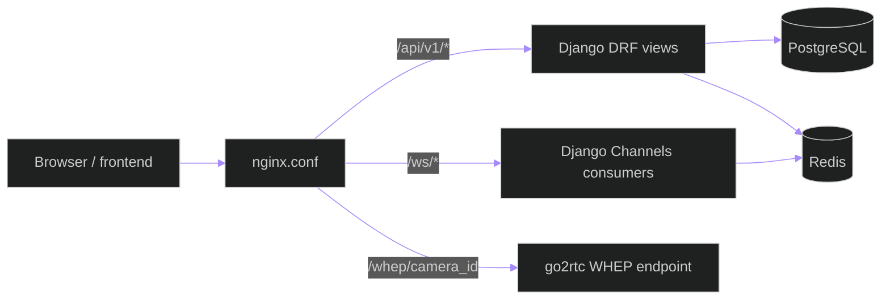
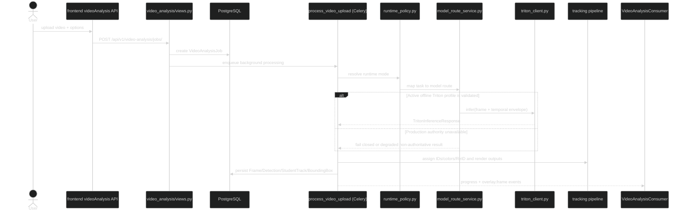
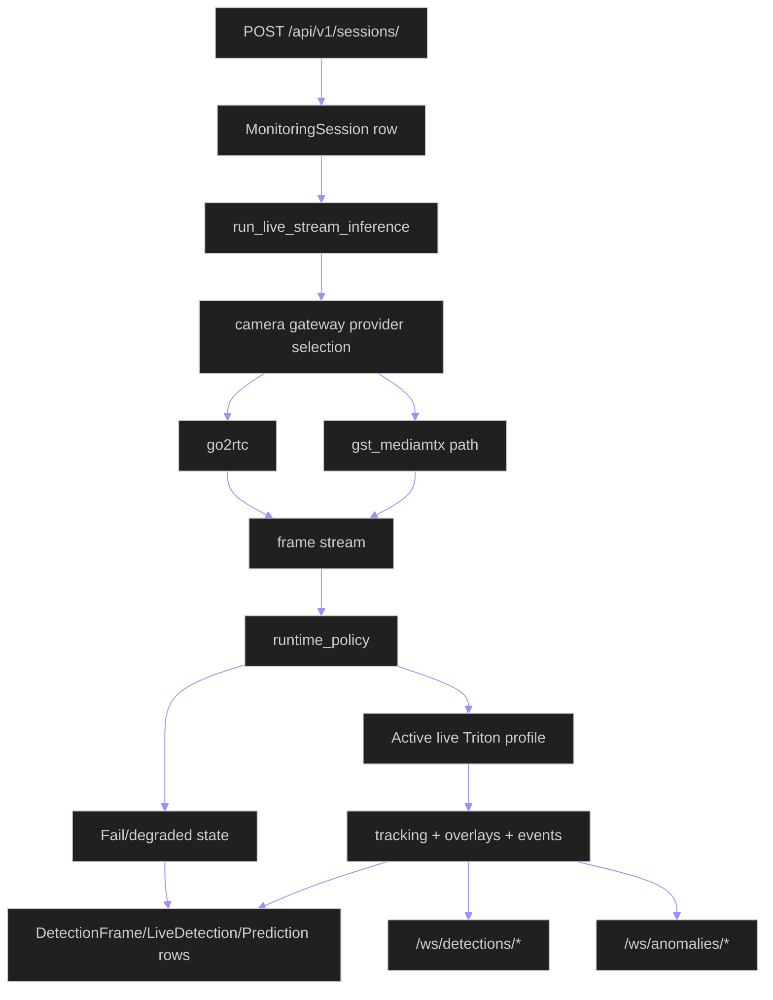
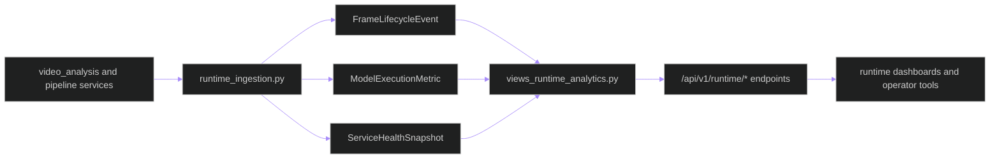

# Data Flow — API, Streaming, Inference, and Runtime Telemetry

**Updated**: 2026-05-25

## Scope

This document maps implementation-backed flows across:
1. HTTP + WebSocket request paths
2. Live streaming inference
3. Offline video analysis inference
4. Runtime telemetry ingestion and analytics APIs

---

## 1. Edge Routing and Protocol Split

---

## 2. Offline Upload Inference Pipeline

---

## 3. Live Stream Inference Pipeline

---

## 4. Runtime Telemetry Flow

---

## 5. Flow Invariants

- Live and offline workloads share governed contracts but execute in separate
  production activation windows with only the selected Triton endpoint active.
- Triton is mandatory for production inference authority. A local or mock
  result may be used only in explicitly non-production development/testing and
  cannot be reported as production evidence.
- Redis is used for queueing/channel-layer/cache state; PostgreSQL is the durable source of truth.
- Runtime analytics APIs read telemetry snapshots/events and do not mutate inference state.
- Every persisted inference/track/pose/behavior event must retain source,
  ingest, queue, inference and persistence time provenance as applicable.

## Related Documents

- [ARCHITECTURE.md](../../ARCHITECTURE.md)
- [deployment-topology.md](deployment-topology.md)
- [observability-runbook.md](observability-runbook.md)
- [triton-operations.md](triton-operations.md)
