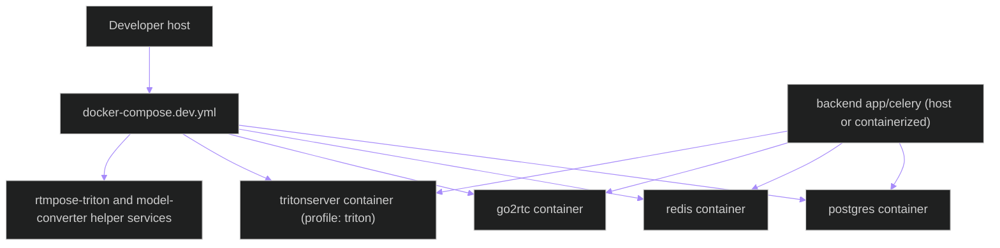
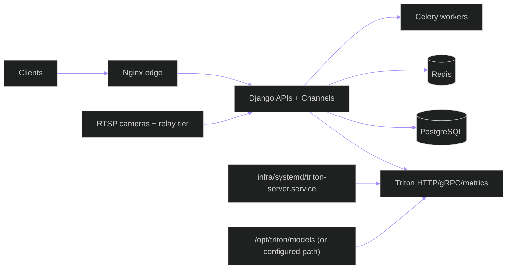
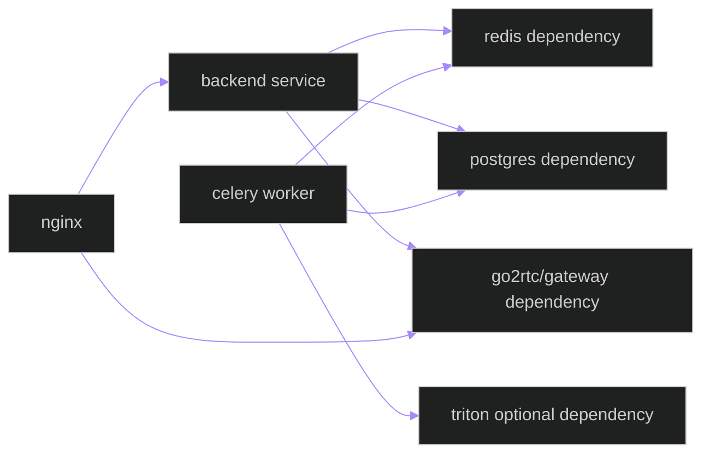

# Deployment Topology — Containers, Native Services, and Network Boundaries

**Updated**: 2026-05-15

## 1. Development Topology (`docker-compose.dev.yml`)

### Dev notes

- Triton is profile-gated and can be omitted for local fallback-only runs.
- `backend\models\triton_repository` is mounted/used as the model repository source.
- Frontend dev server talks to backend and WHEP through nginx or direct local URLs depending on env.

---

## 2. Production Topology (Native Triton + Systemd)

### Production notes

- Triton is expected to run as a native service via `infra\systemd\triton-server.service`.
- Triton ports (`8000/8001/8002`) are internal-only.
- Backend runtime policy can still route to local inference if Triton is unavailable.

---

## 3. Container-to-Service Dependencies

---

## 4. Runtime Dependency Order

1. Redis and PostgreSQL first.
2. Relay tier (`go2rtc` and/or gateway service) next.
3. Backend API + Channels.
4. Celery workers.
5. Optional Triton service (for Triton-enabled workloads).
6. Frontend and operator clients.

## Related Documents

- [ARCHITECTURE.md](../../ARCHITECTURE.md)
- [data-flow.md](data-flow.md)
- [triton-operations.md](triton-operations.md)
