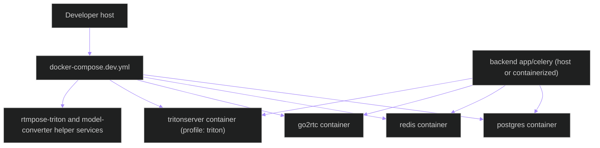
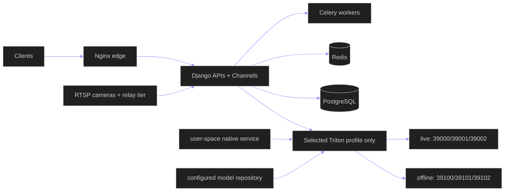
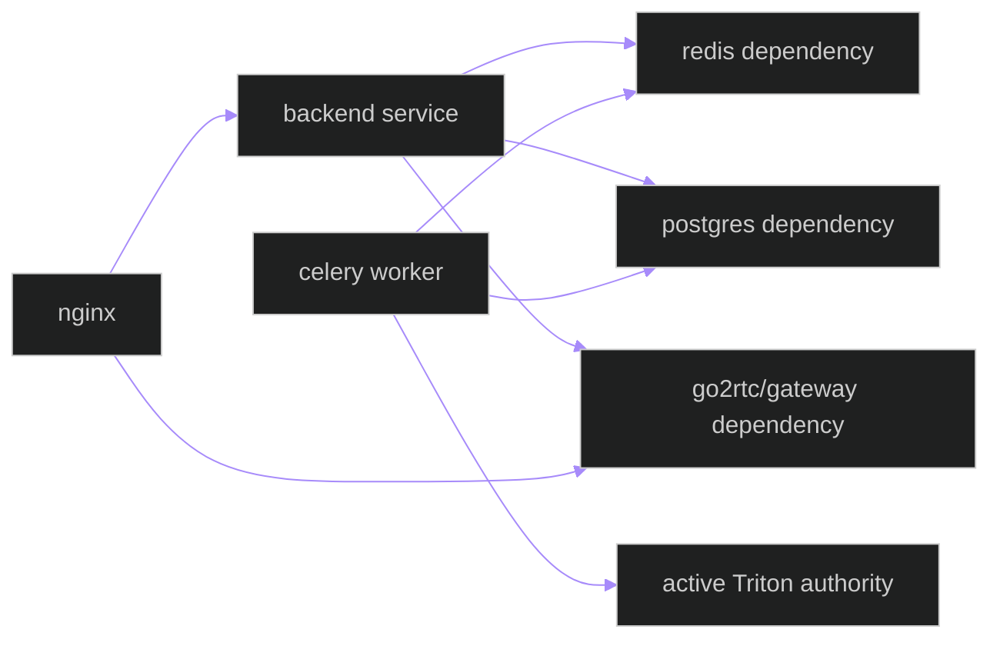

# Deployment Topology — Containers, Native Services, and Network Boundaries

**Updated**: 2026-05-25

## 1. Development Topology (`docker-compose.dev.yml`)

### Dev notes

- Triton is profile-gated and can be omitted for local fallback-only runs.
- `backend\models\triton_repository` is mounted/used as the model repository source.
- Frontend dev server talks to backend and WHEP through nginx or direct local URLs depending on env.

---

## 2. Production Topology (Native Triton + Systemd)

### Production notes

- Production inference requires a native Linux Triton process operated without
  Docker or sudo assumptions.
- Two endpoint profiles are configured, but exactly one is active: live
  `39000/39001/39002` or offline `39100/39101/39102`; inactive ports must be
  unreachable during readiness acceptance.
- Backend runtime policy must fail closed or emit explicitly
  non-authoritative degradation when selected Triton/model readiness fails.
  Production local inference fallback is forbidden.

---

## 3. Container-to-Service Dependencies

---

## 4. Runtime Dependency Order

1. Redis and PostgreSQL first.
2. Relay tier (`go2rtc` and/or gateway service) next.
3. Backend API + Channels.
4. Celery workers.
5. Selected native Triton endpoint profile and required models, validated
   before accepting inference work.
6. Frontend and operator clients.

## Related Documents

- [ARCHITECTURE.md](../../ARCHITECTURE.md)
- [data-flow.md](data-flow.md)
- [triton-operations.md](triton-operations.md)
