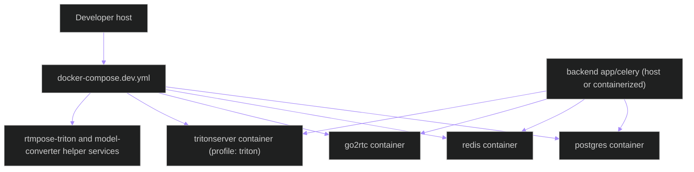
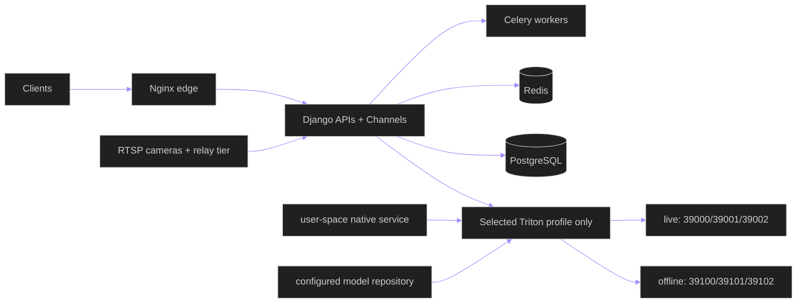
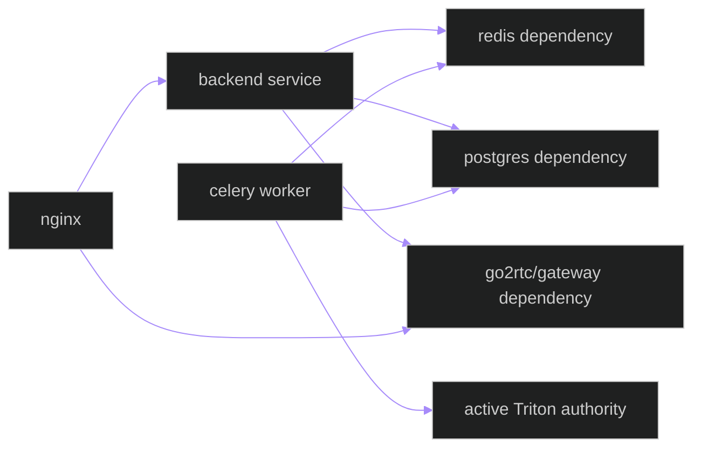

# Deployment Topology — Containers, Native Services, and Network Boundaries

**Updated**: 2026-05-27

## 1. Development Topology (`docker-compose.dev.yml`)



### Dev notes

- Triton is profile-gated and can be omitted for local fallback-only runs.
- `backend\models\triton_repository` is mounted/used as the model repository source.
- Frontend dev server talks to backend and WHEP through nginx or direct local URLs depending on env.

---

## 2. Production Topology (Native Triton + Systemd)



### Production notes

- Production inference requires a native Linux Triton process operated without
  Docker or sudo assumptions.
- Two endpoint profiles are configured, but exactly one is active: live
  `39000/39001/39002` or offline `39100/39101/39102`; inactive ports must be
  unreachable during readiness acceptance.
- `backend/.env` selects the active production mode through
  `TRITON_EXECUTION_MODE=live` or `TRITON_EXECUTION_MODE=offline`; a repo-root
  `.env` is not backend startup authority.
- PostgreSQL is the only durable authority for BSIL records, lineage,
  reconciliation, and accepted production evidence. Redis remains an
  accelerator/broker, never evidence authority.
- Backend runtime policy must fail closed or emit explicitly
  non-authoritative degradation when selected Triton/model readiness fails.
  Production local inference fallback is forbidden.

---

## 3. Container-to-Service Dependencies



---

## 4. Runtime Dependency Order

1. Redis and PostgreSQL first.
2. Relay tier (`go2rtc` and/or gateway service) next.
3. Backend API + Channels.
4. Celery workers.
5. Selected native Triton endpoint profile and required models, validated
   before accepting inference work.
6. Frontend and operator clients.

## 5. BSIL Queue Isolation

Only queues belonging to the selected mode are routed to production workers.
Every stage has a corresponding dead-letter queue named by appending `.dlq`.

| Stage | Live route | Offline route |
| --- | --- | --- |
| Semantic pose | `pipeline.live.bsil.semantic.worker` | `pipeline.offline.bsil.semantic.worker` |
| Temporal state | `pipeline.live.bsil.temporal.worker` | `pipeline.offline.bsil.temporal.worker` |
| Interaction graph | `pipeline.live.bsil.graph.worker` | `pipeline.offline.bsil.graph.worker` |
| Anomaly candidate | `pipeline.live.bsil.anomaly.worker` | `pipeline.offline.bsil.anomaly.worker` |
| Lineage replay | `pipeline.live.bsil.replay.worker` | `pipeline.offline.bsil.replay.worker` |
| Evidence export | `pipeline.live.bsil.evidence.worker` | `pipeline.offline.bsil.evidence.worker` |

`apps.pipeline.routing.resolve_bsil_route_declarations()` resolves only the
selected mode; `validate_no_cross_mode_queue()` rejects a live/offline
cross-route. Runtime reconciliation also rejects cross-mode queue evidence.

## 6. Production Evidence Closure

Before collecting BSIL final evidence, confirm the active Triton readiness
endpoint responds and the inactive profile is unreachable:

```bash
# Offline validation session:
curl -fsS http://127.0.0.1:39100/v2/health/ready
! curl -fsS http://127.0.0.1:39000/v2/health/ready

# Live validation session:
curl -fsS http://127.0.0.1:39000/v2/health/ready
! curl -fsS http://127.0.0.1:39100/v2/health/ready
```

Run the matching mode from the Windows operator workspace:

```powershell
.\tools\prod\prod-bsil-final-evidence.ps1 -RuntimeMode offline
# or, for a live validation session only:
.\tools\prod\prod-bsil-final-evidence.ps1 -RuntimeMode live
```

The helper loads `backend/.env` on production and invokes
`backend/.venv/bin/python backend/manage.py run_bsil_acceptance`. The command
validates fresh PostgreSQL-backed evidence, task/database/queue/artifact/
telemetry/frontend reconciliation, and raw Triton/NVIDIA GPU queue causality,
plus a valid PostgreSQL-backed access-audit manifest, then writes
`ci_evidence/bsil/production/final/final_acceptance_manifest.json`.

## Related Documents

- [ARCHITECTURE.md](../../ARCHITECTURE.md)
- [data-flow.md](data-flow.md)
- [triton-operations.md](triton-operations.md)
- [bsil-runtime.md](bsil-runtime.md)
