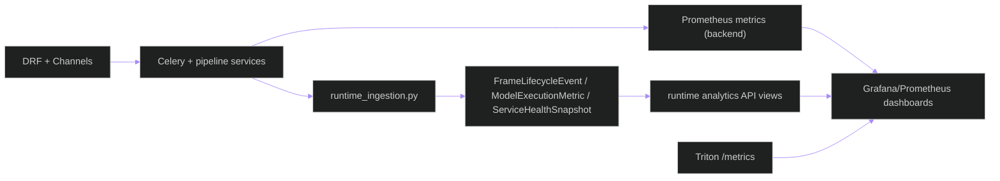

# Observability Runbook — Inference, Runtime Telemetry, and Incident Triage

**Updated**: 2026-05-15

## 1. Signals You Can Trust

Primary backend metrics are emitted from `backend/core/observability.py`.

| Metric | Type | Labels | Purpose |
|---|---|---|---|
| `inference_requests_total` | Counter | `model_name`, `model_version`, `status` | Request outcomes by route/model |
| `inference_latency_ms` | Histogram | `model_name`, `model_version`, `status` | End-to-end inference latency |
| `inference_timeout_total` | Counter | `model_name`, `model_version` | Timeouts per model path |

Runtime telemetry endpoints (`/api/v1/runtime/*`) expose lifecycle events, execution metrics, and service health snapshots persisted by runtime ingestion services.

---

## 2. Observability Architecture

---

## 3. Triage Playbooks

### A) Rising latency

1. Check `inference_latency_ms` and `inference_timeout_total`.
2. Split by labels (`model_name`, `status`) to isolate affected routes.
3. Correlate with runtime telemetry snapshots and Triton health.
4. In production, stop admission or mark outputs explicitly
   non-authoritative until the selected Triton profile is healthy; never shift
   production-authoritative inference to a local path.

### B) Inference failures

1. Inspect `inference_requests_total{status="error"}` trend.
2. Validate route policy and model readiness.
3. Check runtime event stream for service-level degradation.

### C) Streaming regressions

1. Validate camera relay health (`go2rtc` or gateway provider status).
2. Validate websocket event rate and runtime analytics frame lifecycle entries.
3. Verify Redis channel-layer and broker health.

---

## 4. Endpoint Checklist

| Endpoint | Purpose |
|---|---|
| `/api/v1/health/` | Base service health |
| `/api/v1/health/model-serving/` | Inference backend health summary |
| `/api/v1/runtime/*` | Runtime telemetry and analytics views |
| `http://<triton-host>:8002/metrics` | Triton server metrics |

---

## 5. Alerting Guidance

- **Warning**: sustained p95 latency drift or elevated timeout counters.
- **Critical**: sustained error spikes, model-serving health degraded, or missing runtime lifecycle events during active jobs.
- Route changes should be policy-driven and reversible (`TRITON_*` / runtime flags), not code edits.

## Related Documents

- [ARCHITECTURE.md](../../ARCHITECTURE.md)
- [data-flow.md](data-flow.md)
- [deployment-topology.md](deployment-topology.md)
- [triton-operations.md](triton-operations.md)
