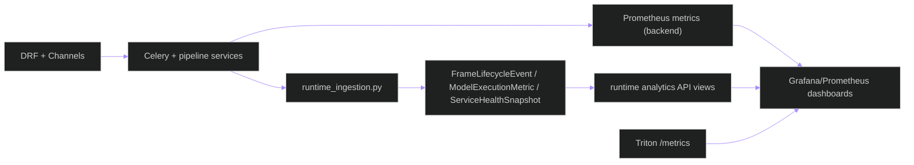

# Observability Runbook — Inference, Runtime Telemetry, and Incident Triage

**Updated**: 2026-05-27

## 1. Signals You Can Trust

Primary backend metrics are emitted from `backend/core/observability.py`.

| Metric | Type | Labels | Purpose |
|---|---|---|---|
| `inference_requests_total` | Counter | `model_name`, `model_version`, `status` | Request outcomes by route/model |
| `inference_latency_ms` | Histogram | `model_name`, `model_version`, `status` | End-to-end inference latency |
| `inference_timeout_total` | Counter | `model_name`, `model_version` | Timeouts per model path |

Runtime telemetry endpoints (`/api/v1/runtime/*`) expose lifecycle events, execution metrics, and service health snapshots persisted by runtime ingestion services.

---

## 2. BSIL Truth States

BSIL dashboards and evidence must distinguish absence from success. The
implemented acceptance and read surfaces expose these truth states:

| State | Meaning | Operator action |
| --- | --- | --- |
| `valid` | Reconciliation or raw GPU/queue causality accepted. | Retain evidence with its digest and runtime mode. |
| `invalidated` | Reconciliation or causality rejected a mismatch, synthetic trace, bad attribution, or cross-mode route. | Block maturity claims and investigate failure reasons. |
| `unavailable` | A required surface is not implemented or cannot be authoritative; currently returned by the BSIL access-audit stub. | Treat production closure as blocked. |
| `degraded` / `invalid` confidence bands | Behavioral output is impaired or fails lineage/runtime gates. | Display the cause; do not promote it as accepted evidence. |

PostgreSQL remains durable telemetry/evidence authority. Redis cache values,
temporary artifacts, or a healthy process alone do not establish BSIL truth.

---

## 3. BSIL Metrics and Dashboards

The BSIL observability contract requires the following dashboard families.
They must be backed by raw exports when used for acceptance.

| Dashboard | Required signals |
| --- | --- |
| Behavioral runtime | runtime mode, admission, semantic/temporal latency, queue depth/age/retries/timeouts/DLQ |
| Temporal state | state transitions and reasons, decays, invalid windows, cooldowns |
| Interaction graph | node/edge counts, edge confidence, suppression reasons, ambiguous identity evidence |
| Semantic confidence | confidence band distributions and uncertainty reasons by mode/type |
| Evidence and reconciliation | artifact digests, stale/degraded states, task/DB/queue/artifact/telemetry/frontend convergence |
| Review workflow | review tasks, false-positive/false-negative labels, access-audit volume |

Raw GPU-backed evidence must include measured queue wait and GPU execution
events, a single correlation lineage, `runtime_backend="triton"`,
`device_target="nvidia:gpu"`, and non-zero utilization for claimed heavy GPU
workloads. Synthetic events are not acceptance evidence.

---

## 4. Observability Architecture

---

## 5. Triage Playbooks

### A) Rising latency

1. Check `inference_latency_ms` and `inference_timeout_total`.
2. Split by labels (`model_name`, `status`) to isolate affected routes.
3. Correlate with runtime telemetry snapshots and Triton health.
4. In production, stop admission or mark outputs explicitly
   non-authoritative until the selected Triton profile is healthy; never shift
   production-authoritative inference to a local path.

### B) Inference failures

1. Inspect `inference_requests_total{status="error"}` trend.
2. Validate route policy and model readiness.
3. Check runtime event stream for service-level degradation.

### C) Streaming regressions

1. Validate camera relay health (`go2rtc` or gateway provider status).
2. Validate websocket event rate and runtime analytics frame lifecycle entries.
3. Verify Redis channel-layer and broker health.

---

## 6. BSIL Acceptance Triage

1. Confirm exactly one selected runtime mode (`live` or `offline`) is active.
2. Inspect reconciliation failures across task, database, queue, artifact,
   telemetry, and frontend components.
3. Reject any evidence marked placeholder, fallback, synthetic, stale, or
   non-PostgreSQL.
4. For GPU claims, inspect raw queue and Triton/NVIDIA GPU attribution before
   reading summarized latency or utilization values.
5. Treat the access-audit `unavailable` response as a blocking incomplete
   maturity surface until implemented.

---

## 7. Endpoint Checklist

| Endpoint | Purpose |
|---|---|
| `/api/v1/health/` | Base service health |
| `/api/v1/health/model-serving/` | Inference backend health summary |
| `/api/v1/runtime/*` | Runtime telemetry and analytics views |
| `/api/v1/behavior/bsil/*` | BSIL semantic, temporal, episode, interaction, lineage, review and audit truth surfaces |
| `http://<triton-host>:8002/metrics` | Triton server metrics |

---

## 8. Alerting Guidance

- **Warning**: sustained p95 latency drift or elevated timeout counters.
- **Critical**: sustained error spikes, model-serving health degraded, or missing runtime lifecycle events during active jobs.
- **Blocking**: BSIL cross-mode queue route, reconciliation mismatch, missing
  confidence decomposition, silent fallback attempt, or unavailable required
  evidence/audit surface.
- Route changes should be policy-driven and reversible (`TRITON_*` / runtime flags), not code edits.

## Related Documents

- [ARCHITECTURE.md](../../ARCHITECTURE.md)
- [data-flow.md](data-flow.md)
- [deployment-topology.md](deployment-topology.md)
- [triton-operations.md](triton-operations.md)
- [bsil-runtime.md](bsil-runtime.md)
