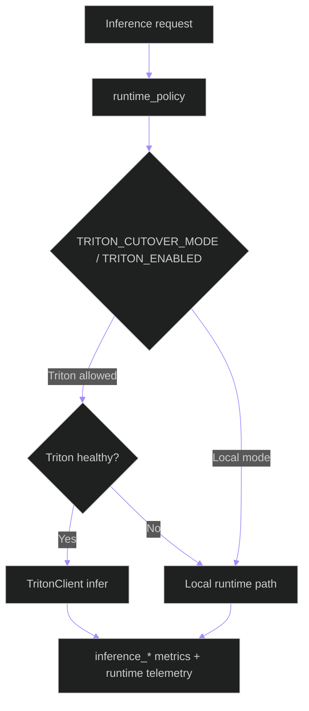
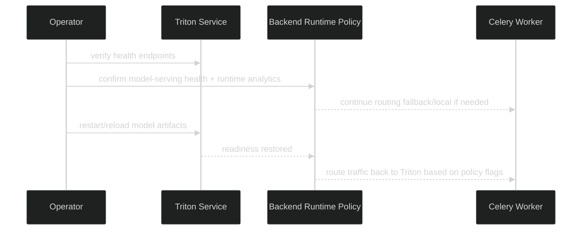

# Triton Operations Runbook

**Updated**: 2026-05-15

## Scope

Triton is an optional-but-preferred inference backend selected through runtime policy. This runbook covers health checks, triage, and safe fallback behavior.

---

## 1. Runtime Decision Model

---

## 2. Health Checks

| Component | Check |
|---|---|
| Triton liveness | `GET /v2/health/live` |
| Triton readiness | `GET /v2/health/ready` |
| Backend model serving view | `GET /api/v1/health/model-serving/` |
| Runtime telemetry API | `GET /api/v1/runtime/service-health/` (or related runtime endpoints) |

---

## 3. Common Incidents

### A) Triton unavailable

Symptoms:
- model-serving health degrades
- Triton route errors increase
- workload shifts to local runtime path

Actions:
1. Validate service status (`systemctl status triton-server` or compose status in dev).
2. Validate model repository path and model readiness endpoints.
3. Inspect Triton logs and backend runtime events.
4. Keep runtime policy fallback enabled until readiness recovers.

### B) Latency regression

Symptoms:
- `inference_latency_ms` p95 increases
- elevated timeouts (`inference_timeout_total`)

Actions:
1. Confirm host resource pressure (GPU/CPU/memory).
2. Inspect Triton metrics endpoint (`:8002/metrics`).
3. Validate active route policy/canary settings.
4. Reduce Triton pressure or switch selected workloads to local runtime until stable.

### C) Model load/version issues

Symptoms:
- one model consistently fails while others pass
- readiness endpoint for specific model fails

Actions:
1. Check model directory structure and version folder.
2. Verify route mapping in backend policy/route service.
3. Reload affected model or restart Triton if required.

---

## 4. Safe Recovery Sequence

---

## 5. Operational Boundaries

- Development: Triton usually runs in compose (profile-controlled).
- Production: Triton runs as native systemd service (`infra/systemd/triton-server.service`).
- Runtime policy must remain the single switchboard for cutover/canary decisions; avoid hardcoding direct Triton-only assumptions in callers.

## 6. Phase 4/5 Runtime Knobs (Backend-Facing)

The following knobs are read by backend runtime configuration and task orchestration code paths.

| Env knob | Runtime default | Where used |
|---|---|---|
| `TRITON_MODEL_WARMUP_ENABLED` | `false` | `core.configuration.ModuleConfigLoader` |
| `TRITON_MODEL_WARMUP_ITERATIONS` | `0` | `core.configuration.ModuleConfigLoader` |
| `TRITON_RATE_LIMITER_ENABLED` | `false` | `core.configuration.ModuleConfigLoader` |
| `TRITON_RATE_LIMITER_LIVE_PRIORITY` | `2` | `core.configuration.ModuleConfigLoader` |
| `TRITON_RATE_LIMITER_OFFLINE_PRIORITY` | `1` | `core.configuration.ModuleConfigLoader` |
| `TRITON_PINNED_MEMORY_POOL_BYTES` | `0` | `core.configuration.ModuleConfigLoader` |
| `TRITON_CUDA_MEMORY_POOL_BYTES` | `0` | `core.configuration.ModuleConfigLoader` |
| `TRITON_PROTOCOL_PREFERENCE` | `http` | `core.configuration.ModuleConfigLoader` |
| `TRITON_HTTP_ENABLED` | `true` | `core.configuration.ModuleConfigLoader` |
| `TRITON_GRPC_ENABLED` | `false` | `core.configuration.ModuleConfigLoader` |
| `INFERENCE_RUNTIME_CANARY_P95_LATENCY_THRESHOLD_MS` | `120.0` | `core.configuration.ModuleConfigLoader` |
| `INFERENCE_RUNTIME_CANARY_P99_LATENCY_THRESHOLD_MS` | `220.0` | `core.configuration.ModuleConfigLoader` |
| `INFERENCE_RUNTIME_CANARY_FALLBACK_RATE_THRESHOLD` | `0.05` | `core.configuration.ModuleConfigLoader` |
| `INFERENCE_RUNTIME_CANARY_ERROR_RATE_THRESHOLD` | `0.03` | `core.configuration.ModuleConfigLoader` |

## 7. Orchestrator Routing References

- Upload and live workers call `_build_triton_orchestrator` in `backend/apps/video_analysis/tasks.py`.
- `_build_triton_orchestrator` resolves `TRITON_EXECUTION_PROFILE`, `TRITON_LIVE_URL`, and `TRITON_OFFLINE_URL`.
- The orchestration contract is implemented in `backend/apps/video_analysis/services/inference_orchestrator.py`.

## Related Documents

- [deployment-topology.md](deployment-topology.md)
- [data-flow.md](data-flow.md)
- [observability-runbook.md](observability-runbook.md)
- [../../../triton_inference_speed_stabilization_plan.md](../../../triton_inference_speed_stabilization_plan.md)
- [../../apps/video_analysis/services/inference_orchestrator.md](../../apps/video_analysis/services/inference_orchestrator.md)
