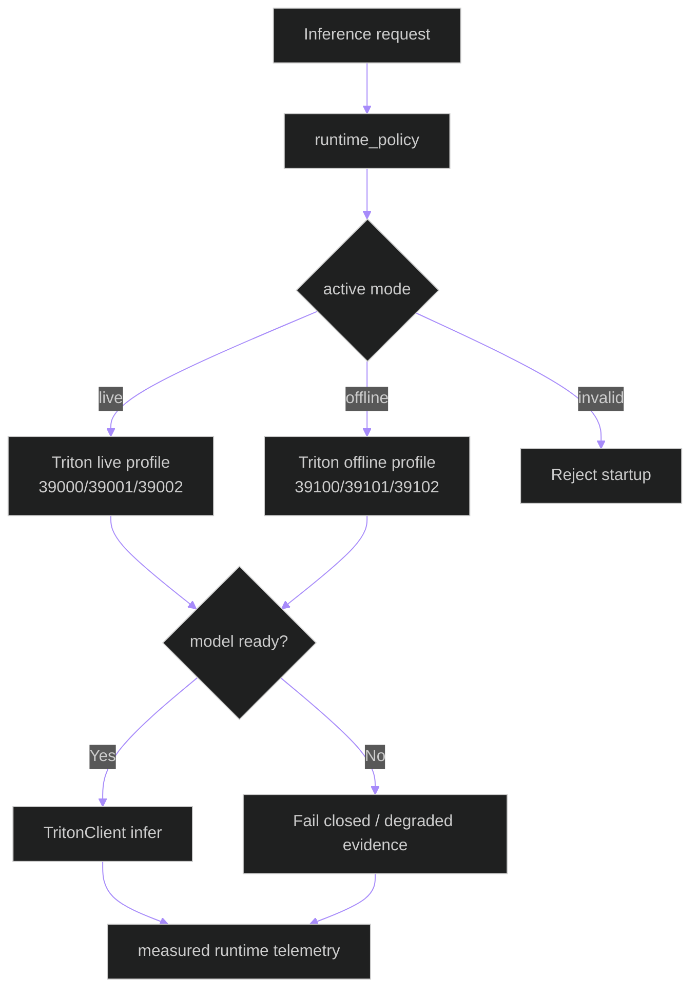

# Triton Operations Runbook

**Updated**: 2026-05-25

## Scope

Triton is the only production inference authority. Development and explicitly
labeled test runs may exercise non-Triton adapters, but they cannot produce
production-valid evidence. Production runs use native Linux deployment with
one active endpoint profile at a time and fail closed when that authority is
unavailable.

---

## 1. Runtime Decision Model

---

## 2. Health Checks

| Component | Check |
|---|---|
| Triton liveness | `GET /v2/health/live` |
| Triton readiness | `GET /v2/health/ready` |
| Inactive profile isolation | Inactive profile readiness endpoint is unreachable |
| Required model readiness | `GET /v2/models/<model>/ready` on active profile |
| Backend model serving view | `GET /api/v1/health/model-serving/` |
| Runtime telemetry API | `GET /api/v1/runtime/service-health/` (or related runtime endpoints) |

---

## 3. Common Incidents

### A) Triton unavailable

Symptoms:
- model-serving health degrades
- Triton route errors increase
- production inference admission stops or becomes explicitly non-authoritative

Actions:
1. Validate service status (`systemctl status triton-server` or compose status in dev).
2. Validate model repository path and model readiness endpoints.
3. Inspect Triton logs and backend runtime events.
4. Reject production-authoritative inference until readiness and model
   contract validation recover; never switch to local production inference.

### B) Latency regression

Symptoms:
- `inference_latency_ms` p95 increases
- elevated timeouts (`inference_timeout_total`)

Actions:
1. Confirm host resource pressure (GPU/CPU/memory).
2. Inspect Triton metrics endpoint (`:8002/metrics`).
3. Validate active route policy/canary settings.
4. Apply documented backpressure, throttle admission, or suspend the selected
   mode; do not route production work to local inference.

### C) Model load/version issues

Symptoms:
- one model consistently fails while others pass
- readiness endpoint for specific model fails

Actions:
1. Check model directory structure and version folder.
2. Verify route mapping in backend policy/route service.
3. Reload affected model or restart Triton if required.

---

## 4. Safe Recovery Sequence

---

## 5. Operational Boundaries

- Development: Triton may run in compose; non-Triton adapters are
  non-production test conveniences only.
- Production: Triton runs natively on Linux, with no Docker or sudo
  dependency, and is mandatory for inference authority.
- Production has two configured endpoint profiles but only one running profile
  at any time: `live` on `39000/39001/39002` or `offline` on
  `39100/39101/39102`.
- Runtime policy is the authority for mode binding and must reject invalid,
  multi-active, unhealthy, or model-incompatible production startup.

## 6. Phase 4/5 Runtime Knobs (Backend-Facing)

The following knobs are read by backend runtime configuration and task orchestration code paths.

| Env knob | Optimized production env default | Where used |
|---|---|---|
| `TRITON_MODEL_WARMUP_ENABLED` | `false` | `core.configuration.ModuleConfigLoader` |
| `TRITON_MODEL_WARMUP_ITERATIONS` | `0` | `core.configuration.ModuleConfigLoader` |
| `TRITON_RATE_LIMITER_ENABLED` | `false` | `core.configuration.ModuleConfigLoader` |
| `TRITON_RATE_LIMITER_LIVE_PRIORITY` | `2` | `core.configuration.ModuleConfigLoader` |
| `TRITON_RATE_LIMITER_OFFLINE_PRIORITY` | `1` | `core.configuration.ModuleConfigLoader` |
| `TRITON_PINNED_MEMORY_POOL_BYTES` | `0` | `core.configuration.ModuleConfigLoader` |
| `TRITON_CUDA_MEMORY_POOL_BYTES` | `0` | `core.configuration.ModuleConfigLoader` |
| `TRITON_NOFILE_LIMIT` | `65535` | `tools/prod/prod_start_triton.sh` |
| `TRITON_LOG_MAX_MIB` | `1024` | `tools/prod/prod_start_triton.sh` |
| `TRITON_PROTOCOL_PREFERENCE` | `grpc` | `core.configuration.ModuleConfigLoader` |
| `TRITON_HTTP_ENABLED` | `true` | `core.configuration.ModuleConfigLoader` |
| `TRITON_GRPC_ENABLED` | `true` | `core.configuration.ModuleConfigLoader` |
| `TRITON_NUMPY_OUTPUTS` | `true` | `apps.pipeline.services.triton_client.TritonClient` |
| `TRITON_TRUE_BATCH_REQUESTS` | `true` | `apps.video_analysis.services.inference_orchestrator.InferenceOrchestrator` |
| `TRITON_YOLO_MAX_DECODE_CANDIDATES` | `100` | `apps.video_analysis.tasks._decode_yolo_output0` |
| `TRITON_CROP_BEHAVIOR_INPUT_SIZE` | `640` | `apps.video_analysis.tasks._run_triton_frame_level_inference` |
| `TRITON_BEHAVIOR_ENSEMBLE` | `true` | `apps.video_analysis.tasks._run_triton_frame_level_inference`, `apps.pipeline.services.triton_client.TritonClient` |
| `GAZE_HORIZONTAL_HEAD_VARIANT` | `coco80` | `apps.video_analysis.tasks._yolo_output_channels_for_task`, `tools/prod/prod_start_triton.sh` |
| `TRITON_MODEL_BATCH_SIZE_OVERRIDES` | `object-models=8,behavior_all=32,pose=16` | `apps.video_analysis.tasks._effective_task_batch_size` |
| `TRITON_OFFLINE_THREADED_DECODE` | `true` | `apps.video_analysis.tasks._run_triton_frame_level_inference` |
| `TRITON_OFFLINE_DECODE_QUEUE_SIZE` | `4` | `apps.video_analysis.tasks._run_triton_frame_level_inference` |
| `INFERENCE_RUNTIME_CANARY_P95_LATENCY_THRESHOLD_MS` | `120.0` | `core.configuration.ModuleConfigLoader` |
| `INFERENCE_RUNTIME_CANARY_P99_LATENCY_THRESHOLD_MS` | `220.0` | `core.configuration.ModuleConfigLoader` |
| `INFERENCE_RUNTIME_CANARY_FALLBACK_RATE_THRESHOLD` | `0.05` | `core.configuration.ModuleConfigLoader` |
| `INFERENCE_RUNTIME_CANARY_ERROR_RATE_THRESHOLD` | `0.03` | `core.configuration.ModuleConfigLoader` |
| `OFFLINE_DB_BATCH_WRITES` | `true` | `apps.video_analysis.tasks.process_video_upload` |
| `OFFLINE_DB_BATCH_SIZE` | `1000` | `apps.video_analysis.tasks.process_video_upload` |
| `OFFLINE_OFFLOAD_POST_STAGES` | `true` | `apps.video_analysis.tasks._run_followup_inline_for_job` |
| `OFFLINE_TRIM_PROCESS_MEMORY` | `true` | `apps.video_analysis.tasks._trim_process_memory_if_enabled` |
| `OFFLINE_EMBEDDING_REUSE_BY_TRACK` | `true` | `apps.video_analysis.tasks.generate_embeddings` |
| `OFFLINE_BEHAVIOUR_REUSE` | `false` | `apps.video_analysis.tasks._run_triton_frame_level_inference` |
| `OFFLINE_BEHAVIOUR_REUSE_TTL_FRAMES` | `0` | `apps.video_analysis.tasks._run_triton_frame_level_inference` |
| `OFFLINE_BEHAVIOUR_REUSE_IOU_THRESHOLD` | `0.90` | `apps.video_analysis.tasks._run_triton_frame_level_inference` |

## 7. Orchestrator Routing References

- Upload and live workers call `_build_triton_orchestrator` in `backend/apps/video_analysis/tasks.py`.
- `_build_triton_orchestrator` resolves `TRITON_EXECUTION_PROFILE`, `TRITON_LIVE_URL`, and `TRITON_OFFLINE_URL`.
- The orchestration contract is implemented in `backend/apps/video_analysis/services/inference_orchestrator.py`.

## Related Documents

- [deployment-topology.md](deployment-topology.md)
- [data-flow.md](data-flow.md)
- [observability-runbook.md](observability-runbook.md)
- [../../../triton_inference_speed_stabilization_plan.md](../../../triton_inference_speed_stabilization_plan.md)
- [../../apps/video_analysis/services/inference_orchestrator.md](../../apps/video_analysis/services/inference_orchestrator.md)
