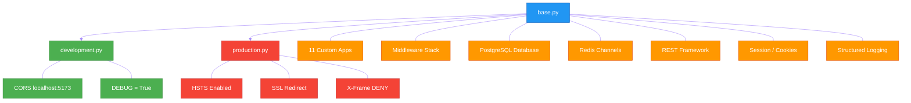

# config/settings/ — Split Settings Package

> **Source:** [`backend/config/settings/`](../../../backend/config/settings/)

---

## 1. Purpose

Houses the Django settings as a Python package with a **base + overlay** pattern. `base.py` holds all shared configuration, while `development.py` and `production.py` override or extend it for their respective environments. This keeps sensitive production hardening separate from developer-friendly defaults.

---

## 2. Exports

| File | Key Symbols | Description |
|------|-------------|-------------|
| `__init__.py` | *(empty)* | Marks directory as importable package |
| `base.py` | All core Django settings | ~132 lines of shared configuration |
| `development.py` | `DEBUG`, `CORS_*`, cookie overrides | Local development overrides |
| `production.py` | `DEBUG`, security headers, SSL settings | Production hardening |

---

## 3. Internal Logic

### 3.1 `base.py` — Core Configuration (~132 lines)

#### INSTALLED_APPS

11 custom apps plus third-party packages:

| Custom Apps | Third-Party |
|-------------|-------------|
| `apps.accounts` | `channels` |
| `apps.cameras` | `rest_framework` |
| `apps.detections` | `corsheaders` |
| `apps.anomalies` | |
| `apps.sessions` | |
| `apps.recordings` | |
| `apps.exams` | |
| `apps.exports` | |
| `apps.health` | |
| `apps.pipeline` | |
| `apps.audit` | |

#### MIDDLEWARE Stack

| Order | Middleware | Source |
|-------|-----------|--------|
| 1 | `CorsMiddleware` | `corsheaders` |
| 2 | `SecurityMiddleware` | Django |
| 3 | `SessionMiddleware` | Django |
| 4 | `CommonMiddleware` | Django |
| 5 | `CsrfViewMiddleware` | Django |
| 6 | `AuthenticationMiddleware` | Django |
| 7 | `MessageMiddleware` | Django |
| 8 | `AuditMiddleware` | `apps.audit` |
| 9 | `ForcePasswordChangeMiddleware` | `apps.accounts` / `core` |

#### Database

- Engine: **PostgreSQL** (`django.db.backends.postgresql`)
- Configured via environment variables

#### Channel Layers

- Backend: **Redis** channel layer (`channels_redis`)

#### REST Framework

- Default authentication: **Session authentication**
- Pagination: `StandardResultsPagination` from `core.pagination`

#### Session / Cookie Settings

| Setting | Value |
|---------|-------|
| Session timeout | 30 minutes |
| `SESSION_COOKIE_HTTPONLY` | `True` |
| `SESSION_COOKIE_SAMESITE` | `Lax` |

#### Logging

- Structured logging under the `exam_monitor` logger name

---

### 3.2 `development.py`

```python
from .base import *  # noqa
```

| Setting | Value |
|---------|-------|
| `DEBUG` | `True` |
| `CORS_ALLOWED_ORIGINS` | `http://localhost:5173` |
| Cookies | Insecure (no `Secure` flag) |

---

### 3.3 `production.py`

```python
from .base import *  # noqa
```

| Setting | Value |
|---------|-------|
| `DEBUG` | `False` |
| `SECURE_HSTS_SECONDS` | Enabled |
| `SECURE_SSL_REDIRECT` | `True` |
| `X_FRAME_OPTIONS` | `DENY` |
| `SECURE_CONTENT_TYPE_NOSNIFF` | `True` |
| Cookies | `Secure` flag set |

---

### Settings Hierarchy & Subsystems Diagram



---

## 4. Dependencies

| Module | Used In | Purpose |
|--------|---------|---------|
| `os` | `base.py` | Environment variable access |
| `pathlib.Path` | `base.py` | `BASE_DIR` resolution |
| `datetime.timedelta` | `base.py` | Session age configuration |
| `django` | All | Framework settings contract |
| `channels_redis` | `base.py` | Redis channel layer backend |
| `rest_framework` | `base.py` | DRF configuration keys |
| `corsheaders` | `base.py` | CORS middleware |
| `core.pagination` | `base.py` | `StandardResultsPagination` |
| `apps.audit.middleware` | `base.py` | `AuditMiddleware` |

---

## 5. Cross-references

- [../manage.md](../manage.md) — Sets `DJANGO_SETTINGS_MODULE` to `config.settings.development`
- [asgi.md](asgi.md) — Also sets `DJANGO_SETTINGS_MODULE`; consumes `CHANNEL_LAYERS`
- [wsgi.md](wsgi.md) — Also sets `DJANGO_SETTINGS_MODULE`
- [celery.md](celery.md) — Reads any `CELERY_`-prefixed settings from this package
- [urls.md](urls.md) — `ROOT_URLCONF` defined in `base.py` points to `config.urls`
