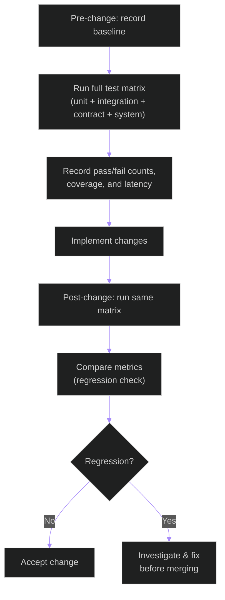

# Onboarding Baseline — Test Measurement Workflow

**Feature**: Architecture Refactoring & Triton Transition (005)
**Updated**: 2026-05-07

## Purpose

This document records the onboarding baseline test pass rates and measurement workflow
for the architecture refactoring feature. Baselines are recorded before and after
significant changes to quantify regression risk.

---

## Baseline Measurement Flow



---

## Baseline Recording Commands

```powershell
cd e:\grad_project\backend

# Full unit test baseline
pytest tests/unit -q --tb=no --co -q 2>&1 | Measure-Object -Line

# Unit + Integration with coverage
pytest tests/unit tests/integration `
  --cov=apps `
  --cov-report=term-missing `
  --cov-report=json:coverage-baseline.json `
  -q --tb=short

# Contract test baseline
pytest tests/contract -q --tb=short

# System tests (dev mode, no real Triton)
pytest tests/system `
  --ignore=tests/system/test_triton_load_capacity.py `
  -q --tb=short
```

---

## Initial Baseline (Feature 005, 2026-05-07)

| Test Suite | Total | Passed | Failed | Skipped | Coverage |
|-----------|-------|--------|--------|---------|----------|
| Unit | — | — | — | — | — |
| Integration | — | — | — | — | — |
| Contract | — | — | — | — | — |
| System | — | — | — | — | — |

> **Note**: Fill in these numbers after running the full test matrix for the first time.
> Compare against future runs to detect regressions.

---

## Coverage Targets (per spec SC-002 through SC-004)

| Suite | Target | Rationale |
|-------|--------|-----------|
| Unit | ≥ 85% | Spec SC-002: test coverage ≥ 85% |
| Integration | ≥ 70% | Spec SC-003: integration tests for all three levels |
| System | Pass all | Spec SC-004: system test scenarios complete |

---

## Regression Detection Thresholds

A change is considered a regression if:
- Unit coverage drops **below 85%** from baseline
- Integration test pass rate drops **more than 5%** from baseline
- P95 inference latency increases **more than 10%** from baseline (spec SC-010)
- Any previously-passing contract test fails

---

## Related Documents

- [ARCHITECTURE.md](../../ARCHITECTURE.md)
- [ci-policy.md](ci-policy.md)
- [real-data-test-policy.md](real-data-test-policy.md)
- [release-quality-tracker.md](release-quality-tracker.md)
- [COVERAGE_REPORT.md](../../../../COVERAGE_REPORT.md)
