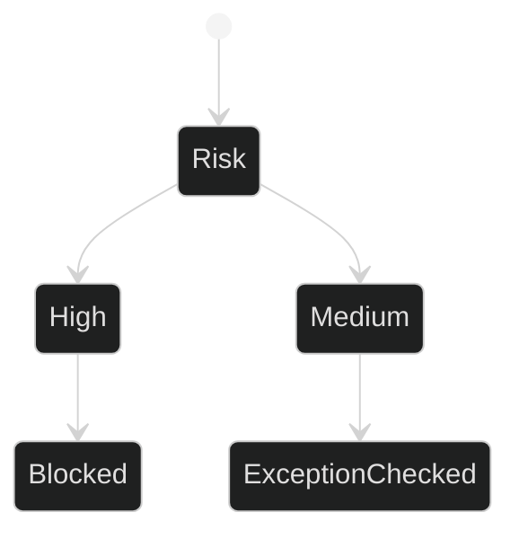

# Coupling Risk Register Tests

## Related Documents

- [coupling risk register](../../../architecture/coupling-risk-register.md)
- [coupling risk contract](../../../../specs/006-modular-low-coupling/contracts/coupling-risk-contract.md)
- [backend test](../../../../backend/tests/contract/test_coupling_risk_register.py)

## Test Flow

The tests enforce that high-risk coupling cannot be retained as an exception and that medium/low exceptions carry owner, expiry, removal plan, regression coverage, and approval.
