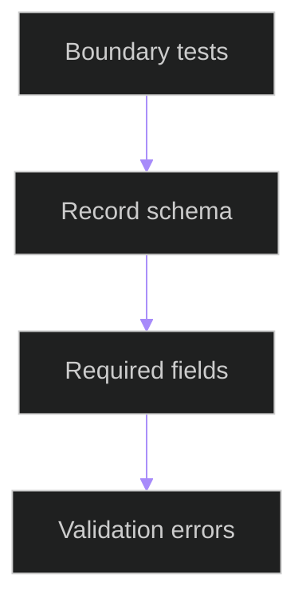

# Module Boundary Contract Tests

## Related Documents

- [module boundary map](../../../architecture/module-boundary-map.md)
- [boundary contract](../../../../specs/006-modular-low-coupling/contracts/module-boundary-contract.md)
- [backend test](../../../../backend/tests/contract/test_module_boundary_contracts.py)

## Test Flow

The tests verify that boundary records expose ownership, inputs, outputs, consumers, dependencies, forbidden dependencies, and failure behavior. They also verify invalid records fail validation.
