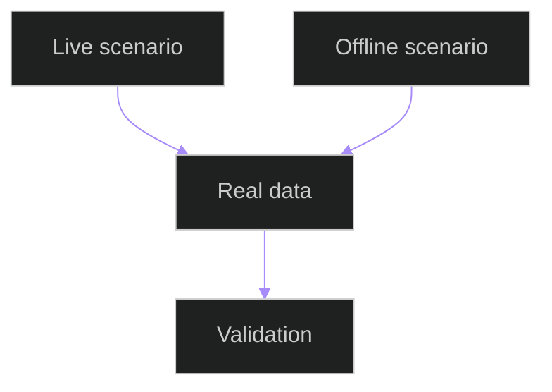

# Runtime Scenario Contract Tests

## Related Documents

- [runtime scenario matrix](../../../architecture/runtime-scenario-matrix.md)
- [runtime scenario contract](../../../../specs/006-modular-low-coupling/contracts/runtime-scenario-contract.md)
- [backend test](../../../../backend/tests/contract/test_runtime_scenario_contracts.py)

## Test Flow

The tests require live and offline runtime records to name real model/media evidence, boundaries, contracts, user-visible outputs, failure modes, and test links.
