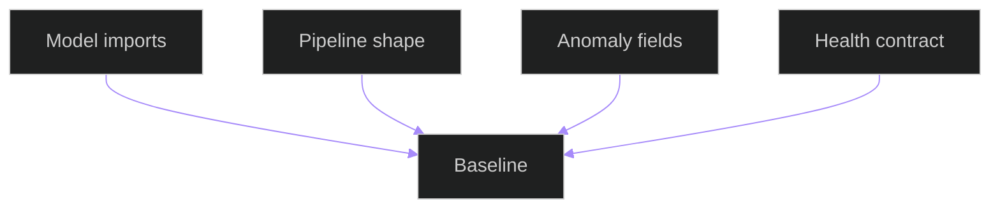

# Full Delivered Baseline Tests

## Related Documents

- [full delivered baseline evidence](../../../../specs/006-modular-low-coupling/evidence/baseline/full-delivered-baseline.md)
- [runtime scenario matrix](../../../architecture/runtime-scenario-matrix.md)
- [test source](../../../../backend/tests/integration/test_full_delivered_baseline.py)

## Test Flow

The flowchart shows the integration baseline tests. They verify delivered model boundaries import together, prediction output keeps tracking identity, anomaly records preserve user-visible fields, and health snapshots expose dashboard-readable status.
