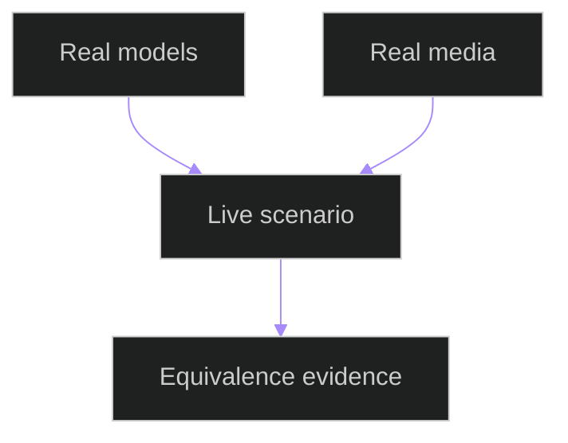

# Live Stream Modular Equivalence Tests

## Related Documents

- [runtime scenario matrix](../../../architecture/runtime-scenario-matrix.md)
- [real data assets](../../../../specs/006-modular-low-coupling/evidence/real-data-assets.md)
- [test source](../../../../backend/tests/system/test_live_stream_modular_equivalence.py)

## Test Flow

The diagram shows the live-stream equivalence guard. The test requires real local model artifacts and real media files before later live workflow validation can claim real-data coverage.
