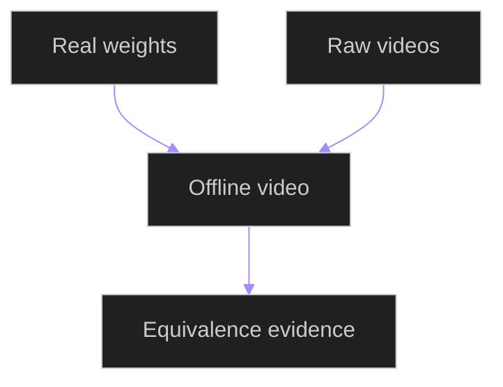

# Offline Video Modular Equivalence Tests

## Related Documents

- [runtime scenario matrix](../../../architecture/runtime-scenario-matrix.md)
- [real data assets](../../../../specs/006-modular-low-coupling/evidence/real-data-assets.md)
- [test source](../../../../backend/tests/system/test_offline_video_modular_equivalence.py)

## Test Flow

The diagram shows the offline-video real-data guard. The tests confirm that real model weights and raw input videos are available for offline processing validation.
