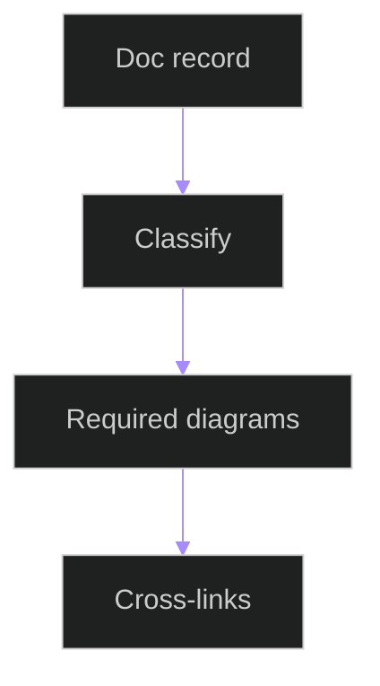

# Documentation Diagram Coverage Tests

## Related Documents

- [documentation diagram coverage](../../../../architecture/documentation-diagram-coverage.md)
- [documentation diagram contract](../../../../../specs/006-modular-low-coupling/contracts/documentation-diagram-contract.md)
- [backend test](../../../../../backend/tests/unit/docs/test_documentation_diagram_coverage.py)

## Test Flow

The tests validate diagram coverage records for source, module, system, and feature documentation. Source docs must have code structure diagrams; system docs must have interaction diagrams and complete links.
